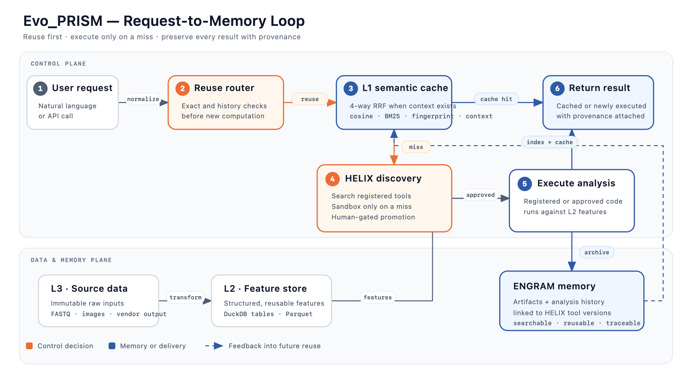
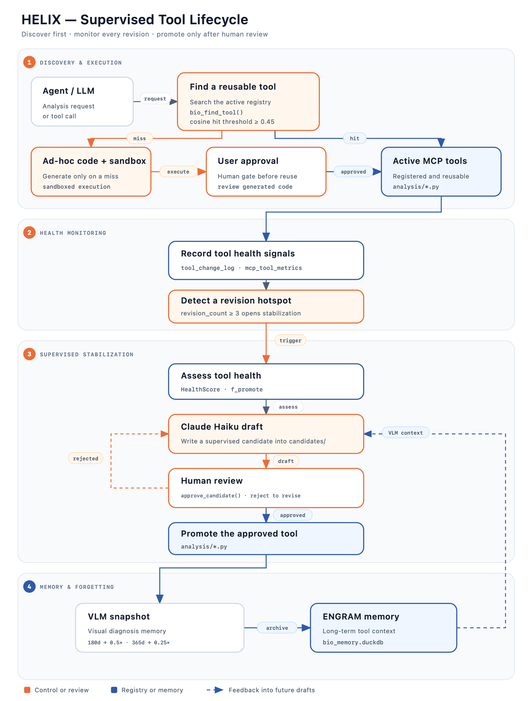
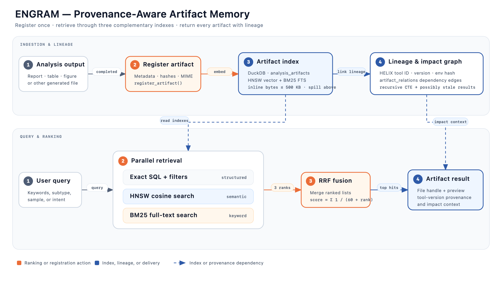
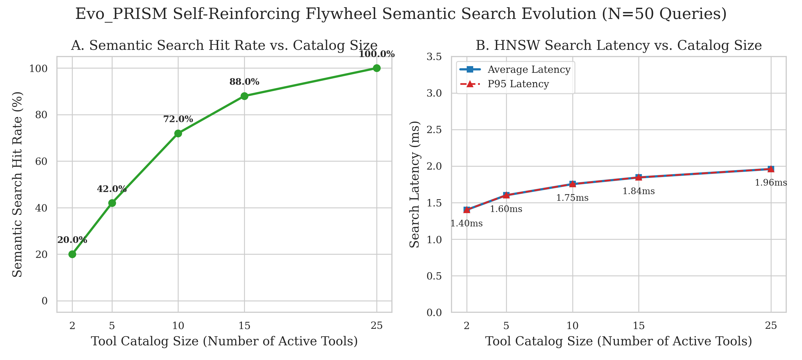

# Evo_PRISM

**Evolutionary Platform for Runtime Intelligence & Semantic Memory**

> **語言：** [English](README.md) · 繁體中文

[](https://github.com/ddmanyes/Evo_PRISM/actions/workflows/ci.yml)
[](https://www.python.org/)
[](https://github.com/ddmanyes/Evo_PRISM/releases/tag/v.0.1)
[](https://modelcontextprotocol.io/)
[](LICENSE)

[為什麼選擇 Evo_PRISM](#為什麼選擇-evo_prism) · [快速開始](#快速開始) · [系統架構](#系統架構) · [MCP 工具](#mcp-工具) · [基準測試](#基準測試摘要) · [文件](#文件索引)

Evo_PRISM 是一套 local-first 執行環境，透過 [Model Context Protocol（MCP）](https://modelcontextprotocol.io/)把自然語言需求連接到具版本管理的分析工具與可搜尋、可追溯的永久記憶。

兩個核心子系統讓執行環境能長期維持可信度：**HELIX** 管理工具探索、版本、健康度與人工審核後的晉升；**ENGRAM** 歸檔分析產物，並保留產物與工具版本之間的來源關係。此 repo 以生物資訊作為旗艦展示，涵蓋空間轉錄體、bulk RNA-seq、scRNA-seq 與 MCseg 輔助空間分析流程。

## 為什麼選擇 Evo_PRISM？

LLM 分析流程常在第一次成功執行後開始失控：生成程式碼消失、方法逐漸漂移、產物難以搜尋，結果也失去與工具版本的連結。Evo_PRISM 從執行環境層處理這些問題。

| 支柱 | 提供能力 |
| :--- | :--- |
| **HELIX** | 工具探索、版本追蹤、健康診斷與人工審核晉升 |
| **ENGRAM** | 具 provenance 的產物儲存，以及 Exact、HNSW、BM25 與 RRF 檢索 |
| **MCP runtime** | 以 stdio 或 HTTP 提供自然語言介面，並重用分析歷史與快取 |

## 快速開始

此公開 checkout 目前可驗證的路徑是手動建立 Python 環境。建議使用 Python 3.11。

### 1. 安裝

```bash
git clone https://github.com/ddmanyes/Evo_PRISM.git
cd Evo_PRISM

python3.11 -m venv .venv
source .venv/bin/activate
python -m pip install "uv>=0.4,<1"
uv sync --no-install-project

cp .env.example .env
python scripts/00_init_db.py
for script in $(ls scripts/[0-9][0-9]_migrate_schema_*.py | sort -V); do
    python "$script"
done
```

### 2. 啟動預設 Embedding 服務

安裝 [llama.cpp](https://github.com/ggml-org/llama.cpp)、下載 [`bge-m3-Q8_0.gguf`](https://huggingface.co/ggml-org/bge-m3-Q8_0-GGUF)，再執行：

```bash
~/llama.cpp/build/bin/llama-server \
  --model ~/llama.cpp/models/bge-m3-Q8_0.gguf \
  --embedding \
  --port 8081 \
  --ctx-size 8192 \
  --n-gpu-layers 99
```

### 3. 連接 MCP 客戶端

```bash
cp .mcp.json.example .mcp.json
# 替換所有絕對路徑佔位文字，再把設定加入 MCP client。
```

若要獨立提供 HTTP transport：

```bash
.venv/bin/python server/bio_memory_server.py --transport http --port 8082
```

選用 Web UI 時，先在 `.env` 設定對應 API key，再執行：

```bash
VENV_PYTHON="$PWD/.venv/bin/python" bash start_bioagent.sh --claude
# 其他選項：--google 或 --local
```

看到 readiness 訊息後，開啟 <http://localhost:8000>。本機模式還需要設定 [`.env.example`](.env.example) 列出的視覺模型路徑。

> **Docker 注意：**目前 Compose entrypoint 會啟動 stdio MCP，但檔案暴露的是 Web UI 與 HTTP ports，因此 `docker compose up` 尚不是已驗證的完整服務啟動路徑。

ExFAT／同步資料夾、Google 或 OpenAI embedding、Web UI backend 與 HPC／Singularity 設定請見 [SETUP.md](SETUP.md)。

## 系統架構



請求由 L3 不可變來源進入 L2 結構化特徵，再進入 L1 低延遲檢索。系統會先檢查可重用結果與已登記工具，只有未命中時才冷啟動執行；新結果則回流至具 provenance 的記憶。

<details>
<summary><strong>HELIX 工具生命週期</strong></summary>



HELIX 在生成程式碼前先搜尋 active registry。被重用的候選工具與不健康工具會進入 supervised stabilization，而晉升至 `analysis/` 前必須通過人工審核。

</details>

<details>
<summary><strong>ENGRAM 產物記憶</strong></summary>



ENGRAM 為報告、圖表與資料表保存語意向量及工具版本來源。Impact graph 能找出 HELIX 工具變更所影響的歷史結果。

</details>

## MCP 工具

Server 共宣告 **36 個工具**，預設提供 **35 個**；`bio_execute_code` 只有在明確啟用後才會顯示。

| 分組 | 數量 | 範例能力 |
| :--- | :---: | :--- |
| 歷史與樣本 | 8 | 查詢、時間軸、登記、比較 |
| 記憶與產物 | 7 | 語意搜尋、報告、圖片、產物讀取 |
| 探索與治理 | 5 | 工具搜尋、健康度、失敗診斷、影響分析 |
| 核心分析 | 6 | Spatial／bulk EDA、DEG、富集、熱圖 |
| MCseg 與後處理 | 9 | ROI／全片、QC、註解、Loupe export |
| 選用高權限 | 1 | 沙盒 Python execution |

完整宣告以 [`server/bio_memory_server.py`](server/bio_memory_server.py) 為準。MCseg 執行需要此 repo 未包含的外部 backend。工具晉升需人工審核，HTTP 可設定 bearer authentication，高成本工具則有 rate limit。

## 基準測試摘要



Repo 追蹤的 R10 圖表顯示：命中率由 **2 個 active tools 時的 20%** 提升至 **25 個時的 100%**；HNSW 平均延遲則由 **1.40 ms** 變為 **1.96 ms**。這些是專案回報結果；原始 benchmark bundle 未包含在此公開 checkout。

## 文件索引

- [安裝與部署](SETUP.md) · [Windows 安裝](docs/guides/WINDOWS_SETUP.md)
- [MCP stdio](docs/guides/MCP_JSON_SETUP.md) · [MCP HTTP](docs/guides/MCP_HTTP_GUIDE.md)
- [資料整合](docs/guides/DATA_INTEGRATION_GUIDE.md) · [L3 匯入](docs/guides/L3_DATA_INGEST_GUIDE.md)
- [排程任務](docs/guides/SCHEDULED_TASKS.md) · [Star schema](docs/guides/STAR_SCHEMA.md)

## 參與貢獻

歡迎提出 issue 與 pull request。送出變更前，請先閱讀 [CONTRIBUTING.md](CONTRIBUTING.md)。

## 授權

MIT License — © 2026 詹麒儒（Chan Chi Ru）。詳見 [LICENSE](LICENSE)。
