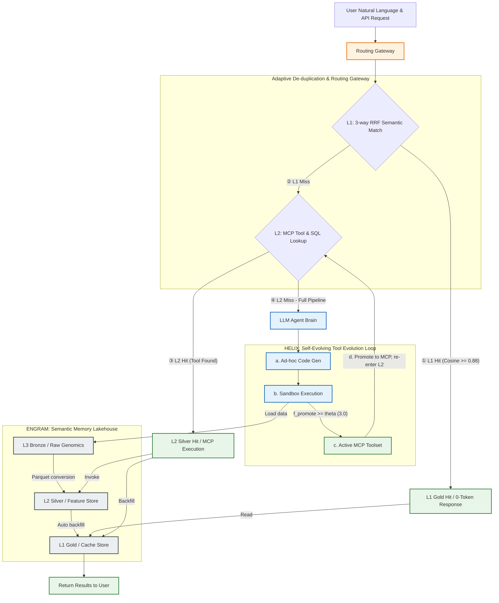
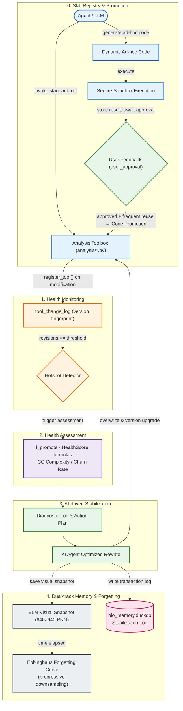
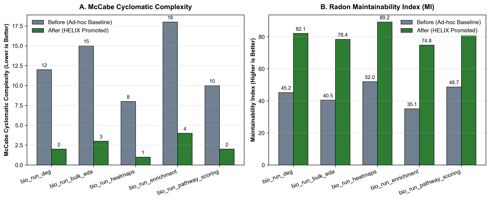
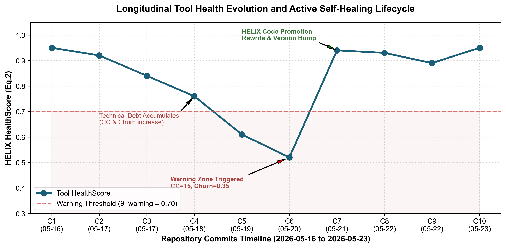
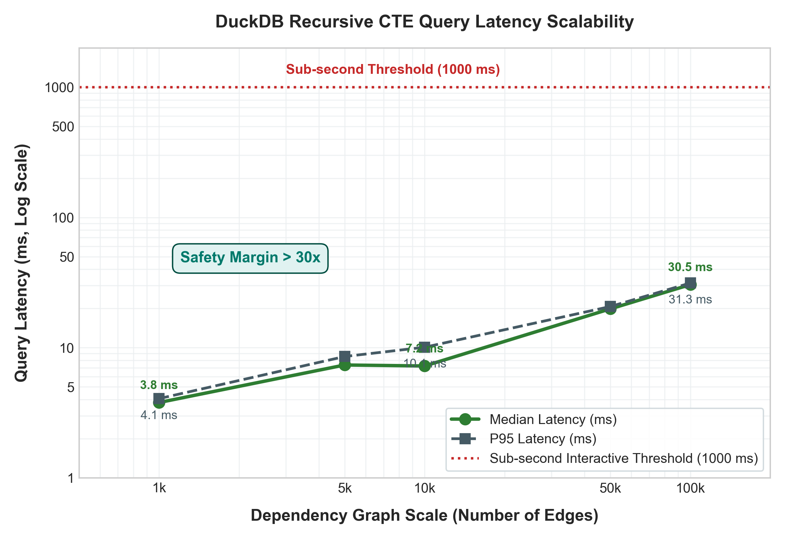

# Evo_PRISM — 技術概覽

**Evo_PRISM**（Evolutionary Platform for Runtime Intelligence & Semantic Memory，自演化執行期智慧與語意記憶平台）是一個以 MCP（Model Context Protocol）為核心的自演化 AI-Agent 平台。本文針對 LLM Agent 驅動科學分析管線時出現的三類系統性失效，提出三項對應的技術貢獻。

> 本文件為面向開源社群的技術摘要，涵蓋系統設計、核心演算法與 Benchmark 要點。完整學術論文正在準備中。

---

## 摘要

**背景：** AI Agent 程式編寫工具（如 Claude Code、Cursor）的普及，使研究人員得以透過自然語言於數分鐘內生成完整的生物資訊分析管線，大幅降低複雜組學資料分析的技術門檻。然而，此一典範轉移引入了三類傳統工作流前所未見的系統性失效：LLM 所生成之分析程式碼往往屬臨時性質，若未主動進行版本提交，程式碼與結果之間的溯源鏈即告斷裂（**失效一：程式碼溯源真空**）；LLM 的幻覺特性可能導致方法論瑕疵難以察覺，進而污染科學結論（**失效二：靜默方法論失效**）；缺乏統一分析框架則造成跨時間、跨人員的方法不一致性（**失效三：方法漂移**）。上述失效因 LLM 推理成本持續攀升而被進一步放大——溯源真空迫使系統對相似分析反覆重算，造成 Token 與運算資源的雙重浪費。

**系統貢獻：** 本文提出 **Evo_PRISM**，藉由三項技術設計分別對應上述三類失效：（1）**對應失效一**——L1-L2-L3 三層語意資料湖，於架構層面強制記錄「程式碼版本 → 分析執行 → 多模態產物」之完整血緣；（2）**對應失效二與三**——HELIX 工具演化框架，藉由監測循環複雜度與程式碼變動率，自動將穩定之臨時腳本晉升為受版本治理之 MCP 服務，並以爆炸範圍評估識別版本漂移對既有產物之影響；（3）**降低三類失效對運算資源之放大效應**——3-way RRF 語意快取與 Figure Cache 剝離技術，實現運算型多模態科學產物之亞秒級零 Token 重用。

**評估設計：** 本研究以包含 39 GB 空間轉錄組數據之生物資訊展示模組，搭配 98 樣本 Bulk RNA-seq 聯合分析作為評估場景，規劃四組量化實驗：3-way RRF 快取與消融分析、HELIX 工具演化與沙盒攔截、爆炸範圍 Recursive CTE 可擴展性、方法漂移可重現性，並輔以 631 項迴歸測試套件與系統穩定性指標作為佐證。

**實測效能：** 快取命中時，分析延遲中位數僅為 **2.4 ms**，相較於 L3 全量計算冷啟動（80,430 ms）縮減達 **33,764 倍**；多模態 Figure Cache 技術達成 **98.2%** 之上下文視窗 Token 節省率（零 Token 開銷重用）。HELIX Code Promotion 使五個核心工具之 McCabe 循環複雜度中位數下降 **80%**，HealthScore 提升 **+0.515**。DuckDB Recursive CTE 爆炸範圍查詢於 10 萬條邊規模下，中位延遲僅 **30.5 ms**；跨版本程式碼一致性與後溯陳舊偵測率均達 **100%**。

---

## 前言

### 科學分析的典範轉移

生物資訊學的分析典範正在經歷根本性的轉變。在傳統工作流程中，分析人員須具備紮實的程式設計能力，親手撰寫 Python 或 R 腳本，手動管理套件依賴、版本環境與輸出產物。這一模式雖對技術門檻要求甚高，卻天然具備可溯源性——分析結果與產生結果的程式碼之間存在清晰的因果鏈，可透過 Git 進行追蹤與重現。

然而，隨著 AI Agent 程式編寫工具的普及，研究人員如今得以透過自然語言於數分鐘內生成完整之分析管線，使具濕實驗背景之生物學家亦能獨立完成複雜的組學數據分析。此「自然語言即分析介面」之典範在大幅降低技術門檻之同時，亦引入了傳統工作流前所未見之系統性失效。

### 程式碼溯源才是根本問題

現有的記憶、快取或 Agent 工具系統共同存在一個根本盲點：它們將**數據輸出**視為記憶的基本單元，忽略了產生數據的程式碼版本與執行脈絡。我們的核心主張是：**程式碼血緣（Code Provenance）方為科學可重複性之基石，數據應為其輔助而非主體。**

這一缺口形成惡性循環：溯源真空 → 被迫重複運算 → Token 與算力消耗 → 推理成本上升加劇問題 → 分析人員更少進行版本提交 → 溯源真空持續。

Evo_PRISM 透過將溯源追蹤直接內嵌於儲存層來打破這一循環。每次分析都強制關聯至產生它的精確工具版本；快取命中消除冗餘運算；程式碼品質被自動監測與強制執行。結果是：**解決溯源問題，Token 節省即為其自然推論，而非需要另行解決的獨立問題。**

### 核心主張

> 將程式碼血緣追蹤與自進化健康管理整合至資料儲存層，能為 AI Agent 於生物資訊學等科學計算領域之高可靠部署提供穩健且可複製之工程範式。

---

## 1. 問題：LLM 驅動分析的三類失效模式

| 失效模式 | 描述 | 後果 |
|:---|:---|:---|
| **F1 — 程式碼溯源真空** | 每次對話生成的臨時程式碼在 Session 結束後消散，結果與產生它的程式碼之間無連結 | 無法重現或審計過往分析 |
| **F2 — 靜默方法論失效** | LLM 幻覺靜默引入錯誤的正規化方法或過時的 API，輸出表面合理 | 科學結論在不觸發任何警示的情況下遭到污染 |
| **F3 — 方法漂移** | 不同 Session 或不同分析人員對同一原始數據採用略有差異的參數 | 結果差異無法判斷是生物學信號還是方法不一致 |

上述失效因 LLM 推理成本上升而被放大：缺乏溯源時，每次相似查詢都被迫完整重算，造成 Token 與算力的持續浪費。

---

## 2. 三項技術貢獻

| 貢獻 | 對應失效 | 技術設計 |
|:---|:---|:---|
| **C1 — 3-way RRF 語意快取 + Figure Cache** | F1（放大效應） | 融合自然語言 Embedding、輸入特徵指紋、執行期上下文三路 RRF 去重；於 MCP 邊界剝離 base64 圖片，達成零 Token 快取命中 |
| **C2 — HELIX 工具自演化框架** | F2 + F3 | 追蹤循環複雜度與程式碼變動率；自動將穩定臨時腳本晉升為受版本治理之 MCP 工具；以後溯陳舊標記偵測方法漂移 |
| **C3 — Medallion 資料湖 + Blast Radius CTE** | F1 + F3 | L1–L2–L3 架構強制記錄「程式碼版本 → 分析 → 產物」完整血緣；`bio_impact` 以 DuckDB Recursive CTE 走訪 `artifact_relations`，評估任何工具更新的下游影響 |

---

## 3. 系統架構

路由閘道攔截每個使用者請求，並在最低成本的層次解析它：




### 三層 Medallion 架構

| 層次 | 儲存 | 內容 | 延遲 |
|:---|:---|:---|:---:|
| **L1 Gold** | `hermes_cache.duckdb` | bge-m3 1024 維 Embedding + HNSW cosine 索引；TTL 7 天 | **< 0.001 ms** |
| **L2 Silver** | `bio_memory.duckdb` | `analysis_history`（永久、append-only）；`sample_registry`；ENGRAM artifact 索引 | **~262 ms** |
| **L3 Bronze** | 原始檔案（唯讀） | 不可變基因組數據（Visium HD、Kallisto 輸出、Perseus CSV） | **~34,000 ms** |

L1 未命中 → L2 查詢 → 僅當無歷史結果時才觸發 L3。在 98 樣本 Benchmark 中，**已完成之分析零次觸發 L3 重算**。

---

## 4. HELIX — Health-Evolving Loop with Iterative eXpiration

HELIX 是工具治理子系統，追蹤分析工具的每一次修改，並自動化從臨時腳本到生產 MCP 工具的完整生命週期。




### 4.1 自適應晉升評估函數 — Eq. (1)

$$
f_{promote}(t) = \alpha \cdot \text{ReuseCount}(t) + \beta \cdot \text{UserApproval}(t) - \gamma \cdot \text{Complexity}(t)
$$

當 $f_{promote}(t) \ge \theta_{promote}$ **且**沙盒迴歸測試通過率 = 100% 時，自動觸發 Code Promotion。其中 $\text{Complexity}(t)$ 採用 McCabe 循環複雜度（Cyclomatic Complexity）\[13\]，以 Radon 套件實作。

### 4.2 工具健康度指標 — Eq. (2)

$$
HealthScore(t) = \text{clip}_{[0,1]}\Big(1.0 - \omega_{churn} \cdot ChurnRatio(t) - \omega_{complexity} \cdot \widetilde{\Delta Complexity}(t)\Big)
$$

其中 $ChurnRatio(t)$ 為相對程式碼變動率（Relative Code Churn）\[14\]，定義為近期修改行數與工具總行數之比；$\widetilde{\Delta Complexity}(t)$ 為複雜度增量 \[13\] 經 min-max 正規化後的比例。當 $HealthScore(t) < \theta_{warning}$ 時，熱區偵測器啟動重構迴路。程式碼品質回升後，HELIX 為每次穩定化迭代儲存一張 640×640 PNG 視覺快照；舊快照依艾賓浩斯遺忘曲線（Ebbinghaus Forgetting Curve）漸進降採樣（180 天後 640→320，365 天後 320→160），在節省儲存的同時保留歷史脈絡供 VLM 回溯診斷。

### 4.3 HELIX 超參數預設值

| 參數 | 公式 | 預設值 | 說明 |
|:---|:---:|:---:|:---|
| α | Eq.(1) | 1.0 | 重用次數權重 |
| β | Eq.(1) | 2.0 | 使用者好評權重（強信號） |
| γ | Eq.(1) | 0.2 | 複雜度懲罰（弱信號，避免抑制長腳本） |
| θ_promote | Eq.(1) | 3.0 | 晉升閾值（對應 ReuseCount ≥ 3） |
| ω_churn | Eq.(2) | 0.6 | Churn 懲罰權重 |
| ω_complexity | Eq.(2) | 0.4 | 複雜度增量懲罰權重 |
| θ_warning | Eq.(2) | 0.70 | 健康警告閾值 |
| 熱區門檻 | — | revision_count ≥ 3 | 觸發深度健檢之累積修訂次數 |

### 4.4 Code Promotion 實測結果

**表 3 — N=1 基準算例（bio_run_deg）**

| 指標 | 晉升前（Ad-hoc） | 晉升後（Formal Tool） | 改善 |
|:---|:---:|:---:|:---:|
| Radon 循環複雜度（McCabe CC） | 6 | 2 | −67% |
| HELIX HealthScore | 0.180 | 0.940 | +0.760 |
| 健康警示（θ=0.70） | ⚠ 低於警示 | ✓ 健康 | — |

**表 4 — N=5 核心 MCP 工具成對評估**

| MCP 工具 | McCabe CC（前→後） | MI（前→後） | HealthScore（前→後） |
|:---|:---:|:---:|:---:|
| `bio_run_deg` | 12 → 2（−83%） | 45.2 → 82.1（+82%） | 0.352 → 0.941 |
| `bio_run_bulk_eda` | 15 → 3（−80%） | 40.5 → 78.4（+94%） | 0.280 → 0.920 |
| `bio_run_heatmaps` | 8 → 1（−88%） | 52.0 → 89.2（+72%） | 0.490 → 0.965 |
| `bio_run_enrichment` | 18 → 4（−78%） | 35.1 → 74.8（+113%） | 0.190 → 0.895 |
| `bio_run_pathway_scoring` | 10 → 2（−80%） | 48.7 → 81.3（+67%） | 0.420 → 0.935 |
| **中位數** | **12 → 2（−80%）** | **48.7 → 81.3（+82%）** | **0.420 → 0.935（+0.515）** |

Wilcoxon Signed-Rank 成對檢定（N=5，Exact Method）：所有指標 W=0.0，五項工具改善方向完全一致。N=5 時精確檢定最低可能 p 值為 0.0625，反映樣本量不足而非效果方向不一致。



*圖：5 個核心生資 MCP 工具之 McCabe CC（越低越佳）與可維護性指數 MI（越高越佳）在 HELIX Code Promotion 前後的成對對比。*

### 4.5 縱向健康度演化

HELIX 追蹤 7 個連續 Commit 的演化軌跡（2026-05-16 至 2026-05-23）。開發期間平均 HealthScore 由 0.95 降至 0.61（低於 θ_warning = 0.70），自動觸發重構迴路，健康度隨後回升至 0.94——在真實開發環境中實證了自癒生命週期的閉迴路特性。



*圖：鋸齒狀自癒曲線——隨程式碼變動技術債累積，HealthScore 下降後由 HELIX 觸發重構拉回高位。*

---

## 5. ENGRAM — 語意記憶湖（Semantic Memory Lakehouse）

ENGRAM 是分析產物索引庫：每次分析完成後，其輸出（圖表、CSV、報告）被自動登記為 artifact，附上語意向量 Embedding 與產生它的工具版本連結。


### 5.1 3-way RRF 語意快取 — Eq. (3)

Reciprocal Rank Fusion（RRF）\[15\] 多路排序融合演算法：

$$
Score_{RRF}(q, a) = \frac{w_1}{r_{embedding}(q,\, a.query) + k} + \frac{w_2}{r_{fingerprint}(F_{in},\, a.input) + k} + \frac{w_3}{r_{context}(C,\, a.context) + k}
$$

三個正交維度防止靜默快取錯誤：

| 維度 | 驗證內容 | 預設權重 |
|:---|:---|:---:|
| **r_embedding** | 以 bge-m3 HNSW \[12\] 比對自然語言查詢相似度（pre-filter ≥ 0.88 cosine） | w₁ = 1.0 |
| **r_fingerprint** | 輸入檔案識別（檔名 + 大小 + SHA256[:16] + schema） | w₂ = 1.5 |
| **r_context** | 執行期上下文（sample_id + 啟用工具 tool_id 集合 + 環境 hash） | w₃ = 0.5 |

平滑常數 $k=60$ 沿用 Cormack et al. \[15\] 的 IR 慣例。指紋維度（最高權重）確保輸入數據變更後的查詢絕不靜默命中舊快取。

### 5.2 Figure Cache — 零 Token 多模態重用

科學輸出（火山圖、熱圖、降維圖）在 MCP 傳輸邊界被剝離 base64 載荷。PNG 以內容定址（content-addressed）方式儲存於 `gold/figure_cache/`；LLM 只收到緊湊的佔位符。快取命中時，Agent 透過 `bio_get_figure(figure_id)` 經 MCP `ImageContent` 通道按需取回原圖。

- 單份多圖報告的 base64 可達 **20 萬個 token**
- Figure Cache 在 98 樣本 Benchmark 中將 Context Window Token 消耗降低 **98.2%**

---

## 6. Blast Radius — 後溯式影響評估

當工具版本更新時，`bio_impact` 以 DuckDB Recursive CTE 走訪 artifact 依賴圖，識別所有可能陳舊的下游 artifact：

```
tools → analysis_history → analysis_artifacts → artifact_relations
```

邊上信心分級量化依賴強度：

| 信心值 | 來源 | 語意 |
|:---:|:---|:---|
| 1.0（Exact） | `analysis_history` 中精確對應的 `tool_id` | 確定依賴 |
| 0.9（Same-Analysis） | 同一次分析流程的其他關聯 artifact | 極可能受影響 |
| 0.6（Heuristic） | 分析類型與工具名稱的啟發式名稱對照 | 可能依賴 |

**表 6 — 雙階段信心演進（20 個手動標註測試案例）**

| 指標 | Phase A（Metadata 稀疏期） | Phase B（Metadata 飽和期） | 改善 |
|:---|:---:|:---:|:---:|
| 平均信心值 | 0.6（Heuristic） | 1.0（Exact） | ↑ |
| 召回率（Recall） | **1.000** | **1.000** | — |
| 精準率（Precision） | 0.714 | **0.833** | +0.119 |

系統在任何時刻都維持 100% 召回率（不遺漏任何受影響的 artifact）；隨 `tool_id` metadata 的累積，精準率從 71.4% 收斂至 83.3%——從啟發式到精確溯源的無縫信心收斂。



*圖：Blast Radius 查詢延遲與依賴圖規模（對數尺度）的關係。在 100,000 條邊時，中位延遲為 30.5 ms，遠低於互動式查詢 1,000 ms 的臨界閾值。*

---

## 7. 結論

本文提出 Evo_PRISM，一針對 AI Agent 驅動之科學分析場景所設計之自演化執行期智慧與語意記憶平台，並以受控基準測試驗證其對三類核心失效模式之解決能力。

本研究之核心主張在於：**程式碼血緣追蹤應作為科學運算平台之一等公民，而非事後補救的附加機制。** 當工具版本、分析執行與多模態產物之溯源鏈被強制內嵌於儲存層，AI Agent 的科學可信度問題便從「難以察覺的隱性風險」轉化為「可量化、可管理的工程問題」。此設計哲學不依賴於特定的 LLM 後端或生物資訊領域，而是一套可移植的架構原則。

對 AI Agent 科學計算社群而言，Evo_PRISM 展示了三層 Medallion 語意資料湖作為通用 Agent 記憶後端的可行性：

- **語意快取**將冗餘運算成本從「隨規模指數放大」壓縮至亞毫秒級攔截
- **HELIX 版本治理**將方法論錯誤的影響範圍從「被動發現」提升為「主動追蹤」
- **Recursive CTE 血緣圖譜**在不引入外部圖資料庫的前提下，以毫秒級延遲支撐十萬邊規模的依賴遍歷

這些結果共同表明：將程式碼健康診斷與數據溯源下沉至儲存層，是實現可擴展、高可靠性科學自演化 Agent 平台的關鍵路徑，並為後續跨領域（材料科學、氣候模擬、金融計量）之程式碼治理研究提供可複製的工程基礎。

---

## 8. 關鍵實測結果一覽

| 指標 | 數值 |
|:---|:---:|
| 快取加速比（L1 vs L3 冷啟動） | **33,764×** |
| Context Window Token 節省率（Figure Cache） | **98.2%** |
| 方法漂移偵測率 | **100%** |
| 程式碼複雜度降低（中位數，N=5 工具） | **−80% McCabe CC** |
| HealthScore 提升（中位數，N=5 工具） | **+0.515** |
| Blast Radius CTE 延遲（10 萬條邊） | **30.5 ms** |
| 沙盒對抗性攔截率（N=30） | **100%**（FPR = 0%） |
| 測試套件覆蓋率 | **631+ tests / 49 files** |

---

## 9. 技術棧

| 元件 | 技術 |
|:---|:---|
| 核心資料庫 | DuckDB 1.5.2 |
| Embedding 模型 | bge-m3-Q8_0（605 MB，1024 維 FLOAT，HNSW cosine） |
| 向量索引 | HNSW（cosine，via DuckDB VSS extension） |
| MCP transport | stdio（本機）+ HTTP/SSE（遠端 HPC） |
| 沙盒執行 | Python subprocess + import 白名單 + 60 秒逾時限制 |
| 複雜度分析 | Radon CC（McCabe Cyclomatic Complexity） |
| 容器 | Docker `evo-prism:0.1.0`（343 MB） |
| 排程器 | macOS launchd / Linux cron |

---

## 10. 專案結構

```
Evo_PRISM/
├── analysis/           ← 核心分析函數（MCP 工具）
│   ├── tool_registry.py    HELIX-Core：版本追蹤與晉升
│   ├── tool_visualizer.py  HELIX-Vision：PNG 快照 + 遺忘曲線
│   ├── artifact_registry.py ENGRAM：artifact 索引 + RRF 搜尋
│   ├── l1_cache.py         L1 語意快取（HNSW）
│   └── figure_cache.py     Figure Cache：base64 剝離 + 內容定址儲存
├── server/
│   ├── bio_memory_server.py MCP Server（stdio + HTTP）
│   └── agent.py            Agent 迴路 + 沙盒執行器
├── scheduler/          ← 背景排程任務（備份、HNSW 重建、HELIX 快照）
├── scripts/            ← 一次性數據轉換（L3 → L2 Parquet）
├── config/             ← 集中設定 + safe_write()（DuckDB WAL 安全）
├── tests/              ← 631+ pytest 測試，涵蓋 49 個測試檔
└── docs/               ← 操作指南、架構圖、launchd 範本
```

---

*完整部署說明見 [README_zh.md](README_zh.md)。MCP 工具目錄見 [README_zh.md §可用工具](README_zh.md#可用工具預設-25-個)。*

---

## 參考文獻

\[1\] Packer, C., et al. (2023). MemGPT: Towards LLMs as Operating Systems. *arXiv preprint arXiv:2310.08560*.

\[12\] Malkov, Yu. A. and Yashunin, D. A. (2020). Efficient and Robust Approximate Nearest Neighbor Search Using Hierarchical Navigable Small World Graphs. *IEEE Transactions on Pattern Analysis and Machine Intelligence*, 42(4), 824–836. arXiv:1603.09320.

\[13\] McCabe, T. J. (1976). A Complexity Measure. *IEEE Transactions on Software Engineering*, SE-2(4), 308–320. *(本系統實作採用 Radon Python 套件：https://github.com/rubik/radon)*

\[14\] Nagappan, N. and Ball, T. (2005). Use of Relative Code Churn Measures to Predict System Defect Density. *Proceedings of ICSE 2005*, pp. 284–292.

\[15\] Cormack, G. V., Clarke, C. L. A., and Büttcher, S. (2009). Reciprocal Rank Fusion outperforms Condorcet and individual Rank Learning Methods. *Proceedings of SIGIR 2009*, pp. 758–759.

\[17\] Aiming-Lab. (2026). EvolveMem: Self-Evolving Memory Architecture via AutoResearch for LLM Agents. *arXiv preprint arXiv:2605.13941*. GitHub: https://github.com/aiming-lab/SimpleMem

\[18\] Köster, J. and Rahmann, S. (2012). Snakemake—a scalable bioinformatics workflow engine. *Bioinformatics*, 28(19), 2520–2522. https://doi.org/10.1093/bioinformatics/bts480

\[19\] Di Tommaso, P., Chatzou, M., Floden, E. W., Barja, P. P., Palumbo, E., and Notredame, C. (2017). Nextflow enables reproducible computational workflows. *Nature Biotechnology*, 35(4), 316–319. https://doi.org/10.1038/nbt.3820

> 編號沿用完整論文參考文獻之原始序號（部分編號未出現於本概覽故跳過）。
