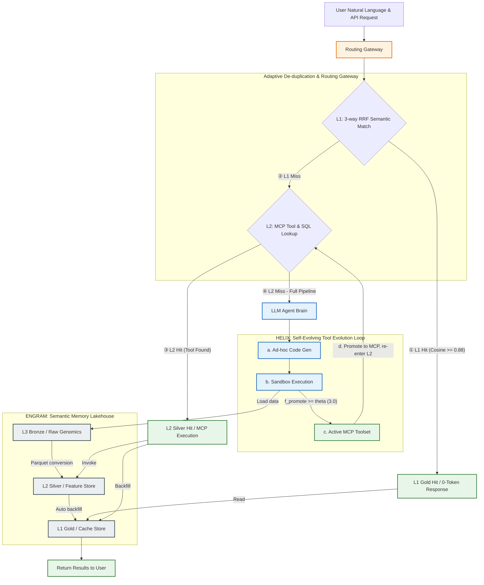
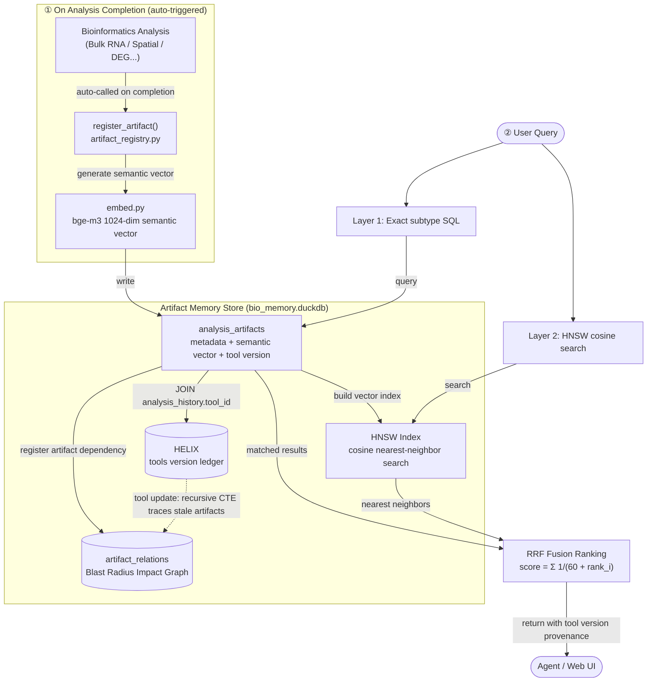

# Evo_PRISM — Technical Overview

**Evo_PRISM** (Evolutionary Platform for Runtime Intelligence & Semantic Memory) is a self-evolving AI-Agent platform built around the Model Context Protocol (MCP). It addresses three systematic failure modes that emerge when LLM agents drive scientific analysis pipelines, and proposes three technical contributions to solve them.

> This document is a technical summary for the open-source community. It covers system design, key algorithms, and benchmark highlights. A full academic manuscript is in preparation.

---

## 1. Problem: Three Failure Modes in LLM-Driven Analysis

| Failure Mode                                  | Description                                                                                                                 | Consequence                                                               |
| :-------------------------------------------- | :-------------------------------------------------------------------------------------------------------------------------- | :------------------------------------------------------------------------ |
| **F1 — Code Provenance Vacuum**        | Ad-hoc code generated per conversation is lost after the session ends; no link between result and the code that produced it | Cannot reproduce or audit past analyses                                   |
| **F2 — Silent Methodological Failure** | LLM hallucinations silently introduce wrong normalization or stale APIs; outputs look plausible                             | Scientific conclusions corrupted without warning                          |
| **F3 — Methodological Drift**          | Different sessions or analysts apply slightly different parameters to the same raw data                                     | Results diverge; impossible to attribute differences to biology vs method |

These failures are amplified by LLM inference cost: without provenance, every similar query forces a full re-run — wasting tokens and compute.

---

## 2. Three Technical Contributions

| Contribution                                            | Addresses          | What it does                                                                                                                                                                                                        |
| :------------------------------------------------------ | :----------------- | :------------------------------------------------------------------------------------------------------------------------------------------------------------------------------------------------------------------ |
| **C1 — 3-way RRF Semantic Cache + Figure Cache** | F1 (amplification) | Fuses NL embedding, input fingerprint, and runtime context via Reciprocal Rank Fusion to deduplicate queries; strips base64 figures at the MCP boundary to achieve zero-token cache hits                            |
| **C2 — HELIX Tool Evolution Framework**          | F2 + F3            | Tracks cyclomatic complexity and code churn; automatically promotes stable ad-hoc scripts to versioned MCP tools; detects methodological drift with retrospective stale-analysis marking                            |
| **C3 — Medallion Lakehouse + Blast Radius CTE**  | F1 + F3            | L1–L2–L3 architecture enforces full `code version → analysis → artifact` lineage; `bio_impact` uses DuckDB Recursive CTE to traverse `artifact_relations` and assess downstream impact of any tool update |

---

## 3. System Architecture

The routing gateway intercepts every user request and resolves it at the lowest-cost layer available:




### Three-Layer Medallion Architecture

| Layer               | Store                   | Contents                                                                                  |       Latency       |
| :------------------ | :---------------------- | :---------------------------------------------------------------------------------------- | :------------------: |
| **L1 Gold**   | `hermes_cache.duckdb` | 1024-dim bge-m3 embeddings + HNSW cosine index; TTL 7 days                                | **< 0.001 ms** |
| **L2 Silver** | `bio_memory.duckdb`   | `analysis_history` (permanent, append-only); `sample_registry`; ENGRAM artifact index |  **~262 ms**  |
| **L3 Bronze** | Raw files (read-only)   | Immutable genomics data (Visium HD, Kallisto output, Perseus CSV)                         | **~34,000 ms** |

L1 miss → L2 lookup → L3 only if no prior result exists. In the 98-sample benchmark, **zero L3 re-runs were triggered** for previously completed analyses.

---

## 4. HELIX — Health-Evolving Loop with Iterative eXpiration

HELIX is the tool governance subsystem. It tracks every modification to an analysis tool and automates the lifecycle from ad-hoc script to production MCP tool.


### 4.1 Adaptive Promotion Function — Eq. (1)

$$
f_{promote}(t) = \alpha \cdot \text{ReuseCount}(t) + \beta \cdot \text{UserApproval}(t) - \gamma \cdot \text{Complexity}(t)
$$

Promotion triggers when $f_{promote}(t) \ge \theta_{promote}$ **and** sandbox regression pass rate = 100%.

### 4.2 Tool Health Score — Eq. (2)

$$
HealthScore(t) = \text{clip}_{[0,1]}\Big(1.0 - \omega_{churn} \cdot ChurnRatio(t) - \omega_{complexity} \cdot \widetilde{\Delta Complexity}(t)\Big)
$$

When $HealthScore(t) < \theta_{warning}$, the hotspot detector activates a refactoring loop. After code quality recovers, HELIX saves a 640×640 PNG visual snapshot per stabilization iteration; old snapshots are progressively downsampled following an Ebbinghaus forgetting curve (640→320 after 180 days, 320→160 after 365 days) to reduce storage while preserving historical context for VLM review.

### 4.3 HELIX Hyperparameters

| Parameter         | Formula |       Default       | Description                                                |
| :---------------- | :-----: | :-----------------: | :--------------------------------------------------------- |
| α                | Eq.(1) |         1.0         | Reuse count weight                                         |
| β                | Eq.(1) |         2.0         | User approval weight (strong signal)                       |
| γ                | Eq.(1) |         0.2         | Complexity penalty (weak, avoids suppressing long scripts) |
| θ_promote        | Eq.(1) |         3.0         | Promotion threshold (triggers at ReuseCount ≥ 3)          |
| ω_churn          | Eq.(2) |         0.6         | Churn penalty weight                                       |
| ω_complexity     | Eq.(2) |         0.4         | Complexity delta penalty weight                            |
| θ_warning        | Eq.(2) |        0.70        | Health warning threshold                                   |
| Hotspot threshold |   —   | revision_count ≥ 3 | Triggers deep health assessment                            |

### 4.4 Code Promotion Results

**Table 3 — N=1 baseline (bio_run_deg)**

| Metric                 |  Before (Ad-hoc)  | After (Formal Tool) | Improvement |
| :--------------------- | :----------------: | :-----------------: | :---------: |
| McCabe CC              |         6         |          2          |    −67%    |
| HELIX HealthScore      |       0.180       |        0.940        |   +0.760   |
| Health alert (θ=0.70) | ⚠ Below threshold |     ✓ Healthy     |     —     |

**Table 4 — N=5 core MCP tools (paired evaluation)**

| MCP Tool                    | McCabe CC (before→after) |      MI (before→after)      |    HealthScore (before→after)    |
| :-------------------------- | :-----------------------: | :---------------------------: | :-------------------------------: |
| `bio_run_deg`             |      12 → 2 (−83%)      |      45.2 → 82.1 (+82%)      |          0.352 → 0.941          |
| `bio_run_bulk_eda`        |      15 → 3 (−80%)      |      40.5 → 78.4 (+94%)      |          0.280 → 0.920          |
| `bio_run_heatmaps`        |      8 → 1 (−88%)      |      52.0 → 89.2 (+72%)      |          0.490 → 0.965          |
| `bio_run_enrichment`      |      18 → 4 (−78%)      |     35.1 → 74.8 (+113%)     |          0.190 → 0.895          |
| `bio_run_pathway_scoring` |      10 → 2 (−80%)      |      48.7 → 81.3 (+67%)      |          0.420 → 0.935          |
| **Median**            | **12 → 2 (−80%)** | **48.7 → 81.3 (+82%)** | **0.420 → 0.935 (+0.515)** |

Wilcoxon Signed-Rank test (N=5, Exact): W=0.0 across all metrics — all 5 tools improved in the same direction. The minimum achievable p-value at N=5 is 0.0625, reflecting sample size rather than effect direction inconsistency.


*Figure: McCabe CC (lower is better) and Maintainability Index (higher is better) for 5 core bioinformatics MCP tools, before and after HELIX Code Promotion.*

### 4.5 Longitudinal Health Evolution

HELIX was tracked across 7 consecutive commits (2026-05-16 to 2026-05-23). Mean HealthScore dropped from 0.95 to 0.61 during active development (below θ_warning = 0.70), automatically triggering the refactoring loop, which recovered health to 0.94 — demonstrating the self-healing lifecycle in a real development environment.


*Figure: Sawtooth self-healing curve — HealthScore drops as code churn accumulates, then recovers after HELIX-triggered refactoring.*

---

## 5. ENGRAM — Semantic Memory Lakehouse

ENGRAM is the artifact index: every completed analysis registers its outputs (figures, CSVs, reports) as artifacts with a semantic embedding vector and a link to the tool version that produced them.




### 5.1 3-way RRF Semantic Cache — Eq. (3)

$$
Score_{RRF}(q, a) = \frac{w_1}{r_{embedding}(q,\, a.query) + k} + \frac{w_2}{r_{fingerprint}(F_{in},\, a.input) + k} + \frac{w_3}{r_{context}(C,\, a.context) + k}
$$

Three orthogonal dimensions prevent silent cache errors:

| Dimension               | What it checks                                                  | Default weight |
| :---------------------- | :-------------------------------------------------------------- | :------------: |
| **r_embedding**   | NL query similarity via bge-m3 HNSW (pre-filter ≥ 0.88 cosine) |   w₁ = 1.0   |
| **r_fingerprint** | Input file identity (filename + size + SHA256[:16] + schema)    |   w₂ = 1.5   |
| **r_context**     | Runtime context (sample_id + active tool_id set + env hash)     |   w₃ = 0.5   |

The fingerprint dimension (highest weight) ensures a query with changed input data never silently hits a stale cached result.

### 5.2 Figure Cache — Zero-Token Multimodal Reuse

Scientific outputs (volcano plots, heatmaps, dimensionality reduction) are stripped of their base64 payload at the MCP boundary. The PNG is stored content-addressed in `gold/figure_cache/`; the LLM receives only a compact placeholder. On cache hit, the agent retrieves the original image on-demand via `bio_get_figure(figure_id)` through MCP's `ImageContent` channel.

- A single multi-figure report can carry 200,000+ tokens of base64
- Figure Cache reduces context-window token consumption by **98.2%** in the 98-sample benchmark

---

## 6. Blast Radius — Retrospective Impact Assessment

When a tool is updated, `bio_impact` walks the artifact dependency graph using a DuckDB Recursive CTE to identify all downstream artifacts that may be stale:

```
tools → analysis_history → analysis_artifacts → artifact_relations
```

Edge confidence levels encode how strong the dependency evidence is:

|     Confidence     | Source                                                         | Interpretation       |
| :-----------------: | :------------------------------------------------------------- | :------------------- |
|     1.0 (Exact)     | Precise `tool_id` match in `analysis_history`              | Definite dependency  |
| 0.9 (Same-Analysis) | Other artifacts from the same analysis run                     | Very likely affected |
|   0.6 (Heuristic)   | Name-based matching (e.g.`bulk_eda` → `bio_run_bulk_eda`) | Possible dependency  |

**Table 6 — Dual-phase confidence evolution (20 hand-labelled test cases)**

| Metric          | Phase A (sparse metadata) | Phase B (saturated metadata) | Change |
| :-------------- | :-----------------------: | :--------------------------: | :----: |
| Mean confidence |      0.6 (Heuristic)      |         1.0 (Exact)         |   ↑   |
| Recall          |      **1.000**      |       **1.000**       |   —   |
| Precision       |           0.714           |       **0.833**       | +0.119 |

The system maintains 100% Recall at all times (no affected artifact is missed). Precision improves as `tool_id` metadata accumulates — a graceful convergence from heuristic to exact provenance.


*Figure: Blast Radius query latency vs. dependency graph size (log scale). At 100,000 edges the median latency is 30.5 ms — well below the 1,000 ms interactive threshold.*

---

## 7. Key Results at a Glance

| Metric                                        |              Value              |
| :-------------------------------------------- | :-----------------------------: |
| Cache speedup (L1 vs L3 cold start)           |       **33,764×**       |
| Context-window token savings (Figure Cache)   |         **98.2%**         |
| Methodological drift detection rate           |         **100%**         |
| Code complexity reduction (median, N=5 tools) |    **−80% McCabe CC**    |
| HealthScore improvement (median, N=5 tools)   |        **+0.515**        |
| Blast Radius CTE latency at 100k edges        |        **30.5 ms**        |
| Sandbox adversarial intercept rate (N=30)     |    **100%** (FPR = 0%)    |
| Test suite coverage                           | **631+ tests / 49 files** |

---

## 8. Technology Stack

| Component           | Technology                                             |
| :------------------ | :----------------------------------------------------- |
| Core database       | DuckDB 1.5.2                                           |
| Embedding model     | bge-m3-Q8_0 (605 MB, 1024-dim FLOAT, HNSW cosine)      |
| Vector index        | HNSW (cosine, via DuckDB VSS extension)                |
| MCP transport       | stdio (local) + HTTP/SSE (remote HPC)                  |
| Sandbox execution   | Python subprocess with import whitelist + 60 s timeout |
| Complexity analysis | Radon CC (McCabe Cyclomatic Complexity)                |
| Container           | Docker `evo-prism:0.1.0` (343 MB)                    |
| Scheduler           | macOS launchd / Linux cron                             |

---

## 9. Repository Structure

```
Evo_PRISM/
├── analysis/           ← Core analysis functions (MCP tools)
│   ├── tool_registry.py    HELIX-Core: version tracking & promotion
│   ├── tool_visualizer.py  HELIX-Vision: PNG snapshots + forgetting curve
│   ├── artifact_registry.py ENGRAM: artifact indexing + RRF search
│   ├── l1_cache.py         L1 semantic cache (HNSW)
│   └── figure_cache.py     Figure Cache: base64 strip + content-addressed storage
├── server/
│   ├── bio_memory_server.py MCP Server (stdio + HTTP)
│   └── agent.py            Agent loop + sandbox executor
├── scheduler/          ← Background tasks (backup, HNSW rebuild, HELIX snapshots)
├── scripts/            ← One-time data transformation (L3 → L2 Parquet)
├── config/             ← Settings + safe_write() for DuckDB WAL safety
├── tests/              ← 631+ pytest tests across 49 files
└── docs/               ← Guides, architecture diagrams, launchd templates
```

---

*For full deployment instructions, see [README.md](README.md). For the MCP tool catalogue, see [README.md §Available Tools](README.md#available-tools-17-by-default).*
