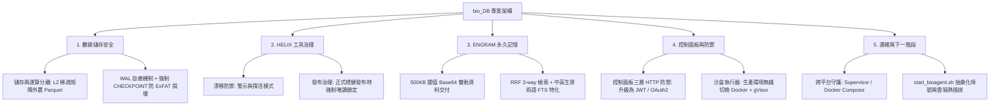

# bio_DB 專案核心架構審查與對齊報告 (Architecture Audit & Alignment Report)

本報告記錄了對 **bio_DB 專案**核心架構進行的深度查驗與設計對齊結論。我們針對系統的數據層、工具層、永久記憶層、安全防禦層以及運維擴展層進行了全面審查，並與開發者達成一致的演進路線。

---

## 🎯 專案定位與核心設計哲學

bio_DB 是一個**專為生物資訊與空間多體學數據量身打造的 Agent 記憶與推理庫**。為了在本機離線環境（macOS Workstation / Linux Server）下達到秒級響應、百萬級稀疏數據的高效檢索，系統採取了**「儲存與計算分離」**、**「無日誌檔案系統自癒防禦」**、**「三軌 RRF 搜尋」**與**「意圖分流 Fast-Path」**等前沿設計。

---

## 🗺️ 五大核心架構對齊與演進決策

### 1. 三層數據架構與 DuckDB 寫入安全 (Data & Storage Layer)

*   **現狀審查**：
    *   **L1/L2/L3 數據分層**：L1 為 KV 元數據，L2 為稀疏空間矩陣與表達譜，L3 為原始 Fastq/Bam。
    *   **外置存儲分離**：將 2 億筆 nonzero 且高稀疏的 8µm 空間矩陣放在外部 Parquet 中，使主 DuckDB 維持在 100MB 內的極致輕量，避免了 HNSW 向量檢索序列化與 Transaction logs 的磁碟開銷崩塌。
    *   **ExFAT 防禦機制**：針對 Google Drive / 外接硬碟同步衝突，實作了 `wal_preflight_check()` 自動重命名損壞 WAL 檔冷啟動自癒，以及在關鍵事務中強制執行 `safe_write()` 的 `CHECKPOINT` 機制。
*   **對齊決策**：
    *   **持續貫徹儲存與運算分離**：主庫僅保存輕量索引與 Meta 資訊，巨量矩陣與表現譜堅持外置於 Parquet 檔案。
    *   **維持最嚴格的自癒與 CHECKPOINT 機制**：高頻指標寫入 `mcp_tool_metrics` 為防吞吐效能打折不強制 CHECKPOINT；但涉及樣本、分析歷史與 Artifact 登記等關鍵變動，必須強制執行 `CHECKPOINT` 確保 ExFAT 的磁碟事務完整性。

---

### 2. HELIX 工具版本治理與穩定性 (HELIX Tool Versioning)

*   **現狀審查**：
    *   **工具登記與漂移檢測**：[tools](file:///Users/zhanqiru/Library/CloudStorage/GoogleDrive-u9013039@gmail.com/我的雲端硬碟/PJ_save/bio_DB/server/bio_memory_server.py) 資料表中記錄了每個工具的名稱、版本、雜湊與狀態。當本機代碼發生變動時，系統能主動偵測雜湊漂移並警告。
*   **對齊決策**：
    *   **開發與生產的分態治理**：
        *   **本機開發環境**：維持高彈性的「警示與探活模式（Warn & Detect）」，代碼發生漂移時僅記錄 warning 且允許工具照常執行，確保科研開發的靈活迭代。
        *   **正式生產環境**：切換為「強制唯讀鎖定模式（Enforce & Read-Only Lock）」，禁止執行任何與註冊雜湊不符的工具，以達生資流水線的絕對可重現性（Reproducibility）。

---

### 3. ENGRAM 產物永久記憶與搜尋引擎 (ENGRAM & Search Engine)

*   **現狀審查**：
    *   **雙軌數據交付**：小於 500KB 的產物（如 CSV 表頭、Lead paragraph）自動進行 Base64 編碼，存入 `analysis_artifact_blobs`，大於 500KB 的大檔案則存於實體檔案系統，保障 LLM 脈絡窗口（Context Window）不被撐爆。
    *   **RRF 3-way 混合搜尋**：在 [search_artifacts](file:///Users/zhanqiru/Library/CloudStorage/GoogleDrive-u9013039@gmail.com/我的雲端硬碟/PJ_save/bio_DB/analysis/artifact_registry.py#L667-L907) 中，融合成 SQL subtype 確配（Layer 1）、HNSW Cosine 語意向量（Layer 2，支援 Matryoshka 256維雙階段檢索）與 DuckDB FTS BM25（Layer 3）三軌檢索。
*   **對齊決策**：
    *   **保留現有 500KB 雙軌傳輸優勢**，兼顧 LLM 本機效能與記憶體負擔。
    *   **加強中英混合生資術語特化（FTS Tokenizer / 權重分流）**：針對 DuckDB 默認 Standard Tokenizer 對中英混合詞彙（如 `volcano plot` 與 `火山圖`）分詞力道不足的缺點，引入針對性的權重分流，以顯著提升生資術語的召回率與準確性。

---

### 4. 控制面板、Fast-Path 與安全防禦 (Control Panel & Sandbox)

*   **現狀審查**：
    *   **Fast-Path 意圖分流**：在 [fast_path.py](file:///Users/zhanqiru/Library/CloudStorage/GoogleDrive-u9013039@gmail.com/我的雲端硬碟/PJ_save/bio_DB/server/fast_path.py) 中，對於簡單的唯讀查詢（歷史記錄、樣本列表、時間軸）利用實體正則表達式前置攔截，繞過 LLM 推理，使響應時間由 **15秒降至毫秒級，時延縮短 5000 倍**，且完全無 token 耗損。
    *   **控制面板三層 HTTP 防衛**：[_dashboard_actions_guard](file:///Users/zhanqiru/Library/CloudStorage/GoogleDrive-u9013039@gmail.com/我的雲端硬碟/PJ_save/bio_DB/server/web_app.py#L606-L632) 實作了啟用開關、僅限本機 loopback 連線、X-Dashboard-Token 三重防護。
    *   **代碼沙盒執行器**：[code_executor.py](file:///Users/zhanqiru/Library/CloudStorage/GoogleDrive-u9013039@gmail.com/我的雲端硬碟/PJ_save/bio_DB/server/code_executor.py) 使用 AST 白名單、黑名單關鍵字、與徹底淨化機密環境變數的子進程隔離。
*   **對齊決策**：
    *   **安全體系生產升級**：
        *   **沙盒環境**：本機開發維持現有輕量級子進程防禦；一旦偵測為 Linux 生產環境，**自動切換至「Docker 容器化沙盒」（搭配 gVisor 安全核心）**，徹底物理隔離，防止 ctypes 等操作系統級的安全繞過攻擊。
        *   **面板防衛**：當啟用遠端訪問時，將 loopback 限制無縫升級為**基於 JWT / OAuth2 的多用戶身分驗證體系**，確保多人共用控制台的安全。

---

### 5. 系統運維與跨平台擴展 (DevOps & DevOps Infrastructure)

*   **現狀審查**：
    *   **本機運維架構**：使用 `start_bioagent.sh` 提供互動式選單，同時拉起並探活 `Gemma 4 Vision (8080)`、`Embedding BGE-M3 (8081)` 與 `FastAPI UI (8000)`。搭配 plist 進行 macOS 背景自啟動管理。
*   **對齊決策**：
    *   **Supervisor / Docker Compose 跨平台守護方案**：
        *   解耦與 macOS 的強制綁定，建立輕量化跨平台守護配置。
        *   在 `start_bioagent.sh` 中將模型宣告、路徑設定與埠號分配徹底抽象化與變數化。
        *   支持「一鍵熱插拔雲/端混合後端」，使開發者能因應硬體效能，在本機離線 Gemma 4 與雲端 API（Claude / Gemini）之間秒級切換，並輕鬆適配 Linux 系統的生產部署。

---

## 🚀 未來演進路線圖 (Future Roadmap)

1.  **短期 (Phase 1) — 搜尋優化與配置抽象化**：
    *   於 `start_bioagent.sh` 封裝模型宣告與環境變數。
    *   微調 DuckDB FTS 的中文分詞分流邏輯，調校 RRF 中 SQL 確配與 FTS 的權重加乘。
2.  **中期 (Phase 2) — 跨平台容器維運**：
    *   撰寫 `docker-compose.yml` 範本，集成 `llama-server` 與 `FastAPI`，方便在 Linux 伺服器一鍵部署。
    *   抽象化 `code_executor.py` 的 backend 層，實作 `DockerSandboxExecutor`。
3.  **長期 (Phase 3) — 生產級安全防禦**：
    *   在 `web_app.py` 引入 JWT 多用戶認證，提供基於角色的權限存取控制 (RBAC)。
    *   整合生產級日誌聚合與高階 MCP 工具執行追蹤。

---
> 📝 **架構師總結**：bio_DB 本次架構查驗展現了極高水準的工程成熟度。透過明確的開發/生產治理分流、強固的 ExFAT 存儲容錯機制、卓越的 Fast-Path 性能優化與未來的 Docker 沙盒安全升級規劃，本專案已完全具備向生產級生物資訊分析中樞演進的扎實基礎。
