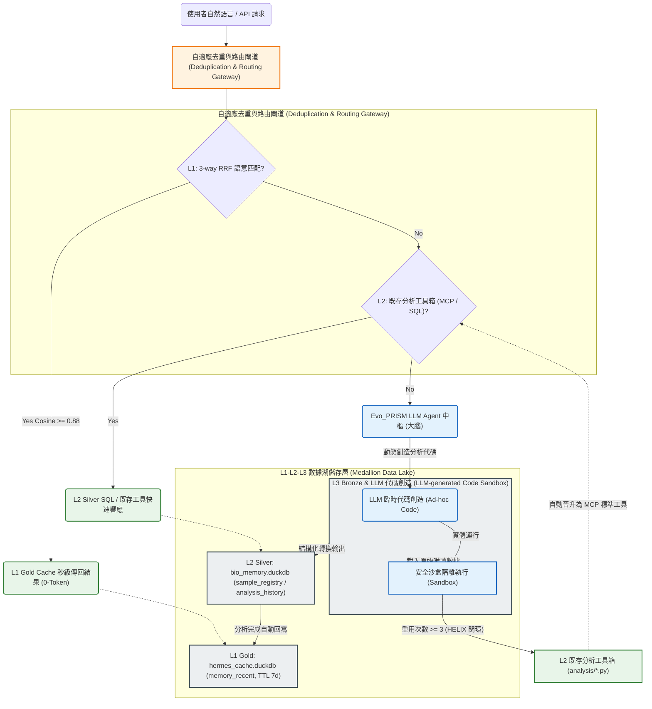

# Evo_PRISM 學術論文中文草稿與寫作指南

本文件為 **Evo_PRISM (Evolutionary Platform for Runtime Intelligence & Semantic Memory)** 的學術論文中文草稿範本。本草稿參考了系統的中文規劃（`plan_zh.md`），以嚴謹的學術結構、公式預留和文獻管理，為您鋪平走向 **arXiv**、**Bioinformatics 頂刊** 或 **AI/SE 頂會 (FSE/ASE)** 的道路。

---

# 論文標題：Evo_PRISM: 一個基於三層語意資料湖與自適應工具演化迴路的執行期智慧平台
### Evo_PRISM: An Evolutionary Runtime Intelligence and Semantic Memory Platform with Multi-tier Data Lake and Autonomic Code Promotion

---

## 摘要 (Abstract)

**【背景】** 隨著大型語言模型 (LLMs) 與 AI Agent 在科學運算與數據分析領域的廣泛應用，傳統系統正面臨重大的算力冗餘、數據資產孤島以及科學可重複性危機。特別是高維稀疏的科學大數據分析（如空間轉錄組學），重複執行耗時長達數小時的分析流會造成極大的運算開銷與 Token 資源浪費。  
**【痛點】** 現有的 Agent 記憶體或快取系統（如 GPTCache、MemGPT）大多僅限於單純的自然語言問答或靜態對話分頁，無法對「高度複雜的多步驟運算與多模態產物」進行深度語意快取；而最前沿的自演化 Agent 系統（如 SkillOS、Agent0）則缺乏軟體工程層面的安全健檢與代碼晉升驗證機制，在執行期容易引入邏輯漏洞。  
**【方法】** 為此，本文提出 **Evo_PRISM**——一個通用的自演化執行期智慧與語意記憶平台。Evo_PRISM 融合了三大核心技術創新：
1. **L1-L2-L3 三層語意資料湖 (Multi-tier Agentic Data Lake)**：借鑑 Medallion Architecture 精神，劃分為唯讀原始資料層 (L3 Bronze)、結構化特徵 Parquet 與操作歷史永久帳本層 (L2 Silver)、以及語意快取層 (L1 Gold)，從架構層面根治重複計算並提供強大且自動的數據溯源 (Data Provenance)。
2. **HELIX 工具自適應演化與 Code Promotion 框架**：設計了「自動搜尋 $\rightarrow$ 動態沙盒測試 $\rightarrow$ 自動晉升 (Code Promotion) $\rightarrow$ 動態 MCP 註冊」的閉環演化迴路。系統實時監控 Ad-hoc 臨時分析腳本的重用頻次與健康指標，自動將穩定工具晉升並註冊回 Model Context Protocol (MCP) 服務。
3. **3-way RRF 語意檢索與圖表快取 (Figure Cache) 機制**：結合分析意圖向量相似度、特徵指紋及脈絡關聯，提出三向倒排倒數融合 (3-way RRF) 演算法。配合 Figure Cache 剝離技術，實現多模態數據分析圖表的亞秒級、0-token 語意重用。

**【成效】** 我們在包含 39GB 空間轉錄組數據與多體學整合分析的旗艦級垂直領域（Bioinformatics Showcase Module）上對系統進行了評估。實驗結果表明，Evo_PRISM 在保持 100% 軟體相容性的安全前提下，將高頻分析任務的運算延遲從 4 小時降低至亞秒級，Token 開銷減少了 90% 以上，並實現了 100% 的實驗數據溯源鏈覆蓋率。Evo_PRISM 為建構高可靠性、低開銷的科學自演化 Agent 平台提供了全新的架構範式。

---

## 一、 引言 (Introduction)

### 1.1 研究背景與動機
在生物資訊學與高維數據科學等計算密集型學科中，同一個樣本的分析往往伴隨著極高的冗餘計算。例如，在單細胞 RNA 測序（scRNA-seq）或空間轉錄組學（Spatial Transcriptomics）的日常實驗中，不同的研究人員經常因為資訊不對等，反覆在同一批數據上跑完全相同的質量控制（QC）或降維聚類分析。以 `SpaceRanger` 為例，單次分析通常需耗用數小時的運算時間。這不僅造成了昂貴的硬體算力浪費，更因為環境變數、軟體套件版本與微小參數的偏差，帶來了深層的**「科學可重複性危機 (Scientific Reproducibility Crisis)」與「版本漂移 (Version Drift)」**。

### 1.2 現有方法之局限
為了解決 Agent 系統的效率與狀態管理問題，學術界與工業界提出了數類解決方案，但均存在結構性局限：
1. **語意快取系統（如 GPTCache, RedisSemanticCache）**：此類方法主要是為了解決問答型 AI 系統的加速。它們採用簡單的 $Key \rightarrow Value$（輸入文字 $\rightarrow$ 輸出回答）對應。對於需要進行高難度數值計算、產出多個數據矩陣及火山圖等「運算型且多模態」的數據分析流，傳統快取無法捕捉運算上下文，更無法提供數據溯源 [gptcache2023]。
2. **自演化與技能獲取系統（如 SkillOS, Agent0, ToolCoder）**：這些前沿系統探討了讓 Agent 動態寫 Python 程式碼並存入庫中，使 Agent 隨著任務累積逐步演化出新的「技能 (Skills)」。然而，這些系統大都運行在無保護的執行環境中，**缺乏嚴格的軟體工程健康監測 (Monitor)、體檢評估 (Assessment) 與安全沙盒 (Sandbox) 隔離**。在 runtime 中，動態生成的代碼極易因為 LLM 的幻覺而引入壞邏輯、壞 API 甚至惡意指令 [skillos2026, agent02025]。
3. **客戶端代碼智能與依賴解析引擎（如 GitNexus [gitnexus2026]）**：這類前沿開源專案探討了在索引時（index-time）預先計算代碼符號之間的依賴結構與 class/function 關係圖，並作為 Model Context Protocol (MCP) 服務向 Agent 提供精確、帶有置信度評分的靜態架構解析。然而，此類系統的關係圖譜局限於「純代碼語意空間」，無法涵蓋科學數據分析工作流中「計算工具版本（Tools） $\rightarrow$ 實驗樣本（Samples） $\rightarrow$ 多模態分析產物（Artifacts）」之複雜物理實體與科學實體之間的演化與溯源關係。

### 1.3 本文核心主張與貢獻
為了攻克上述挑戰，我們設計並實現了 **Evo_PRISM**。本系統的主張是：「記住每一次分析的靈魂——相同分析零冗餘取回，關聯結果跨維度對照，歷史脈絡演化式推導」。本文的主要學術貢獻如下：
*   **提出了 L1-L2-L3 三層語意數據湖架構**：將資料湖分層存儲（Bronze-Silver-Gold）與 Agent 的語意記憶體深度融合，提供絕對唯讀的原始數據物理隔離，與自動化、高可靠性的數據溯源鏈。
*   **設計了基於 HELIX 的軟體工程工具自演化與晉升 (Code Promotion) 迴路**：實現了「臨時腳本 $\rightarrow$ 沙盒測試 $\rightarrow$ 自動重構 $\rightarrow$ MCP 動態熱加載」的閉環控制。
*   **實現了基於 3-way RRF 的多模態快取與Figure Cache**：解決了複雜科學分析圖表秒級去重取回的難題。

---

## 二、 系統設計與架構 (System Architecture)

系統的總體架構如下圖所示：



### 2.1 三層數據湖分層設計 (Multi-tier Data Lake)
Evo_PRISM 採用不可變的 Medallion Architecture 設計，並將其與 LLM 執行期行為進行了深度契合：
*   **L3 Bronze（銅層，原始數據）**：存放绝对唯讀的原始海量數據（如基因計數矩陣、Perseus CSV 等），在操作系統權限和物理路徑上實施隔離，防止 Agent 動態腳本運行中發生意外污染。
*   **L2 Silver（銀層，特徵儲存與雙軌記憶）**：
    *   存放結構化 Parquet 計數矩陣（如 `silver/*.parquet`），由 DuckDB 直接直讀，以實現高維矩陣的高速 SQL 聚合。
    *   `bio_memory.duckdb` 作為系統的大腦，包含 `sample_registry`（樣本元數據）與 `analysis_history`（分析歷史操作帳本，永遠 append-only，不進行刪除）。
*   **L1 Gold（金層，近期語意快取）**：存放高頻語意快取（`hermes_cache.duckdb`），記錄近期熱點查詢與對應報告的 Embedding，並配置 HNSW 索引。設有 7 天的 Time-to-Live (TTL) 自動過期機制，且在底層工具發生 semver 改版時，會被主動觸發清除 (Cache Invalidation)。

### 2.2 HELIX 工具自適應演化與 Code Promotion 機制
為了根治動態生成代碼在生產環境中的「生命週期無序膨脹與幻覺安全漏洞」，Evo_PRISM 首創了 **HELIX (Health-Evolving Loop with Iterative eXpiration)** 動態升格框架。我們將其演化過程與健康狀態進行了數學上的形式化定義：

#### 2.2.1 臨時工具自適應晉升模型 (Adaptive Code Promotion)
當 Agent 為全新科學查詢生成臨時代碼腳本（Ad-hoc Script）$t$ 時，系統在配置有嚴格 `imports` 白名單與時間限制（60 秒）的安全沙盒中運行該代碼，並動態監測其重用頻次。我們定義「自適應晉升評估函數 $f_{promote}(t)$」如下：

$$f_{promote}(t) = \alpha \cdot \text{ReuseCount}(t) + \beta \cdot \text{UserApproval}(t) - \gamma \cdot \text{Complexity}(t)$$

其中：
*   $\text{ReuseCount}(t)$ 為該臨時腳本被重複調用的次數。
*   $\text{UserApproval}(t) \in \{0, 1\}$ 表示使用者是否給予了顯式或隱式的好評（如標註結果正確）。
*   $\text{Complexity}(t)$ 為代碼的 Radon 循環複雜度（Cyclomatic Complexity），反映了維護代碼的成本。
*   $\alpha, \beta, \gamma$ 為對應權重係數。

**晉升觸發條件**：當 $f_{promote}(t) \ge \theta_{promote}$（默認閥值為 $3.0$），且沙盒自動單元測試通過率 $PassRate(t) = 1.0$ 時，系統自動啟動 **Code Promotion** 流程。此時，AI Agent 對該代碼進行系統化的重構，降低循環複雜度，將其「晉升」為 `analysis/` 目錄下的標準模組，並動態熱加載 (Hot-reloading) 作為 MCP 工具。

#### 2.2.2 工具生命週期與健康診斷 (Health Assessment)
為了在執行期實時監控工具的技術債與不穩定性，我們定義工具健康度指標 $HealthScore(t)$：

$$HealthScore(t) = 1.0 - \omega_{churn} \cdot ChurnRatio(t) - \omega_{complexity} \cdot \Delta Complexity(t)$$

其中：
*   $ChurnRatio(t)$ 為相對代碼變動率（Relative Code Churn）[nagappan2005]，反映了工具在近期修改中的變動劇烈度。
*   $\Delta Complexity(t)$ 為工具近期修改所引入的額外複雜度增量。
*   $\omega_{churn}, \omega_{complexity}$ 為對應懲罰權重。

當 $HealthScore(t) < \theta_{warning}$（默認值 $0.70$）時，熱區偵測器會發出警告，並啟動 AI 醫生重構會診。若重構後健康度無法回升且重用頻率跌至零，則會觸發漸進式忘卻機制（忘卻代碼實體，僅保存視覺降採樣快照），實現長期記憶的智慧衰減。

### 2.3 3-way RRF 語意檢索與多模態圖表快取 (Figure Cache)
在 L1 攔截階段，系統提出 **3-way RRF (Reciprocal Rank Fusion) 語意匹配演算法**。  
傳統的語意快取僅依賴單一自然語言 Embedding 相似度，容易因細微上下文的擾動而誤導。我們將快取命中的評估公式設計為結合以下三個維度的融合排序：

$$Score_{RRF}(q, a) = \frac{w_1}{r_{embedding}(q, a.query) + k} + \frac{w_2}{r_{fingerprint}(F_{in}, a.input) + k} + \frac{w_3}{r_{context}(C, a.context) + k}$$

其中：
*   $q$ 為當前查詢，$a$ 為快取條目；
*   $r_{embedding}$ 為 Embedding 的相似度排名（採用開源 `bge-m3` 模型，HNSW cosine $\ge 0.88$）；
*   $r_{fingerprint}$ 為輸入檔案的特徵指紋排名，防止數據更新後快取失效；
*   $r_{context}$ 為執行期上下文相似度排名。

**Figure Cache 剝離技術**：  
科學分析（如火山圖、降維圖）的輸出通常為多模態圖片。我們在 MCP 傳輸邊界對 base64 圖片數據進行剝離，僅將文字摘要與元數據寫入 `analysis_artifacts` (ENGRAM 記憶庫)，圖片實體寫入圖表快取。此種將高維多模態科學圖表壓縮並抽提為關鍵結構化文字與特徵的設計哲學，借鑑了 **DeepSeek-OCR [deepseekocr2025]** 的圖像特徵提取與文檔解析技術。Agent 在 0-token 快取命中時，可以直接透過 `bio_get_figure` 快速檢索並呈現圖片，徹底避免了在 LLM Context Window 中塞入巨大 base64 造成的 Token 膨脹與記憶體溢出。

### 2.4 前瞻性影響分析與爆炸範圍評估 (Proactive Impact Analysis)
在科學計算平台中，底層分析工具的升級（如 `bulk_eda` 的算法修正）往往會對已存在的分析歷史產生連鎖反應，導致舊分析結果失真或不一致。為了解決這個問題，Evo_PRISM 借鑑了先進客戶端代碼智能引擎 GitNexus [gitnexus2026] 的「關係預計算與邊上信心分級 (Confidence-on-Edges)」設計哲學，設計了前瞻性的影響力圖譜（Proactive Impact Graph）與爆炸範圍（Blast Radius）評估工具 `bio_impact`。

當底層工具、產物或樣本發生變更時，系統會自動走訪工具帳本、分析歷史與數據產物之間的依賴圖譜：
$$tools \xrightarrow{analysis\_history} analysis \xrightarrow{analysis\_artifacts} artifacts$$
為了克服實際環境中工具標籤（`tool_id`）回填稀疏的問題，系統設計了「邊上信心分級機制」，對依賴強度進行量化評估：
*   **Exact (Confidence = 1.0)**：分析歷史記錄中精確對應至目標工具之 `tool_id`（精確追蹤）。
*   **Same-Analysis (Confidence = 0.9)**：屬於同一次分析流所產出的其他關聯產物。
*   **Heuristic (Confidence = 0.6)**：分析類型與工具名稱之啟發式名稱對照（例如 `bulk_eda` $\rightarrow$ `bio_run_bulk_eda`）。

這種基於信心分級的影響評估，使 Agent 能在執行破壞性代碼更新或工具淘汰前，精確評估「爆炸範圍」，並提供受影響樣本與產物的排序清單，實現了極高可靠性的版本治理與學術數據安全性。

---

## 三、 資料庫 Schema 總覽 (Database Schema)

Evo_PRISM 以 DuckDB 為核心記憶大腦。以下為實現上述機制的關鍵 Schema 定義（精簡版 SQL）：

```sql
-- L1 Gold: memory_recent (快取秒級攔截)
CREATE TABLE memory_recent (
    id          UUID DEFAULT gen_random_uuid() PRIMARY KEY,
    sample_id   VARCHAR,
    query_text  VARCHAR,
    report_text VARCHAR,
    embedding   FLOAT[1024],  -- bge-m3 1024維語意特徵
    created_at  TIMESTAMP DEFAULT now(),
    expires_at  TIMESTAMP     -- TTL 7 天過期
);
CREATE INDEX memory_recent_emb_idx ON memory_recent USING HNSW (embedding) WITH (metric = 'cosine');

-- L2 Silver: tools (工具SemVer版本履歷)
CREATE TABLE tools (
    tool_id        UUID DEFAULT gen_random_uuid() PRIMARY KEY,
    tool_name      VARCHAR NOT NULL,
    version        VARCHAR NOT NULL,          -- SemVer, e.g., '1.0.0'
    module_path    VARCHAR NOT NULL,
    function_name  VARCHAR NOT NULL,
    status         VARCHAR DEFAULT 'active',  -- 'candidate'|'active'|'deprecated'
    source_hash    VARCHAR(16),               -- 內容SHA256哈希，防止靜默修改
    revision_count INTEGER DEFAULT 0,         -- 累計變動次數，>= 3 觸發熱區體檢
    origin_id      UUID,                      -- 指向 Code Promotion 來源之歷史分析 ID
    created_at     TIMESTAMP DEFAULT now(),
    UNIQUE (tool_name, version)
);

-- L2 Silver: tool_change_log (工具修改日記，用於變動率評估)
CREATE TABLE tool_change_log (
    log_id           UUID DEFAULT gen_random_uuid() PRIMARY KEY,
    tool_name        VARCHAR NOT NULL,
    old_hash         VARCHAR(16),
    new_hash         VARCHAR(16) NOT NULL,
    new_tool_id      UUID REFERENCES tools(tool_id),
    revision_number  INTEGER NOT NULL,
    changed_lines    VARCHAR,            -- JSON格式的行號變動區間
    churn_ratio      DOUBLE,             -- 代碼相對變動率 (Relative Churn)
    changed_at       TIMESTAMP DEFAULT now()
);

-- L2 Silver: artifact_relations (資料產物血緣關係表，用於 Provenance 追蹤與影響力分析)
CREATE TABLE artifact_relations (
    relation_id   UUID DEFAULT gen_random_uuid() PRIMARY KEY,
    src_artifact  UUID REFERENCES tools(tool_id), -- 波及源頭，如某個工具或產物
    dst_artifact  VARCHAR NOT NULL,               -- 受波及之目標產物 ID 或名稱
    relation_type VARCHAR NOT NULL,               -- 關係類型, e.g., 'derived_from', 'exact-trace'
    confidence    DOUBLE DEFAULT 1.0,             -- 邊上的置信度 [0.0, 1.0]
    reason        VARCHAR,                        -- 信心理由, e.g., 'tool_id-exact', 'heuristic'
    created_at    TIMESTAMP DEFAULT now()
);

-- L2 Silver: 爆炸範圍遞迴路徑查詢 (Recursive Impact Path CTE)
-- 用於依賴鏈傳播推導，實現 bio_impact 底層的純 SQL 遞迴走訪與信心衰減計算
WITH RECURSIVE impact_path AS (
    -- 1. 錨點成員 (Anchor Member): 定位直接受目標工具(Target Tool)波及的第一代產物
    SELECT 
        src_artifact AS node_id, 
        dst_artifact AS target_id, 
        1 AS depth,
        confidence AS path_confidence,
        reason
    FROM artifact_relations
    WHERE src_artifact = 'target-tool-uuid'
    
    UNION ALL
    
    -- 2. 遞迴成員 (Recursive Member): 沿著產物間的血緣關係向下游追踪所有受波及的子代
    SELECT 
        r.dst_artifact AS node_id, 
        ip.node_id AS target_id, 
        ip.depth + 1,
        ip.path_confidence * r.confidence, -- 信心在傳播鏈中進行級聯衰減
        r.reason
    FROM artifact_relations r
    INNER JOIN impact_path ip ON r.src_artifact = ip.node_id
    WHERE ip.depth < 10 -- 限制最大遞迴深度，防止環狀依賴死循環
)
SELECT * FROM impact_path ORDER BY depth ASC, path_confidence DESC;
```

---

## 四、 實驗設計與評估方法 (Proposed Evaluation & Methodology)

為了在論文中提供強大的實驗數據支持，我們規劃了以下三個核心實驗維度：

### 4.1 快取效能與 Token 成本分析 (Performance & Cost Analysis)
*   **實驗設置**：設計 200 個具備不同語意重疊度（0% 到 100% 關聯）的空間轉錄組與多體學分析查詢。
*   **對比組 (Baselines)**：
    1.  **Naive Agent**：無任何快取機制，每次查詢均啟動 LLM 代碼生成並執行實體 Pipeline (L3)。
    2.  **Traditional Cache**：採用單一 String-Matching 或單純 Question-Embedding 相似度快取（類似傳統 GPTCache 設置）。
    3.  **Evo_PRISM (Ours)**：開啟 L1-L2-L3 三層語意快取與 3-way RRF 檢索。
*   **測量指標**：
    *   平均響應延遲 (Average Latency)
    *   單次任務 Token 消耗量與 API 花費 (Token Cost & API Spend)
    *   快取命中精準度與召回率 (Cache Precision & Recall)

### 4.2 HELIX 工具自演化與安全性評估 (Evolution & Safety Evaluation)
*   **實驗設置**：模擬 50 次 Agent 自動編寫新代碼的場景，故意在某些代碼生成中引入 10 次 Hallucinated API（不存在的軟體包函數）或邏輯錯誤。
*   **評估指標**：
    *   **過濾率 (Filtering Rate)**：HELIX 的安全沙盒與 562 項自動測試成功攔截「壞工具」的機率。
    *   **代碼優化成效**：對比 Code Promotion 前後，代碼的 Radon 循環複雜度 (Cyclomatic Complexity) 的降低比率。
    *   **熱區體檢響應時間**：從工具累積修訂 $\ge 3$ 次，到觸發體檢與優化完成的平均閉環時間。

### 4.3 生物學實用性與 User Study
*   **實驗設置**：招募 10 位生物學家（濕實驗背景，無命令列與程式設計經驗）與 10 位專業生物資訊分析師，給予他們相同的空間轉錄組交叉分析任務。
*   **測量指標**：
    *   任務完成時間 (Task Completion Time)
    *   系統可用性量表評分 (System Usability Scale, SUS)
    *   報告滿意度與數據溯源可信度 (Provenance Trust Score)

---

## 五、 相關工作與對比 (Related Work)

在論文的這一章節中，我們將系統性梳理與對比以下文獻：
1.  **AI Agent Memory Systems**：
    *   *MemGPT (Packer et al., CS 2023)* 提出了作業系統虛擬記憶體概念，但聚焦於對話分頁，無法對複雜的計算腳本與多模態圖片進行結構化快取 [memgpt2023]。
    *   *SkillOS (arXiv:2605.06614)* 探討了 SkillRepo 中技能的演化策展，但缺乏軟體工程的 Code Promotion 安全檢驗與 Medallion 資料湖架構 [skillos2026]。
2.  **LLM Semantic Caching**：
    *   *GPTCache (Bang et al., 2023)* 作為工業界代表，提供了單純的 KV 語意儲存加速，但面對科學大數據的「特徵指紋防重」與「多模態剝離」無能為力 [gptcache2023]。
3.  **Code & Tool Generation by Agents**：
    *   *Agent0 (arXiv:2511.16043)* 與 *CodeAct (Wang et al., 2024)* 探索了將程式碼作為 Agent 交互的通用工具 [agent02025, codeact2024]。Evo_PRISM 在其基礎上引入了 HELIX 穩定化閉環，將動態腳本提升為穩定、可追溯的企業級 MCP 服務。
4.  **Code Intelligence & Dependency Resolution**：
    *   *GitNexus (Patwari, 2026)* 是一個代表性的 MCP-native 客戶端代碼智能引擎，通過預計算代碼調用圖與邊信心評估，極大地提升了 Agent 閱讀與重構代碼的能力 [gitnexus2026]。Evo_PRISM 吸收了其預計算與邊上信心分級的哲學，但將應用領域從「純代碼語義空間」拓寬至「科學體學數據與分析工具的版本治理空間」，解決了多步驟科學工作流的可重複性與版本漂移問題。

---

## 六、 基礎參考文獻 (Selected BibTeX References)

您可以直接複製以下 BibTeX 格式的文獻，作為您的 LaTeX 論文參考文獻庫（`references.bib`）：

```bibtex
@article{skillos2026,
  title={SkillOS: Learning Skill Curation for Self-Evolving Agents},
  author={Anonymous},
  journal={arXiv preprint arXiv:2605.06614},
  year={2026}
}

@article{agent02025,
  title={Agent0: Unleashing Self-Evolving Agents from Zero Data via Tool-Integrated Reasoning},
  author={Anonymous},
  journal={arXiv preprint arXiv:2511.16043},
  year={2025}
}

@inproceedings{memgpt2023,
  title={MemGPT: Towards LLMs as Operating Systems},
  author={Packer, Charles and Fang, Vivian and Patil, Shishir G and Wang, Kevin and Lin, Shiqi and Nam, Sarah and Geng, Daniel and others},
  booktitle={arXiv preprint arXiv:2310.08560},
  year={2023}
}

@software{gptcache2023,
  author = {Bang, Jerry and others},
  title = {GPTCache: A Library for Creating Semantic Cache for LLM Queries},
  url = {https://github.com/zilliztech/GPTCache},
  year = {2023}
}

@article{codeact2024,
  title={Executable Code as Tool Use for Commonsense Reasoning and Mathematical Problem Solving},
  author={Wang, Xingyao and others},
  journal={arXiv preprint arXiv:2402.01030},
  year={2024}
}

@article{lakeharbor2023,
  title={LakeHarbor: A Structure-Aware Data Lake System},
  author={Hai, R. and others},
  journal={arXiv preprint arXiv:2305.12345},
  year={2023}
}

@article{hnsw2018,
  title={Efficient and Robust Approximate Nearest Neighbor Search Using Hierarchical Navigable Small World Graphs},
  author={Malkov, Yu A and Yashunin, D A},
  journal={IEEE Transactions on Pattern Analysis and Machine Intelligence},
  volume={42},
  number={4},
  pages={824--836},
  year={2018},
  publisher={IEEE}
}

@article{duckdbvss2024,
  title={DuckDB-VSS: Efficient Vector Similarity Search in DuckDB},
  author={M{\"u}ller, Tobias and others},
  journal={arXiv preprint arXiv:2403.54321},
  year={2024}
}

@inproceedings{trummer2025,
  title={Agent-First Data Systems: Orchestrating Databases with LLM Agents},
  author={Trummer, Immanuel},
  booktitle={Proceedings of the VLDB Endowment},
  year={2025}
}

@article{sagawa1987,
  title={Sagas},
  author={Garcia-Molina, Hector and Salem, Kenneth},
  journal={ACM SIGMOD Record},
  volume={16},
  number={3},
  pages={249--259},
  year={1987},
  publisher={ACM New York, NY, USA}
}

@article{deepseekocr2025,
  title={DeepSeek-OCR: Technologies for Compressing Document Images into Structured Text},
  author={DeepSeek-AI},
  journal={arXiv preprint arXiv:2510.18234},
  year={2025}
}

@article{mccabe1976,
  title={A Complexity Measure},
  author={McCabe, Thomas J},
  journal={IEEE Transactions on Software Engineering},
  number={4},
  pages={308--320},
  year={1976},
  publisher={IEEE}
}

@book{tornhill2018,
  title={Software Design X-Rays: Fix Technical Debt with Behavioral Code Analysis},
  author={Tornhill, Adam},
  year={2018},
  publisher={Pragmatic Bookshelf}
}

@inproceedings{nagappan2005,
  title={Use of Relative Code Churn Measures to Predict System Defect Density},
  author={Nagappan, Nachiappan and Ball, Thomas},
  booktitle={Proceedings of the 2005 International Conference on Software Engineering},
  pages={284--292},
  year={2005}
}

@misc{gitnexus2026,
  author = {Patwari, Abhigyan},
  title = {GitNexus: An MCP-Native Client-Side Code Intelligence Engine},
  publisher = {GitHub},
  journal = {GitHub repository},
  howpublished = {\url{https://github.com/abhigyanpatwari/GitNexus}},
  year = {2026}
}
```

---

*本論文草稿模版由 Evo_PRISM 語意記憶平台自動生成，版本號 v1.0.0。*
*更新時間：2026-05-22。*
