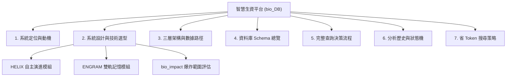
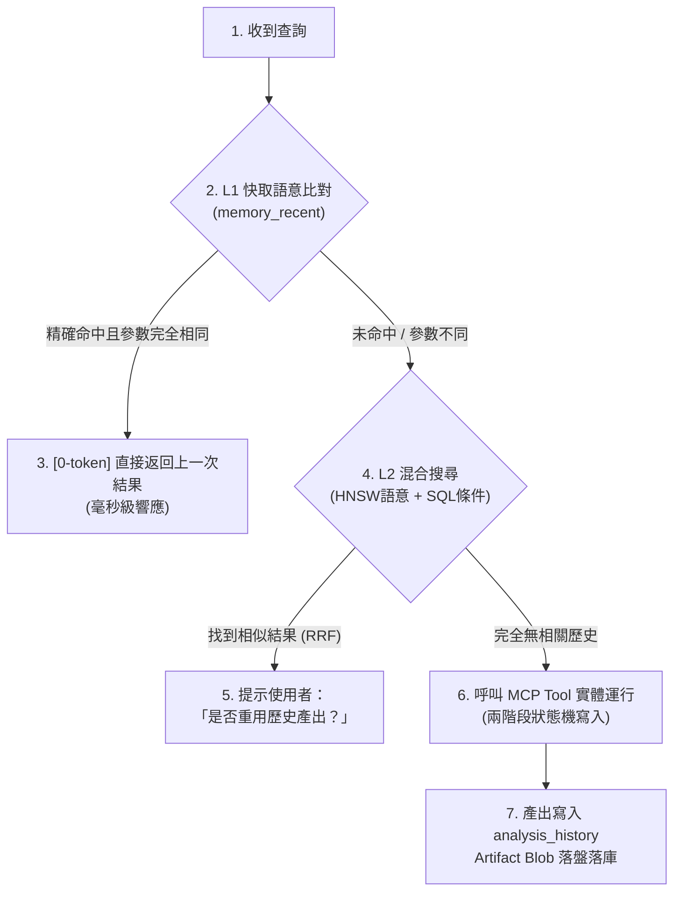

# 🧬 智慧生資分析平台 (bio_DB) — 系統規劃架構整理報告

這份報告是針對 [[plan_zh.md](file:///Users/zhanqiru/Library/CloudStorage/GoogleDrive-u9013039@gmail.com/我的雲端硬碟/PJ_save/bio_DB/plan_zh.md)] 的深度架構整理，提煉了這套「實驗室生資智慧分析系統」的核心骨架、運作機制與獨創模組。

---

## 📌 一分鐘核心亮點導讀

> [!NOTE]
> **本系統的終極目標**：為實驗室打造一個**「有長期記憶、能自我診療程式碼、且超省 Token」**的智慧生資分析助手。它徹底解決了傳統 LLM 生資分析中「分析工具易過時、重複程式碼氾濫、視覺圖表遺失、以及 context 費用高昂」的痛點。

---

## 🗺️ 系統核心骨架大綱



---

## 🚀 三大核心原創模組

### 1. HELIX (健康演化與穩定重構閉環)
HELIX 是一套**代碼健康自驅動修復機制**，它不依賴人工，能自動讓工具越用越好、越用越穩。

* **運作機制（四部曲）**：
  1. **健康監測 (Monitor)**：修改程式會自動觸發 `register_tool()` 並記錄變更。若工具在短時間內被修改 $\ge 3$ 次，或調用出錯，將被標記為**熱區工具（Hotspot）**。
  2. **多維度評估 (Assessment)**：同時並行計算當前代碼的 **Radon 循環複雜度 (CC)**、**相對變動率 (Churn Ratio)** 與 **行級變動 (X-Ray)**，彙整至「評估中心 (Evaluation Hub)」。
  3. **AI 診療 (Stabilization)**：AI 醫生看著檢查報告與歷史脈絡，擬定計畫重構代碼，優化後覆蓋並升級版本。
  4. **記憶忘卻 (Memory & Decay)**：將診療當下的代碼熱圖、CC 儀表板等拍成 `640x640` 的 PNG 視覺快照。隨時間推移進行**漸進式降採樣（320p ➔ 160p）**，利用「遺忘曲線」在保留歷史大體輪廓的同時，節省 VLM 的 Token 消耗。

---

### 2. ENGRAM (產出物索引與雙軌記憶)
ENGRAM 解決了分析所產生的**圖表與二進位報告（PDF/Excel）如何被 LLM 高效記住與檢索**的問題。

* **語意與關係雙軌檢索**：
  * **Layer 1**：精確的 Subtype SQL 參數硬核對。
  * **Layer 2**：透過 `BGE-M3` 向量模型產生 1024 維度語意向量，在 DuckDB 中利用 HNSW 索引進行 Cosine 近鄰語意搜尋。
  * 透過 **RRF (Reciprocal Rank Fusion)** 演算法進行混合排名，精準召回最相關的分析歷史。
* **物理儲存優化**：
  * 對於小於 500 KB 的圖表/報告，以 `inline blob` 直接落盤快取到 `analysis_artifact_blobs` 表中，避免頻繁的磁碟 I/O。
* **版本溯源綁定**：
  * 每份產出（Artifact）都與產生它的 `tools.content_hash` 精確 JOIN，確保能判別分析差異是來自「生物學樣本」還是「工具版本漂移」。

---

### 3. bio_impact (前瞻性爆炸範圍評估)
吸收了 **Confidence-on-Edges (邊上的信心分級)** 精神，解決了生資工具升級時的風險控管問題。

* **爆炸範圍 (Blast Radius)**：
  當分析工具面臨升級、重構或廢棄時，系統能秒級推導出哪些歷史成果、樣本或下游工具會受到波及。
* **信心度分級**：
  * `1.0` (精確關聯)：由同一 content-hash 產生的 Artifacts。
  * `0.9` (產物同源)：同名但不同版本的工具產出。
  * `0.6` (名稱啟發式)：基於名稱或 metadata 的關聯。

---

## 🗂️ 三層數據架構與流向

本系統在實體儲存上設計了清晰的三層結構，確保數據有條不紊：

```text
  [ L0 Raw Data ] ──> 原始測序數據、RDS、h5ad 矩陣等外部文件
         │
         ▼
  [ L1 Bronze ]   ──> memory_recent (DuckDB) + SQLite 語意向量快取 (Gold 數據暫存)
         │
         ▼
  [ L2 Silver ]   ──> bio_memory.duckdb (正規化多表結構：實體註冊、分析歷史、tools 帳本)
         │
         ▼
  [ L3 Gold ]     ──> 系統對話與分析快取 (0-token 快速命中返回)
```

---

## 🛠️ 分析技能四元件規範 (Skill Composition)

在系統中，要新增一個分析領域（如 Bulk RNA-seq、空間轉錄體），必須遵循**「四元件協同規範」**：

| 元件 | 存放路徑 | 職責與重要性 |
| :--- | :--- | :--- |
| **技能說明書 (Playbook)** | `playbooks/*.md` | 定義 Agent 在此領域的**行為規範**：何時呼叫哪個工具、輸出格式、限制條件。沒有它，Agent 會亂帶參數。 |
| **分析函數 (Analysis Function)** | `analysis/*.py` | 實際的**計算實體**，如讀取 L2 Parquet ➔ 計算 ➔ 回傳 base64 火山圖報告。沒有它，工具只是空殼。 |
| **MCP 工具包裝 (MCP Tool)** | `server/bio_memory_server.py` | 將分析函數封裝成 **Agent 可直接呼叫的 API**。沒有它，Agent 只能用動態寫碼執行，極不穩定。 |
| **HELIX 版本登記 (register_tool)** | `analysis/tool_registry.py` | 每次工具修改後，將 hash、修訂說明登入 `tools` 帳本。沒有它，HELIX 無法進行**健康追蹤**。 |

---

## 🔍 省 Token 查詢決策樹 (0-Token Cache Strategy)

為了把 Token 費用壓到最低，當使用者提出查詢時，系統會走以下的決策分支：



---

> [!TIP]
> **整理結論**：[[plan_zh.md](file:///Users/zhanqiru/Library/CloudStorage/GoogleDrive-u9013039@gmail.com/我的雲端硬碟/PJ_save/bio_DB/plan_zh.md)] 是一份非常成熟且宏大的生資平台規劃書。它利用了**「視覺降採樣」**解決了 AI 的長期記憶容量問題，利用**「Radon CC + X-Ray」**實現了代碼質量的自驅閉環，並透過**「BGE-M3 HNSW 混合檢索」**將生資產出物有序管理。它不是一個簡單的工具庫，而是一個能夠在科研過程中自我演化、自我診療的「生資分析作業系統」。
