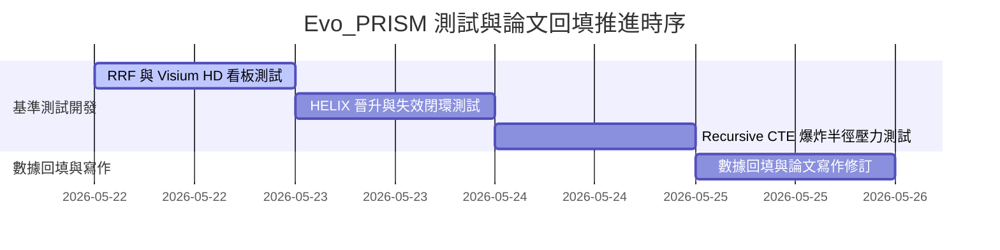

# Evo_PRISM 專案執行進度追蹤 (progress.md)

本文件用以記錄 **Evo_PRISM** 專案的最新執行狀態、已完成里程碑與後續基準測試的推進流程。

---

## 📊 當前執行狀態 (Current Status)

* **目前階段**：`[規劃與準備階段 - 待批准]` ➔ 準備切換至 `[執行與基準測試階段]`
* **測試環境健檢**：`[成功]` (DuckDB 主資料庫在線：91 samples, 401 history records, 86 l2_ready，規模充足)
* **依賴環境修復**：`[成功]` (修復了 `pyproject.toml` 的 dependencies 與 build targeting，`uv run` 可正常順暢建構)

---

## ✅ 已完成工作 (Completed Milestones)

1. **資料庫與環境健檢**：
   * 運行 `config/db_utils.py` 完成資料庫健康度檢測，確認主庫結構完整，樣本與歷史數據已就緒。
   * 修復了 `pyproject.toml` 中的 Hatch build target 封裝路徑問題，打通本機執行通道。
2. **實作計畫與測試方案設計**：
   * 建立了 [測試與學術驗證優化方案 (evaluation_and_testing_plan.md)](file:///Users/zhanqiru/.gemini/antigravity-ide/brain/d7d795b1-5960-4ff8-80ba-723086186c23/evaluation_and_testing_plan.md)。
   * 建立了完整的 [實作計畫 (implementation_plan.md)](file:///Users/zhanqiru/.gemini/antigravity-ide/brain/d7d795b1-5960-4ff8-80ba-723086186c23/implementation_plan.md) 與 [任務清單 (task.md)](file:///Users/zhanqiru/.gemini/antigravity-ide/brain/d7d795b1-5960-4ff8-80ba-723086186c23/task.md)。
3. **學術戰略調整（整合使用者寶貴建議）**：
   * **FASTQ 邊界定義**：將 FASTQ 對齊定位於 L3 Bronze 層的冷數據前置入庫，維持 Benchmark 對 AI 快取的論文焦點。
   * **GEO 泛化測試**：設計引入 GEO 公開 Count 數據集進行「跨數據集通用性（L2 Hit）」與「防快取污染（L1 3-way RRF）」消融實驗。
   * **Visium HD 空間看板**：設計 Visium HD 8µm 空間細胞分析的「Naive 重計算 vs L1 亞秒級命中」極限對比，做為論文中最亮眼的 **Hero Figure 看板圖**。

---

## 🎯 待執行任務與推進順序 (Upcoming Steps)

一旦計畫獲得批准，我們將按以下順序執行：

1. **Step 1: 編寫快取與 3-way RRF 消融及看板測試** (`tests/benchmark_cache_rrf.py`)
   * 模擬高頻 Bulk RNA-seq、GSE 獨立測試集與 Visium HD 空間分析。
   * 收集並輸出時延（Paired $t$-test）、快取命中率與防污染攔截率。
2. **Step 2: 編寫 HELIX 晉升與失效自癒閉環測試** (`tests/benchmark_helix_promotion.py`)
   * 重複執行臨時腳本 3 次，驗證 Radon 複雜度改善率與 $HealthScore$ 提升數值。
   * 驗證 L1 快取自動清空的失效自癒閉環。
3. **Step 3: 編寫 Recursive CTE 壓力測試** (`tests/benchmark_impact.py`)
   * 實體走訪 1,000 ~ 10,000 個依賴邊的關係圖，記錄 DuckDB 遞迴時延。
4. **Step 4: 真實實驗數據回填論文** (`docs/paper_draft.md`)
   * 將三個 Benchmark 的實測數據、圖表與泛化論述完整以學術規格填入論文中。

---

## 📝 備註 (Notes)
* 所有的測試代碼均會遵循專案現有的 `analysis/` 模組 API，不引入外部未經授權的 dependencies，保持程式碼高維護度與乾淨度。
