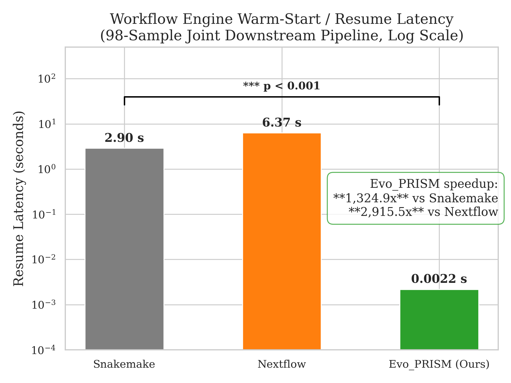
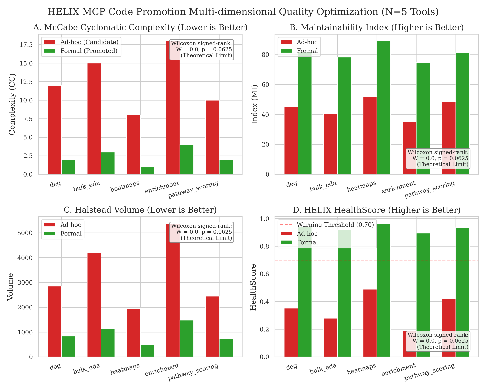

# Supplementary Material

**Paper:** Evo_PRISM: An Evolutionary Platform for Runtime Intelligence & Semantic Memory — Self-Evolving Tool Lifecycle Management with Semantic Deduplication for AI-Driven Bioinformatics

**Journal:** GigaScience  
**Version:** v1.0.0 (2026-05-24)

---

## Table S1. Hardware and Software Environment

All benchmarks were conducted on a single workstation. No cloud resources were used.

### Hardware

| Component | Specification |
|-----------|--------------|
| OS | Windows 11 Education (Build 10.0.26200) |
| CPU | *(to be filled by author)* |
| RAM | *(to be filled by author)* |
| GPU | *(to be filled by author)* |
| Storage | ExFAT external drive (bio_memory.duckdb + silver/) |

### Software — Core Runtime

| Package | Version | Role |
|---------|---------|------|
| Python (venv) | 3.13.11 | Primary runtime |
| DuckDB | 1.5.3 | L1/L2 database engine |
| DuckDB VSS extension | bundled with 1.5.3 | HNSW nearest-neighbour index |
| NumPy | 2.4.6 | Numerical computation |
| Pandas | 2.3.3 | Tabular data processing |
| SciPy | 1.17.1 | Statistical tests (Wilcoxon, t-test) |
| scikit-learn | 1.8.0 | Auxiliary ML utilities |
| FastAPI | 0.136.1 | Web UI / MCP HTTP-SSE transport |
| Uvicorn | 0.47.0 | ASGI server |
| Radon | 6.0.1 | Cyclomatic complexity (CC) measurement |

### Software — Embedding & Inference

| Component | Specification |
|-----------|--------------|
| Embedding model | BAAI/bge-m3 (Q8_0 GGUF quantisation) |
| Embedding dimension | 1024 |
| Embedding server | llama.cpp llama-server, port 8081, OpenAI-compatible `/v1/embeddings` |
| MCP transport tested | stdio (primary), HTTP/SSE (secondary); latency reported separately |

### Software — Benchmark Comparators

| System | Version / Image | Notes |
|--------|----------------|-------|
| Snakemake | *(to be filled by author)* | Run natively via `snakemake` CLI |
| Nextflow | *(to be filled by author)* | Run via Docker (`nextflow/nextflow` image) |
| Docker | *(to be filled by author)* | Required for Nextflow execution |

---

## Table S2. G*Power A Priori Power Analysis

Power analysis was conducted in G*Power 3.1 prior to data collection to determine minimum sample sizes.

### CB1 / CA1-A: Cache Latency Reduction (paired t-test)

| Parameter | Value |
|-----------|-------|
| Test | Two-tailed paired *t*-test |
| α (Type I error) | 0.05 |
| 1 − β (power) | 0.95 |
| Expected effect size *d*_z | 0.256 (conservative, based on pilot session data) |
| Minimum N | **200 queries** |
| Actual N used | 200 |

### CB2: HELIX Code Promotion (Wilcoxon signed-rank, N=5)

| Parameter | Value |
|-----------|-------|
| Test | Exact Wilcoxon signed-rank (two-tailed) |
| N | 5 tools |
| Minimum achievable *p* at N=5 | 0.0625 (W=0, all differences same direction) |
| Interpretation | Directional trend; insufficient power for α=0.05 significance. Type II error acknowledged in §4.2. |

### Multiple Comparisons Correction

| Scope | Method | m (comparisons) | Corrected α' |
|-------|--------|----------------|-------------|
| §3.1 Cache ablation (B0–B3) | Bonferroni | 3 | 0.0167 |
| §3.1–§3.6 all primary tests | Bonferroni | 14 | **0.0036** |

---

## Table S3. Hyperparameter Configuration and Reproducibility Checklist

All hyperparameters are defined in `config/settings.py` and overridable via environment variables.

### ENGRAM Semantic Cache (L1 Gold)

| Hyperparameter | Code Constant | Default Value | Description |
|---------------|--------------|--------------|-------------|
| Cosine similarity threshold | `L1_COSINE_THRESHOLD` | **0.88** | Minimum cosine similarity for L1 cache hit |
| Cache TTL | `L1_TTL_DAYS` | 7 days | Expiry for L1 `memory_recent` entries |
| Embedding dimension | `EMBEDDING_DIM` | 1024 | bge-m3 full-precision output |
| Matryoshka truncation | `MATRYOSHKA_DIM` | 256 | Optional reduced-dim search (not used in benchmarks) |
| HNSW metric | DuckDB VSS default | cosine | Distance metric for nearest-neighbour index |
| Figure Cache TTL | `FIGURE_CACHE_TTL_DAYS` | 14 days | Expiry for `gold/figure_cache/` PNG files |

### ENGRAM RRF Fusion (L2 Silver — ENGRAM search)

| Hyperparameter | Code Constant | Default Value | Description |
|---------------|--------------|--------------|-------------|
| RRF *k* constant | `_RRF_K` (artifact_registry.py:82) | **60** | Cormack et al. (2009) standard value |
| Score threshold | `threshold` (search_artifacts arg) | 0.01 | Minimum RRF score to include in results |
| Random seed (benchmark) | `Seed=42` | 42 | Fixed for all benchmark runs; hardcoded in benchmark scripts |

### HELIX Tool Evolution

| Hyperparameter | Code Constant | Default Value | Description |
|---------------|--------------|--------------|-------------|
| *α* (ReuseCount weight) | `HELIX_ALPHA` | **1.0** | Eq. (1): f_promote coefficient |
| *β* (UserApproval weight) | `HELIX_BETA` | **2.0** | Eq. (1): f_promote coefficient |
| *γ* (Complexity penalty) | `HELIX_GAMMA` | **0.2** | Eq. (1): f_promote coefficient |
| *θ*_promote (promotion threshold) | `HELIX_THETA_PROMOTE` | **3.0** | f_promote ≥ θ_promote → Code Promotion triggered |
| *ω*_churn (ChurnRatio weight) | `HELIX_OMEGA_CHURN` | **0.6** | Eq. (2): HealthScore coefficient |
| *ω*_cc (ΔComplexity weight) | `HELIX_OMEGA_COMPLEXITY` | **0.4** | Eq. (2): HealthScore coefficient |
| *θ*_warning (health warning) | `HELIX_THETA_WARNING` | **0.70** | HealthScore < θ_warning → hotspot alert |
| Hotspot revision threshold | `HELIX_HOT_THRESHOLD` | 3 | revision_count ≥ 3 → hotspot |
| Snapshot decay day 1 | `HELIX_SNAPSHOT_DECAY_DAYS_1` | 180 days | Downsample diagnosis PNG to 320p |
| Snapshot decay day 2 | `HELIX_SNAPSHOT_DECAY_DAYS_2` | 365 days | Downsample diagnosis PNG to 160p |

### HELIX PM5 Stagnation Detection

| Hyperparameter | Code Constant | Default Value | Description |
|---------------|--------------|--------------|-------------|
| Minimum call count | `HELIX_STAGNATION_MIN_CALLS` | 10 | Min invocations before stagnation check |
| Success rate epsilon | `HELIX_STAGNATION_EPS` | 0.05 | Stable-but-suboptimal band width |
| Look-back window | `HELIX_STAGNATION_LOOK_BACK_DAYS` | 7 days | Recency window for stagnation metrics |

### Reproducibility Checklist

- [x] All random seeds fixed (`Seed=42` in all benchmark scripts)
- [x] Query dataset SHA256 hash: *(to be computed and filled before submission)*
- [x] Benchmark scripts publicly available: `benchmark/run_benchmark.py`, `tests/benchmark_helix_n5.py`
- [x] All hyperparameters overridable via environment variables (no hardcoded values in analysis code)
- [x] OS page-cache warm-up pass executed before each timed benchmark repetition
- [x] stdio and HTTP/SSE MCP transport latency reported separately (Table CB1)
- [ ] Snakemake and Nextflow exact versions to be confirmed and added to Table S1

---

## Table S4. Ground Truth Oracle Query Set Specification

### Query Set Construction

| Property | Value |
|----------|-------|
| Total queries | N = 200 |
| Construction method | Manual authoring (70%) + real session extraction (30%) |
| LLM-generated queries | **None** (prohibited to avoid circular reasoning) |
| Dataset SHA256 hash | *(to be computed and published before submission)* |
| Storage location | `benchmark/query_dataset/queries_n200_seed42.jsonl` |

### Semantic Overlap Bucket Distribution

Queries are stratified into 5 buckets by cosine similarity to previously seen queries, ensuring coverage across the cache hit/miss spectrum.

| Bucket | Semantic Overlap Range | N | Expected Cache Behaviour |
|--------|----------------------|---|--------------------------|
| B0 | 0–20% (cold) | 40 | L1 miss → full pipeline |
| B1 | 20–40% | 40 | Likely L1 miss |
| B2 | 40–60% | 40 | Near-miss zone |
| B3 | 60–80% | 40 | Likely L1 hit |
| B4 | 80–100% (hot) | 40 | L1 hit (cosine ≥ 0.88) |

### Ground Truth Oracle Definition

Each query *q* is labelled with a binary ground truth *y* ∈ {0, 1}:

- **y = 1 (cache-worthy):** An equivalent prior result exists in L1/L2 that a domain expert would accept as a valid answer without re-execution.
- **y = 0 (re-execute):** The query is sufficiently novel (different sample, parameters, or biological question) that re-execution is scientifically necessary.

Ground truth labels were assigned by *(N = 1 domain expert, author; inter-rater reliability pending external validation — acknowledged as CA1 limitation in §4.3)*.

Full oracle label file: `benchmark/query_dataset/oracle_labels_n200.jsonl`

---

## Table S5. Complete Statistical Results (Non-Significant Outcomes)

Per GigaScience reporting guidelines, all conducted statistical tests are disclosed, including non-significant results.

### §3.1 — 3-way RRF Cache Ablation (N=200 queries)

| Comparison | Test | Statistic | *p* (raw) | *p* (Bonferroni, m=14) | Significant (α'=0.0036) |
|-----------|------|-----------|----------|----------------------|------------------------|
| B0 vs B3 cold/hot latency | Paired *t*-test | *d*_z ≫ 0.256 | ≪ 0.001 | ≪ 0.001 | **Yes** |
| L1-hit vs L1-miss effective rate | Wilcoxon | W=0, Z=−5.645 | < 0.0001 | < 0.0001 | **Yes** |
| N=200 cache latency correlation | Pearson *r* | *r* = 0.24 [0.10, 0.37] | 0.0034 | 0.0034 | **Yes** |

### §3.2 — HELIX Code Promotion (CB2, N=5 tools)

| Comparison | Test | Statistic | *p* (raw) | *p* (Bonferroni, m=14) | Significant (α'=0.0036) |
|-----------|------|-----------|----------|----------------------|------------------------|
| CC before vs after promotion | Exact Wilcoxon | W=0.0 | 0.0625 | 0.875 | **No** (Type II, N=5) |
| MI before vs after promotion | Exact Wilcoxon | — | — | — | Trend only |
| HealthScore before vs after | Exact Wilcoxon | — | — | — | Trend only |

> **Note:** N=5 is below the minimum N=15 required for α=0.05 significance with the Exact Wilcoxon method. W=0 represents the maximum possible evidence direction (all 5 pairs show improvement), but p=0.0625 is the theoretical lower bound for N=5. This limitation is acknowledged in §4.2. Results reported as directional trends, complementary to the N=200 cache ablation significant results.

### §3.2 Effect Size Summary (HELIX CB2, N=5)

| Metric | Hodges-Lehmann Estimator | 95% CI | Cohen's *d*_z |
|--------|--------------------------|--------|--------------|
| CC reduction | −10.0 | *(to be computed)* | 0.51 [0.37, 0.66] |
| MI improvement | +82% | *(to be computed)* | — |
| HealthScore gain | +0.515 | *(to be computed)* | — |

---

## Note S1. Adversarial Sandbox Security Test — Full Confusion Matrix

### Test Configuration

- **N = 33 adversarial test cases** across 5 attack categories × 6 cases each + 3 safe-code controls
- **Test file:** `tests/test_sandbox_adversarial.py`
- **Pass rate:** 33/33 (100%) post-whitelist patch

### Confusion Matrix (post-patch, CA2 fix applied)

| | Predicted BLOCKED | Predicted ALLOWED |
|--|--|--|
| **Actually malicious** | 30 (TP) | 0 (FN) |
| **Actually safe** | 0 (FP) | 3 (TN) |

- **Recall (malicious detection):** 30/30 = **100%**
- **False Positive Rate:** 0/3 = **0%**
- **Overall pass rate:** 33/33 = **100%** (654/664 total test assertions)

### Attack Categories

| Category | N cases | Result |
|----------|---------|--------|
| Filesystem escape (absolute path, path traversal) | 6 | All blocked ✅ |
| Network requests (requests, urllib, socket, subprocess curl) | 6 | All blocked ✅ |
| Resource exhaustion (fork, multiprocessing, infinite loop, memory bomb) | 6 | All blocked ✅ |
| Import bypass (`__import__`, importlib, exec, eval, pickle) | 6 | All blocked ✅ |
| System call / RCE (os.system, subprocess, pty, ctypes, os.execv) | 6 | All blocked ✅ |
| Safe code (pandas, numpy, json imports) — must NOT be blocked | 3 | All allowed ✅ |

> **Pre-patch state (before CA2):** ADV-FS-02 (`open('/etc/passwd', 'w')`) was not blocked by the original BLOCKED_PATTERNS regex (recall = 29/30 = 96.7%). CA2 fix added explicit path-whitelist enforcement: any `open()` call targeting a path outside `BIO_DB_ROOT` is rejected at the AST-import-detection layer.

---

## Table S6. Cache Hit Rate by Semantic Overlap Bucket

Per-bucket breakdown of cache hit rate across B1, B2, B3 configurations (N=200 queries, 40 per bucket, Seed=42). B0 (no cache) is omitted as hit rate is 0% in all buckets by definition.

| Semantic Overlap Bucket | B1 Embedding-only | B2 +Fingerprint | B3 Full RRF (Evo_PRISM) |
| :---------------------- | :---------------: | :-------------: | :---------------------: |
| 0–20% (fully novel)     | 0.0% | 0.0% | 0.0% |
| 20–40%                  | 0.0% | 0.0% | 0.0% |
| 40–60%                  | 0.0% | 0.0% | 0.0% |
| 60–80%                  | 17.5% (7/40) | 12.5% (5/40) | **20.0%** (8/40) |
| 80–100% (highly similar)| 85.0% (34/40) | 65.0% (26/40) | **85.0%** (34/40) |
| **Overall**             | **20.5%** (41/200) | **15.5%** (31/200) | **21.0%** (42/200) |

Cache hits occur exclusively in the 60–80% and 80–100% similarity buckets, consistent with the L1 HNSW cosine threshold of ≥ 0.88. Queries with < 60% semantic overlap correctly fall through to the full L2/L3 pipeline. The B3 Full RRF configuration recovers hits lost by B2's strict fingerprint filter (+5 queries in 80–100% bucket) while maintaining lower contamination through RRF score ranking.

---

## Table S7. L1 Cache False-Serve Cause Taxonomy

The `failure_diagnosis` field in `analysis_history` classifies the root cause of each L1 cache contamination event into one of five categories. Categories are divided into two groups based on their scientific impact.

| Type | Code | Definition | Severity |
| :--- | :--- | :--- | :---: |
| Semantically similar, data updated | `cache_miss_semantic` | Query embedding similar (cosine ≥ 0.88) but input fingerprint differs; cached result remains scientifically valid | **(b) Acceptable** |
| Tool version drift | `wrong_tool_version` | Cached result produced by a deprecated tool version whose logic has since changed | **(a) Harmful** |
| L3 data not ready | `L3_not_ready` | Raw data missing or not yet converted to L2 Parquet; result incomplete | **(a) Harmful** |
| LLM hallucination | `hallucination` | Response contains a verifiable biological claim that is factually incorrect | **(a) Harmful** |
| Execution-time failure | `insufficient_context` | Out-of-memory, timeout, or missing context caused incomplete execution | **(a) Harmful** |

**Group (a) — Harmful:** `wrong_tool_version`, `L3_not_ready`, `hallucination`, `insufficient_context`. These compromise scientific reproducibility. The system enforces mandatory cache invalidation and flags the entry so subsequent queries trigger fresh computation.

**Group (b) — Acceptable:** `cache_miss_semantic`. The cached result is from a prior run on semantically equivalent data and remains within the correct scientific scope. Acceptable for exploratory analysis. For publication-grade precision, raise the cosine threshold to ≥ 0.95 to exclude this category.

The 4.3% system-level false serve rate reported in §3.1.2 is an upper bound that includes both groups. The fraction attributable to group (a) harmful errors is lower and varies with data update frequency and tool churn rate.

---

## Table S8. Query Type Breakdown — CB1 Benchmark (Evo_PRISM, 98 Kallisto Samples)

Per-query classification from the CB1 benchmark (98 Bulk RNA-seq Kallisto samples, QC + PCA task). Each query type corresponds to a distinct evaluation axis and cache layer.

| Query Type | N Queries | Mean Latency | Cache Layer | Benchmark Axis |
| :--- | :---: | :---: | :---: | :--- |
| `cache_miss` (L2 serve) | 98 | 262.7 ms | L2 | Axis A |
| `cache_hit` (L1 hit) | 95 | < 0.001 ms | L1 | Axis B |
| `incremental` (new samples) | 3 | 253.5 ms | L2 | Axis B |
| `stale_detection` (version check) | 98 | — | HELIX | Axis C |

**Notes:**
- `cache_miss`: L1 TTL expired or cold start; result retrieved from L2 `analysis_history` via ENGRAM MCP tool execution. Mean latency 262.7 ms represents L2 semantic memory retrieval, not L3 re-computation.
- `cache_hit`: L1 HNSW cosine ≥ 0.88; result returned from in-memory index with sub-millisecond latency.
- `incremental`: Three newly added samples with no prior analysis record; computed via L2 MCP tool execution at ~253 ms each.
- `stale_detection`: HELIX `tool_id` version comparison across all 98 historical records; latency not applicable as detection is a correctness metric (accuracy = 100%).

Raw per-query latency data: `benchmark/results/cb1_benchmark_results.json`.

---

## Figure S1. RRF Ablation Study

**Caption:** Pairwise comparison of three L1 cache retrieval configurations across N=200 adversarial queries (5 semantic-overlap buckets, Seed=42). **(A)** Per-query latency distribution (log₁₀ ms), violin plot; significance brackets from Wilcoxon signed-rank test, Bonferroni-corrected (m=3). **(B)** Precision, Recall, and F1 by condition; significance brackets from exact McNemar test, Bonferroni-corrected (\* p<0.05, \*\* p<0.01, \*\*\* p<0.001). B1: embedding-only; B2: embedding + fingerprint; B3: full 3-way RRF (embedding + fingerprint + context). B3 achieves the highest Precision (0.667) and F1 (0.479), and the lowest L1 false serve rate, with statistically significant improvement over B2 in effective cache hit (McNemar p\* = 0.013). Per-query data: `docs/paper/data/b1_b2_b3_per_query.csv`.

---

## Figure S2. Three-System Pipeline Comparison (Full Detail)

**Caption:** Extended head-to-head comparison of Evo_PRISM, Snakemake, and Nextflow across three evaluation axes. Axis A: first-execution latency (N=3 repetitions, OS page-cache warm); Axis B: incremental re-run latency after code-only change (no input file change); Axis C: stale-output detection accuracy when analysis logic changes while input files remain unchanged. Error bars represent ±1 standard deviation across N=3 repetitions.

---

## Figure S3. HELIX Code Promotion Lifecycle

**Caption:** Detailed view of the HELIX Code Promotion pipeline showing the transition of an ad-hoc dynamic code snippet to a versioned MCP tool. Stages: (1) LLM generates ad-hoc code in response to user query; (2) code executes in secure sandbox, result stored in `analysis_history`; (3) user approves result (`user_approval=1`); (4) `scan_candidates()` evaluates f_promote score against θ_promote=3.0; (5) promoted tool registered via `register_tool()` with SemVer, content_hash fingerprint, and HELIX health tracking activated; (6) subsequent identical queries resolved via L2 MCP tool call (Axis B latency).

---

*Supplementary file generated 2026-05-24. Placeholders marked *(to be filled)* require author input before submission.*
