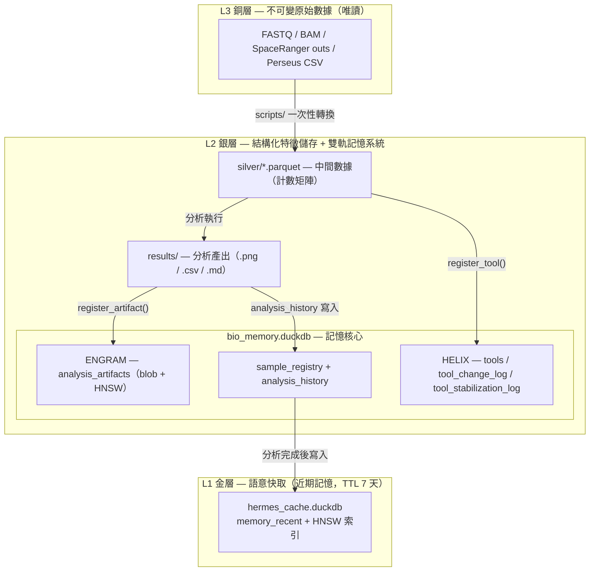
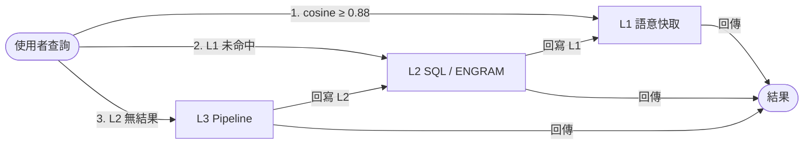
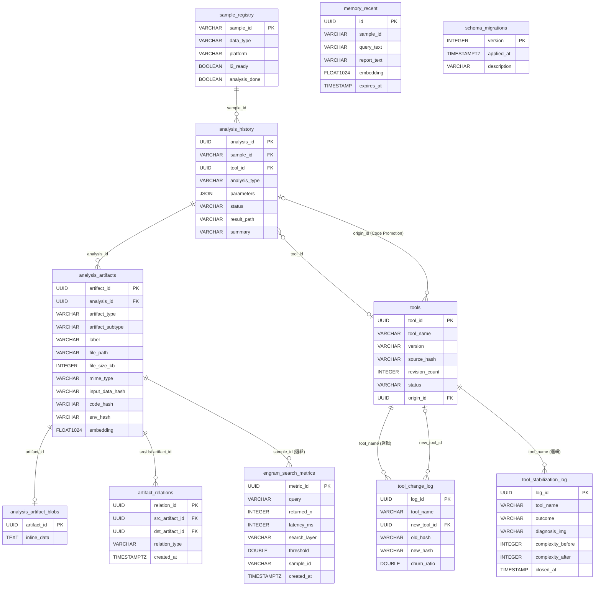
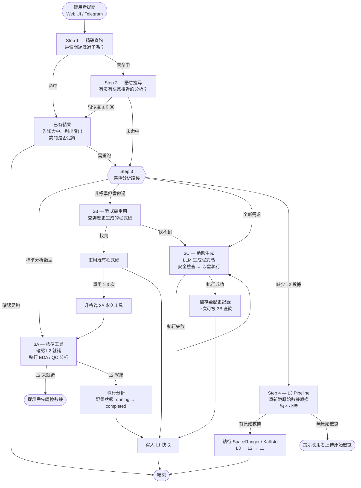

# 智慧生資分析平台 — 實驗室生資智慧分析系統

---

## 一、系統定位與動機

### 問題

同一個 CRC 樣本，A 成員週一完成了 QC，B 成員週三因資訊不對等再度重跑——這在生資實驗室是極為普遍的資源隱形損耗。以 SpaceRanger 為例，單次執行耗時約 4 小時以上，**這不僅浪費了昂貴的硬體算力與等待時間，更帶來了深層的「科學可重複性危機 (Scientific Reproducibility Crisis)」與「版本漂移 (Version Drift)」**。由於環境變數、軟體套件微版本、或執行參數的微小偏差，多次重跑的結果往往難以完全一致，直接降低了數據分析的置信度。

從本質上分析，傳統生資工作流存在四大結構性缺陷：
1. **運算高度冗餘（Redundant Computation）**：缺乏全域分析索引與防重機制，成員在盲區中重複耗用寶貴算力。
2. **數據資產孤島化（Data Siloing）**：分析報告與圖表散落在個人主機或臨時目錄中，無法跨樣本檢索或橫向協同。
3. **實驗追溯鏈斷裂（Broken Provenance Chain）**：分析過程如同黑盒，無法精確溯源「某個特定圖表究竟是由哪個版本的原始數據、哪一版分析程式碼、以及何種參數所產生」。
4. **互動門檻高聳（Interactive Bottleneck）**：非命令列背景的濕實驗研究員無法自助獲取數據，導致數據流動受限於少數生資專家，造成協作瓶頸。

### 核心主張

**記住每一次生資分析的靈魂——相同分析零冗餘取回，關聯結果跨維度對照，歷史脈絡演化式推導。**

系統在每次分析完成後，自動將原始參數、代碼快照、軟硬體環境 (Provenance) 及圖表產出整合寫入 DuckDB 與 Parquet 儲存層，建立可追溯的**永久記憶系統**。這帶來三個層次的漸進價值：
1. **L1 零冗餘取回（Zero-Redundancy Retrieval）**：藉由精確快取攔截（Fast-Path）與語意相似度檢索，近乎 0 token 與 0 算力地攔截並重現歷史結果，徹底杜絕冗餘計算。
2. **L2 跨樣本對照（Cross-Cohort Comparative Analysis）**：提供直觀的並排比對介面與圖表對照機制，使新產出的數據能瞬間與同一樣本或不同 Cohort 的歷史痕跡進行橫向比對，累積越深，基準越穩。
3. **L3 演化式脈絡推導（Evolutionary Knowledge Provenance）**：將分析歷史沉澱為結構化的知識圖譜脈絡（Provenance Graph），不僅能讓歷史路徑被查詢，更能主動引導並歸納出可重用的分析方法與新型假說推導。

### 實現方式

以 **AI Agent** 為協同控制中樞，透過「三層防禦閘道」與「三軌記憶/觀測核心」協同運作：

- **智能人機介面與 MCP 網關（Intelligent Interface & MCP Gateway）**：以 **Model Context Protocol (MCP)** 協議為核心分析中樞，將去重閘道與記憶核心封裝為標準 MCP 工具集，主要透過 MCP 與主流 LLM 交互；同時向下支援 Web UI 與 Telegram 自然語言交互，融合多模態視覺模型（VLM）以直觀解析生資圖表，並搭載 **Fast-Path 協議**，大幅降低提問至取回結果的延遲。
- **三道防禦去重閘道（Three-Tier De-duplication Gateway）**：
  - **L1 語意與精確攔截**：提問進來後先由 Fast-Path 進行 `analysis_history` SQL 精確比對（0 token 延遲），若未命中則走 HNSW 向量語意相似度檢索（極低 token），攔截「曾問過的問題」。
  - **L2 程式碼重用**：若問題意圖不同，則進入程式碼特徵比對與 AST 分析，攔截「曾生成並驗證過的分析邏輯」，實現 3B 程式碼模版級別的重用。
  - **L3 實體計算**：僅在上述閘道皆未命中時，才真正調用生資容器算力進行全新分析，最大化節省 Token 與算力。
- **三軌記憶與觀測核心（Triple Memory & Observability Core）**：
  - **ENGRAM（產出記憶）：記住分析結果與檔案**。永久保存火山圖、數據矩陣與報告產出，並支援快速的混合語意搜尋。提供直觀的並排比對介面，讓成員能瞬間找出歷史結果並進行橫向對照。
  - **HELIX（工具演化記憶）：記住工具版本的雕琢軌跡**。自動追蹤分析代碼的每一次修改，精確版本化。系統能自動辨識哪些工具被反覆修改（熱區），並在持續使用中將其打磨成穩定、可信的標準分析工具，確保工具庫精實進化。
  - **METRICS（可觀測性指標）：追蹤工具的健康運行狀況**。實時記錄每一次工具執行的時間與狀態。這為 AI Agent 提供量化數據，讓它能依據即時效能與錯誤率，聰明地選擇最穩定、最有效率的分析路徑。

  這三者透過分析 ID 與工具 ID 相互關聯，形成一個「知道做了什麼、產出了什麼、工具由誰生成、效能如何」的可追溯知識網絡，構成生資實驗室的智慧記憶大腦。

---

## 二、系統設計與技術選型

本章說明系統各層次的設計決策、兩個原創模組的貢獻，以及底層技術元件的選型依據。文獻依據詳見**附錄 A**。

### 2.1 架構設計決策

**三層資料架構**採用 Medallion Architecture（Hai et al., 2023）的 Bronze / Silver / Gold 分層原則，針對實驗室工作流程的特殊約束加以調整。L3 Bronze 層存放不可修改的原始數據（SpaceRanger 輸出、FASTQ、Perseus CSV），任何腳本錯誤皆無法污染此層；L2 Silver 層存放結構化 Parquet 矩陣與分析歷史，作為可重複查詢的知識庫；L1 Gold 層存放語意快取與 HNSW 索引，作為高頻查詢的快速回應層。這種不可變性設計直接回應了第一章所指出的「數據孤島」與「無分析記憶」問題——原始數據保持唯讀，而分析結果一旦計算完成即永久存入 L2，後續相同查詢無需重新執行管道。

**Agent-First 查詢策略**參考 Trummer（2025）與 MemGPT 分層記憶模型（Packer et al., 2023），明確劃分 LLM 與 Python 的工作邊界。「某樣本做過哪些分析」、「這週完成幾個 QC」等結構化問題由 DuckDB SQL 直接回答，token 消耗為零；只有需要語言推理的問題（如「解讀這份報告」）才送往 LLM。這一分工使 LLM 的角色從萬能助手收窄為推理專家，在實驗室長期高頻使用下可顯著壓低 API 費用。系統採用自製輕量 Agent，工具數量控制在 10 個以內，不引入 LangChain 等重型框架；雙後端（本機 Gemma 4 Vision / 雲端 Claude Sonnet）可於 Web UI 即時切換，工具呼叫格式在 `agent.py` 自動轉換（Anthropic `input_schema` ↔ OpenAI function calling）。

**去重閘道**的設計目標是以最低計算成本攔截重複請求。傳入的問題依序通過兩個維度的檢查：在問題維度，首先以 SQL 精確比對 `analysis_history`（零 token 消耗），其次以 HNSW 語意搜尋攔截「問法不同但語意相同」的查詢（Malkov & Yashunin, 2018），cosine 相似度 ≥ 0.88 即直接回傳既有結果；在程式碼維度，Code Promotion 框架追蹤歷史生成的分析邏輯，相同邏輯不重新生成（詳見 2.2 節）。兩個維度均未命中，系統才真正執行新分析。

**兩階段寫入**借鑑 WAL 與 Saga pattern（Garcia-Molina & Salem, 1987），以應對 ExFAT 無日誌環境下 ~4 小時分析任務中途崩潰的風險。分析開始時即以 `status='running'` 寫入 `analysis_history`，完成後才更新為 `status='completed'`；每次寫入後立即執行 `CHECKPOINT`，將 WAL 刷入主檔，縮小斷電損壞視窗。即便任務中途失敗，資料庫中仍保有可追溯的執行記錄。

**動態程式碼的沙盒執行**依部署階段遞進隔離：macOS 測試階段以 `subprocess.run` 搭配 ALLOWED\_IMPORTS 白名單與 timeout=60s 限制；Linux 部署階段改為 Docker container（`python:3.11-slim` + bind-mount `silver/`），確保動態生成的程式碼不得存取 L3 原始數據以外的系統資源。

### 2.2 原創模組

**Code Promotion 框架**解決動態生成程式碼的生命週期管理問題。LLM 在 Code Generation Loop 中即時生成分析腳本，這些腳本起初存放於臨時記錄中；當同一邏輯的 `reuse_count` 累積至三次時，`promotion_candidates` VIEW 自動偵測並觸發升格評估，將程式碼提升為 `analysis/` 下的永久工具，無需人工追蹤。升格後的工具進入 HELIX 版本管理閉環（詳見下段）。這一機制使程式碼重用率成為工具價值的客觀信號，從使用行為中自然篩選出值得長期維護的分析方法。詳見**附錄 A5**。

**HELIX（Health-Evolving Loop with Iterative eXpiration）** 是本系統提出的工具版本健康管理模組，解決工具庫隨時間臃腫、熱區工具設計不穩定的問題。工具源碼每次修改以 SHA256[:16] content-hash 版本化，`revision_count` 成為設計不穩定性的直接量化信號。當 `revision_count ≥ 3` 時，系統將該工具標記為熱區並自動觸發穩定化迭代：記錄診斷、行動計畫，並以 radon CC（循環複雜度）量化改善幅度（complexity\_before / complexity\_after）。迭代記憶以 640×640 PNG 快照儲存（約 100 VLM tokens），讓 Agent 在後續迭代中以視覺方式讀回上次診斷，而非重新解析源碼。舊快照依 Ebbinghaus 遺忘曲線（Ebbinghaus, 1885）逐步降解析度——迭代關閉後 180 天縮至 320×320，365 天縮至 160×160——在長期記憶與儲存成本之間取得平衡。行級熱區偵測（difflib + Nagappan churn，Tornhill X-Ray）進一步識別反覆被修改的程式碼片段，作為診斷的輔助依據。詳見**附錄 A7**。

**ENGRAM（Evidence & iNdexed Graph of Research Artifacts & Memory）** 是本系統提出的分析產出永久記憶模組，與 HELIX 共同構成雙軌記憶架構。每次分析完成，所有產出（圖、CSV、報告）透過 `register_artifact()` 寫入 `analysis_artifacts`，並自動生成 1024 維語意 embedding。搜尋採用 Reciprocal Rank Fusion（RRF，Cormack et al., 2009）混合兩層結果：第一層以 `analysis_subtype` 精確過濾，第二層以 HNSW cosine 搜尋語意相近產出，兩層排名以 RRF（k=60）融合，無需校準量綱。ENGRAM Web UI 提供縮圖格狀瀏覽、Lightbox 放大、subtype 篩選、多選並排比較與語意搜尋，使分析產出可被查詢、比較與推導。每份產出記錄 provenance hash（輸入數據版本、程式碼 content-hash、執行環境），使結果完全可溯源。詳見**附錄 A8**。

**HELIX 與 ENGRAM 的協同**使搜尋結果不只語意相近，還帶有版本可信度資訊。ENGRAM 的 provenance hash 記錄每份產出由哪個 content-hash 版本的工具生成；當 HELIX 偵測到某工具進入熱區、設計尚不穩定時，可反查 ENGRAM 中所有由該版本產生的產出並加以標記，讓使用者在比較分析結果時同時知道差異來自參數變化還是工具本身的修改——比較從「看起來不同」升級為「知道為什麼不同」。

### 2.3 技術元件選型

**分析資料庫**選用 DuckDB（Raasveldt & Mühleisen, 2019）。相較於 PostgreSQL 或 SQLite，DuckDB 的列式向量化執行引擎針對 OLAP 查詢最佳化，可跳過基因計數矩陣中數億個零值；嵌入式設計（`import duckdb` 即用）消除了獨立 DB Server 的維護負擔，且 macOS 與 Linux 部署行為完全一致。原生讀取 Parquet 的能力（`FROM 'silver/*.parquet'`）使 L2 的 416 MB 數據無需載入記憶體即可執行 SQL 聚合；內建 VSS 擴充提供 HNSW 向量搜尋（Müller et al., 2024），免去部署 Pinecone 或 Weaviate 的額外基礎設施。實測於 Visium HD 8µm 聚合後約 500 萬列，SQL 聚合至 20 行結果再傳給 LLM，節省 99%+ token 消耗。

**L2 儲存格式**選用 Apache Parquet。CRC Visium HD 原始約 30 億數字，以 Parquet RLE + Dictionary encoding 壓縮後降至 416 MB（壓縮率 ~95%）。欄位型別嚴格固定（`float32` / `int32`），DuckDB 無需型別推斷；依樣本分區（`silver/spatial_counts_{sample_id}_8um/`）確保查詢時只讀相關分區。Parquet 的跨語言支援（Python pandas / R arrow / DuckDB 原生）使分析結果可直接以 R 讀取，便於與濕實驗室人員共用中間數據。

**Embedding 模型**選用 bge-m3 Q8（BAAI，llama.cpp 本機推理，port 8081）。bge-m3 以 1024 維輸出、中英混雜查詢表現佳著稱，本機推理零費用，敏感實驗數據不上傳外部服務。**LLM 後端**採用雙軌設計：本機使用 Gemma 4 Vision 26B（llama.cpp），支援多模態輸入、離線運行；雲端切換至 Claude Sonnet（Anthropic），在需要更強推理能力時使用，並以 Prompt Cache 壓低重複 context 的費用。

---

## 三、三層架構

```
L3 銅層（Bronze）── 不可變原始數據
    FASTQ、BAM、SpaceRanger outs/、Perseus CSV
    規則：絕對唯讀，任何腳本嚴禁修改
         │
         │  scripts/ 一次性轉換
         ▼
L2 銀層（Silver）── 結構化特徵儲存 + 雙軌記憶系統
    ── 中間數據 ──
    silver/*.parquet         ← 從 L3 提取的結構化中間數據（計數矩陣，尚未分析）
    ── 分析產出 ──
    results/                 ← 實體產出檔案（圖 .png、CSV .csv、報告 .md）
    ── 記憶資料庫 ──
    bio_memory.duckdb        ← 知識索引與記憶核心
      ├─ sample_registry + analysis_history + Views
      ├─ [HELIX] tools + tool_change_log + tool_stabilization_log
      └─ [ENGRAM] analysis_artifacts（索引 results/ 產出 + blob + HNSW）
    規則：只有 scripts/ 可寫入矩陣；HELIX 由 tool_registry.py 寫入；
          ENGRAM 由 artifact_registry.py 寫入；分析函數唯讀
         │
         │  分析完成後自動寫入
         ▼
L1 金層（Gold）── 語意快取（近期記憶）
    gold/hermes_cache.duckdb  ← memory_recent + HNSW 索引（TTL 7 天）
    規則：analysis/ 函數寫入；TTL 到期自動清除；可重建
```

| 層級                          | 觸發時機        | 回應時間 | Token 消耗         | 資料生命週期                                    |
| ----------------------------- | --------------- | -------- | ------------------ | ----------------------------------------------- |
| L1 快取命中（cosine ≥ 0.88） | L1 語意搜尋命中 | < 1 秒   | 0（直接回傳）      | TTL 7 天；工具改版立即清除；可重建              |
| L2 SQL / Parquet 查詢         | L1 未命中       | ~30 秒   | 極少（SQL 壓縮後） | 永久保存；HELIX 快照 180d/365d 依遺忘曲線降採樣 |
| L3 Pipeline                   | L2 無 Parquet   | ~4 小時  | 正常               | 唯讀，不衰減                                    |





### 寫入路徑

資料進入系統有兩條路徑，各自對應不同的觸發時機。**原始數據轉換路徑**由 `scripts/` 下的一次性工具觸發：SpaceRanger 輸出、FASTQ、Perseus CSV 等 L3 原始數據經過結構化轉換後，以 Parquet 格式寫入 L2 `silver/`，同時將樣本元資料登記至 `sample_registry`。此路徑每個樣本只執行一次，L3 在整個過程中保持唯讀。

**分析寫入路徑**由每次分析完成後自動觸發。分析開始時以 `status='running'` 寫入 `analysis_history`；完成後更新為 `status='completed'`，結果路徑存入 `result_path`；同步呼叫 `register_artifact()` 將所有產出（圖、CSV、報告）寫入 ENGRAM 的 `analysis_artifacts`，並生成語意 embedding；若分析涉及工具修改，則呼叫 `register_tool()` 更新 HELIX 的 `tools` 表與 `tool_change_log`。最後，查詢文字與報告摘要寫入 L1 `memory_recent`，供下次語意命中使用。所有寫入在完成後立即執行 `CHECKPOINT`，確保 ExFAT 環境下資料不因斷電而遺失。

### 查詢路徑

收到查詢後，系統依成本由低到高逐層往下嘗試。首先在 L1 `memory_recent` 以 HNSW cosine 搜尋（閾值 ≥ 0.88），命中則直接回傳既有報告，token 消耗為零、回應時間不到 1 秒。L1 未命中時，退回 L2：結構化問題以 SQL 查詢 `analysis_history` 或 Parquet 矩陣，回應時間約 30 秒、token 消耗極少；若需要跨產出的語意搜尋，則呼叫 ENGRAM 的 RRF 混合搜尋。兩層均無法回答時，才觸發 L3 Pipeline 重新執行完整分析，耗時約 4 小時。查詢完成後，結果自動回寫 L1，下次相同語意的問題可直接命中。

---

## 四、資料庫 Schema 總覽

本章依架構層級由上至下說明各儲存單元，對應三層架構中的 L1 Gold → L2 Silver。



---

### L1 Gold：`memory_recent`

**系統的便條紙——問過的問題先查這裡，7 天後自動丟棄。**

**用途：語意去重快取。** 每次分析完成後，將查詢文字、報告內容與其向量 embedding 一起存入。下次收到語意相似的問題（cosine ≥ 0.88）時，直接回傳快取結果，不重新執行分析、不消耗 LLM token。此表可完整重建，丟失不影響資料完整性。

**快取失效策略（兩道保護）：**

| 保護層           | 機制                                                                                                                                    | 觸發時機                                         |
| ---------------- | --------------------------------------------------------------------------------------------------------------------------------------- | ------------------------------------------------ |
| 工具改版主動清除 | `register_tool()` 偵測到 hash 變化時，自動呼叫 `invalidate_tool_cache(tool_name)`，刪除所有 `query_text` 包含該工具名稱的快取條目 | 開發者更新工具程式碼後立即生效                   |
| TTL 7 天被動過期 | `expires_at` 到期由 `scheduler/cleanup_l1_cache.py` 每日 03:30 自動刪除                                                             | 兜底保護，確保長期不改版的工具快取也不會無限累積 |

選擇「改版清快取」而非「快取加 tool_id 欄位」的理由：`memory_recent` 的設計定位是可重建的短期去重器，不是高價值的持久化資料；修改簽名成本高（跨兩個 DuckDB 檔案、需 migration），而清了重算的代價低。

| 欄位            | 說明                                                 |
| --------------- | ---------------------------------------------------- |
| `query_text`  | 使用者原始問題文字                                   |
| `report_text` | 上次分析產生的完整報告                               |
| `embedding`   | 問題的 1024 維向量（bge-m3），供 HNSW 近似最近鄰搜尋 |
| `expires_at`  | 建立時間 + 7 天，到期由排程自動刪除                  |

```sql
CREATE TABLE memory_recent (
    id          UUID DEFAULT gen_random_uuid() PRIMARY KEY,
    sample_id   VARCHAR,
    query_text  VARCHAR,
    report_text VARCHAR,
    embedding   FLOAT[1024],  -- bge-m3 本機 1024-dim
    created_at  TIMESTAMP DEFAULT now(),
    expires_at  TIMESTAMP     -- TTL 7 天
);
CREATE INDEX memory_recent_emb_idx ON memory_recent
    USING HNSW (embedding) WITH (metric = 'cosine');
```

---

### L2 Silver：Parquet 計數矩陣

**從原始數據壓縮出來的中間數據，還沒被分析過，但已經可以快速查詢。**

**用途：壓縮後的空間轉錄體特徵矩陣。** 由 `scripts/02_spatial_to_parquet.py` 從 L3 原始 SpaceRanger 輸出（`.h5ad`）一次性轉換而來，存於 `silver/<sample_id>/`。DuckDB 可直接查詢 Parquet，不需匯入記憶體，支援生資規模的 SQL 聚合。

每個樣本包含三類檔案：

| 檔案                          | 欄位                                                         | 說明                                    |
| ----------------------------- | ------------------------------------------------------------ | --------------------------------------- |
| `obs_metadata.parquet`      | `barcode`, `spatial_x`, `spatial_y`, `in_tissue`, … | 每個 bin 的空間座標與 QC 指標           |
| `var_metadata.parquet`      | `gene_name`, `gene_id`, `genome`                       | 基因註解                                |
| `expression/part-*.parquet` | `barcode`, `gene_name`, `count`                        | 長格式稀疏矩陣，僅儲存非零值（float32） |

> Visium HD 8µm 解析度：約 21 萬 bins × 最多 3 萬基因；非零值約 2.1 億筆，壓縮後約 416 MB（zstd）。

---

### L2 Silver：`sample_registry`

**實驗室的樣本登記簿——每個樣本進來就登記一筆，之後不再修改。**

**用途：實驗室樣本名冊。** 每個生物樣本登記一筆，記錄它是什麼資料類型、原始檔案在哪、是否已轉換為 L2 Parquet、是否已完成分析。新樣本進來就新增一筆，之後不再修改。

```sql
CREATE TABLE sample_registry (
    sample_id      VARCHAR PRIMARY KEY,
    project        VARCHAR,
    data_type      VARCHAR,  -- visium_hd|visium|scrna|bulk_rnaseq|proteomics|other
    platform       VARCHAR,  -- 10x_visium_hd|kallisto|maxquant|...
    species        VARCHAR,  -- 'mouse'|'human'
    tissue         VARCHAR,
    l3_path        VARCHAR,
    l2_ready       BOOLEAN DEFAULT FALSE,
    analysis_done  BOOLEAN DEFAULT FALSE,
    added_by       VARCHAR,
    notes          VARCHAR,
    last_updated   TIMESTAMP DEFAULT now()
);
```

---

### L2 Silver：`analysis_history`

**實驗室的分析日誌——每跑一次分析自動記一筆，永不刪除。**

**用途：分析操作永久帳本。** 每次執行分析就新增一筆，**永遠不刪除**。記錄對哪個樣本、做了什麼分析、用了哪些參數、結果存在哪裡。這是系統追責與重現的唯一依據，也是 `analysis_index` View 的資料來源。

| 欄位              | 說明                                                                                |
| ----------------- | ----------------------------------------------------------------------------------- |
| `analysis_type` | 分析種類，如 `qc` / `spatial_gene` / `clustering`                             |
| `parameters`    | JSON 格式的完整參數，含可選的 `generated_code`（動態程式碼升格用）                |
| `status`        | `running` → `completed` / `failed` / `stale`（超過 24 小時未完成自動標記） |
| `summary`       | ≤ 50 字的結果摘要，供 Agent 0-token 快速瀏覽                                       |
| `result_path`   | 完整報告或圖檔的存放路徑                                                            |

```sql
CREATE TABLE analysis_history (
    analysis_id   UUID DEFAULT gen_random_uuid() PRIMARY KEY,
    sample_id     VARCHAR REFERENCES sample_registry(sample_id),
    analysis_type VARCHAR,    -- 'bulk_eda', 'eda_report', 'spatial_heatmap' ...
    parameters    JSON,       -- 分析參數 + 可選 generated_code / source / origin_id
    status        VARCHAR,    -- 'running' | 'completed' | 'failed' | 'stale'
    result_path   VARCHAR,
    l1_cache_id   UUID,
    requested_by  VARCHAR,
    started_at    TIMESTAMP,
    completed_at  TIMESTAMP,
    summary       VARCHAR,    -- ≤50 字結果摘要（語意搜尋品質上限）
    tool_id       UUID        -- FK → tools(tool_id)，追蹤哪個版本產生此結果
);
```

---

### L2 Silver：`tools`

**每個分析工具的版本履歷——改了幾次、現在用哪版、是否還在維護，一目了然。**

**用途：工具版本帳本。** 每次工具源碼變動就新增一筆（舊版標為 `deprecated`，active 永遠只有一筆）。`analysis_history.tool_id` 外鍵指向此表，解鎖跨版本查詢（「哪些分析由已 deprecated 的版本產生？」）。

| 欄位               | 說明                                                       |
| ------------------ | ---------------------------------------------------------- |
| `tool_name`      | 邏輯工具名稱（如 `bio_run_bulk_eda`）                    |
| `source_hash`    | SHA256[:16] of normalized source — 內容指紋，偵測靜默修改 |
| `revision_count` | 累積修改次數，≥ 3 視為熱區                                |
| `stability_note` | 診斷備註（為何頻繁修改、穩定化方向）                       |
| `status`         | `active` \| `deprecated`                               |

```sql
CREATE TABLE tools (
    tool_id        UUID DEFAULT gen_random_uuid() PRIMARY KEY,
    tool_name      VARCHAR NOT NULL,
    version        VARCHAR NOT NULL,          -- semver '1.0.0'
    module_path    VARCHAR NOT NULL,
    function_name  VARCHAR NOT NULL,
    description    VARCHAR,
    parameters     JSON,
    status         VARCHAR DEFAULT 'active',  -- 'candidate'|'active'|'deprecated'
    source_hash    VARCHAR(16),               -- SHA256[:16] of normalized source
    revision_count INTEGER DEFAULT 0,         -- monotonically increasing per tool_name
    stability_note VARCHAR,                   -- 診斷備註
    origin_id      UUID,                      -- FK → analysis_history（Code Promotion 來源）
    git_commit     VARCHAR,
    created_at     TIMESTAMP DEFAULT now(),
    deprecated_at  TIMESTAMP,
    UNIQUE (tool_name, version)
);
```

---

### L2 Silver：`tool_change_log`

**工具的修改日記——每次改動自動留下一筆，永不刪除。**

**用途：append-only 修改紀錄。** 每次 `register_tool()` 偵測到 hash 變化時寫入一筆，永不刪除。提供工具演變的完整追溯，也是熱圖快照的時間軸資料來源。

```sql
CREATE TABLE tool_change_log (
    log_id           UUID DEFAULT gen_random_uuid() PRIMARY KEY,
    tool_name        VARCHAR NOT NULL,
    old_hash         VARCHAR(16),        -- NULL 表示初次登記
    new_hash         VARCHAR(16) NOT NULL,
    new_tool_id      UUID,               -- FK → tools(tool_id)
    revision_number  INTEGER NOT NULL,   -- 對應 tools.revision_count 當時值
    change_reason    VARCHAR,            -- 可選的人工說明
    changed_at       TIMESTAMP DEFAULT now(),
    -- 行級熱區欄位（migration v8）
    source_snapshot  TEXT,               -- inspect.getsource() 全文；第一次登記為 NULL
    changed_lines    VARCHAR,            -- JSON [[start,end],...] 1-based 行號區間；純刪除為 [j+1,j]
    churn_ratio      DOUBLE              -- (新增+刪除行) / max(舊行數,新行數)，Nagappan relative churn
);
```

---

### L2 Silver：`tool_stabilization_log`

**問題工具的診療記錄——記下為什麼一直改、做了什麼、改完有沒有變好。**

**用途：穩定化迭代帳本。** 熱區工具（revision ≥ 3）觸發一次穩定化迭代就新增一筆，記錄診斷脈絡、行動計畫、效果驗收。`closed_at IS NULL` 代表迭代仍在進行中。

| 欄位                  | 說明                                                                                                          |
| --------------------- | ------------------------------------------------------------------------------------------------------------- |
| `diagnosis`         | 問題描述（為何一直改、根本原因）                                                                              |
| `action_taken`      | 計畫或已執行的改善行動（重構/抽 helper/加測試…）                                                             |
| `outcome`           | `stabilized` \| `ongoing` \| `reverted`                                                                 |
| `diagnosis_img`     | 640×640 PNG base64 data URI — 含源碼密度熱圖、CC 儀表板、修改時間軸、診斷文字；VLM 讀回約 100 vision tokens |
| `complexity_before` | 迭代開始時的循環複雜度（radon cc_visit）                                                                      |
| `complexity_after`  | 迭代關閉時的循環複雜度；delta = before − after 為改善量                                                      |

```sql
CREATE TABLE tool_stabilization_log (
    log_id            UUID DEFAULT gen_random_uuid() PRIMARY KEY,
    tool_name         VARCHAR NOT NULL,
    trigger_revision  INTEGER NOT NULL,   -- 觸發此次迭代的 revision_count
    diagnosis         VARCHAR,
    action_taken      VARCHAR,
    outcome           VARCHAR,            -- 'stabilized'|'ongoing'|'reverted'
    revision_before   INTEGER NOT NULL,
    revision_after    INTEGER,            -- close 時填入
    diagnosis_img     VARCHAR,            -- base64 data URI PNG（VLM 視覺記憶）
    complexity_before INTEGER,            -- radon CC at open
    complexity_after  INTEGER,            -- radon CC at close
    created_at        TIMESTAMP DEFAULT now(),
    closed_at         TIMESTAMP           -- NULL = 仍在進行
);
```

---

### L2 Silver：`analysis_artifacts`（ENGRAM）

**分析產出的成果檔案櫃——每張圖、每份 CSV、每篇報告都有索引，可語意搜尋、可並排比較。**

**用途：分析產出的永久記憶索引（metadata 層）。** 每次分析完成，`register_artifact()` 自動將所有輸出檔（圖、CSV、報告）寫入此表。與 `analysis_history` 搭配使用：`analysis_history` 記錄「做了什麼分析」，`analysis_artifacts` 記錄「產出了什麼結果」。

**設計亮點：**

| 特性                           | 說明                                                                                                                   |
| ------------------------------ | ---------------------------------------------------------------------------------------------------------------------- |
| blob 分離（migration v14）     | inline_data 移至 `analysis_artifact_blobs`（1:0..1），主表僅存 metadata；消除 HNSW 掃描寬列懲罰                      |
| RRF 混合搜尋（migration 9A-2） | Layer 1 精確 subtype + Layer 2 HNSW cosine，透過 Reciprocal Rank Fusion 融合排名；結果附 `score` 與 `search_layer` |
| 相對路徑（migration v12）      | `file_path` 存 BIO_DB_ROOT 相對路徑；`resolve_artifact_path()` 還原為絕對路徑，跨平台可攜                          |
| 非致命寫入                     | 檔案不存在時僅記 warning，不中斷分析流程                                                                               |
| 工具版本追蹤                   | 透過 `analysis_history.tool_id` JOIN，可查詢「哪個工具版本產出此圖」                                                 |

```sql
-- 主表：僅存 metadata（migration v14 後無 inline_data 欄位）
CREATE TABLE analysis_artifacts (
    artifact_id      UUID    DEFAULT gen_random_uuid() PRIMARY KEY,
    analysis_id      UUID    NOT NULL REFERENCES analysis_history(analysis_id),
    artifact_type    VARCHAR NOT NULL,   -- 'figure' | 'csv' | 'report' | 'log'
    artifact_subtype VARCHAR,            -- 'volcano' | 'pca' | 'heatmap' | 'deg_list' | 'eda_report'
    label            VARCHAR NOT NULL,   -- 人類可讀說明，e.g. 'PCA 圖'
    file_path        VARCHAR,            -- BIO_DB_ROOT 相對路徑（migration v12）
    file_size_kb     INTEGER,            -- 檔案大小（KB）
    mime_type        VARCHAR,            -- 'image/png' | 'text/csv' | 'text/markdown'
    embedding        FLOAT[1024],        -- bge-m3 語意向量（HNSW 搜尋用）
    created_at       TIMESTAMPTZ NOT NULL DEFAULT now()
);
-- HNSW cosine 索引（DuckDB VSS）
CREATE INDEX idx_artifacts_hnsw ON analysis_artifacts
    USING HNSW (embedding) WITH (metric = 'cosine');
-- 常用查詢輔助索引
CREATE INDEX idx_artifacts_analysis_id ON analysis_artifacts (analysis_id);
CREATE INDEX idx_artifacts_subtype     ON analysis_artifacts (artifact_subtype);
-- 防重複：同一分析下同 subtype+label 唯一
CREATE UNIQUE INDEX uq_artifacts_run_subtype_label
    ON analysis_artifacts (analysis_id, artifact_subtype, label);
```

**已知 artifact_subtype 清單：**
`volcano` / `pca` / `heatmap` / `qc_figure` / `scatter` / `deg_list` / `pathway_scores` / `timeseries` / `eda_report` / `summary_report` / `qc_csv` / `counts_csv` / `run_log`

**`results/` 目錄結構：**

實體產出檔案存放於 `bio_DB/results/`，路徑規則依分析模組而異：

| 分析模組 | 路徑規則 | 範例 |
| --- | --- | --- |
| `spatial_eda.py` | `results/<sample_id>/<analysis_type>/` | `results/crc_official_v4/spatial_eda/spatial_CD8A.png` |
| `bulk_eda.py` | `results/bulk_eda/` | `results/bulk_eda/pca_crc_s1_20260518.png` |

`analysis_artifacts.file_path` 存 `BIO_DB_ROOT` 相對路徑（如 `results/crc_official_v4/spatial_eda/spatial_CD8A.png`）；`resolve_artifact_path()` 在執行時還原為絕對路徑，確保跨平台可攜。

---

### L2 Silver：`analysis_artifact_blobs`（ENGRAM blob 表，migration v14）

**成果檔案的實體內容——小檔案（≤ 500 KB）直接存這裡，讓主表保持輕巧。**

**用途：artifact 的 inline base64 blob 儲存（1:0..1 關係）。** migration v14 將 inline_data 從主表拆出，消除 HNSW 掃描時讀取大型 blob 欄位的效能懲罰。≤ 500 KB 的檔案才會寫入此表；大型檔案（報告、高解析度圖）只在 `file_path` 有記錄。

```sql
CREATE TABLE analysis_artifact_blobs (
    artifact_id  UUID PRIMARY KEY REFERENCES analysis_artifacts(artifact_id),
    inline_data  TEXT NOT NULL    -- base64 encoded content
);
```

---

### L2 Silver：`engram_search_metrics`（ENGRAM 搜尋觀測，migration v15）

**搜尋行為的觀測站——記下每次搜尋怎麼跑、多快、走哪一層，累積後用來調整參數。**

**用途：記錄每次 `search_artifacts()` 呼叫的可觀測性數據。** 累積後可分析「哪類查詢 exact 層命中率高」、「哪個 threshold 讓 HNSW 召回率最好」，為未來參數調整提供依據。

```sql
CREATE TABLE engram_search_metrics (
    metric_id    UUID        DEFAULT gen_random_uuid() PRIMARY KEY,
    query        VARCHAR     NOT NULL,
    returned_n   INTEGER     NOT NULL,
    latency_ms   INTEGER     NOT NULL,
    search_layer VARCHAR     NOT NULL,  -- 'exact' | 'hnsw' | 'rrf' | 'none'
    threshold    DOUBLE,                -- RRF score 門檻（範圍 ~0.008–0.033）
    sample_id    VARCHAR,
    created_at   TIMESTAMPTZ NOT NULL DEFAULT now()
);
```

---

### L2 Silver：`schema_migrations`（migration v10）

**資料庫的升級記錄——確保每個版本的 schema 變更只套用一次，不重複不遺漏。**

**用途：追蹤已套用的 schema 版本。** 每次執行 migration 腳本後寫入一筆，確保冪等（重複執行不重複記錄）。

```sql
CREATE TABLE schema_migrations (
    version     INTEGER PRIMARY KEY,
    applied_at  TIMESTAMPTZ NOT NULL DEFAULT now(),
    description VARCHAR     NOT NULL
);
-- v1–v15 均已記錄（migration v10 補登歷史）
```

---

### L2 Silver：`mcp_tool_metrics`（MCP 工具監控，migration v21）

**工具調用的觀測站——記錄每次 MCP 工具執行的時長、呼叫狀態與異常類別，為效能調優與穩定性提供觀測指標。**

**用途：記錄每次 MCP 工具呼叫的可觀測性數據。** 累積數據後，可分析工具平均延遲、P95 延遲、異常分布以及 Rate Limit 發生頻率。

```sql
CREATE TABLE mcp_tool_metrics (
    metric_id    UUID DEFAULT gen_random_uuid() PRIMARY KEY,
    tool_name    VARCHAR NOT NULL,
    tool_id      UUID,                 -- 軟外鍵對照 tools(tool_id)
    duration_ms  INTEGER NOT NULL,
    status       VARCHAR NOT NULL,     -- 'ok' | 'user_error' | 'system_error' | 'rate_limited'
    error_class  VARCHAR,              -- 異常類別名稱，例如 'ValueError'
    requested_by VARCHAR NOT NULL DEFAULT 'mcp_client',
    recorded_at  TIMESTAMP DEFAULT now()
);
CREATE INDEX IF NOT EXISTS idx_mcp_metrics_tool_time 
ON mcp_tool_metrics(tool_name, recorded_at);
```

---

### L2 Silver：Views

Views 是從數據實體表自動聚合的虛擬表，不佔額外儲存空間，查詢結果即時反映最新資料。

| View                     | 用途                                                                                     | Token |
| ------------------------ | ---------------------------------------------------------------------------------------- | ----- |
| `analysis_index`       | 依樣本 × 分析類型彙總執行次數、最後執行日期、成功／失敗數，Agent 每輪掃一眼即可掌握全局 | 0     |
| `promotion_candidates` | 列出 `reuse_count ≥ 3` 的動態程式碼，供 Code Promotion 流程評估是否升格為永久工具     | 0     |
| `v_tool_perf_30d`      | 分析 MCP 工具 30 天內效能指標（P95 延遲、錯誤率、Rate Limit 統計），用作效能診斷   | 0     |

#### `v_tool_perf_30d` 效能分析視圖

```sql
CREATE OR REPLACE VIEW v_tool_perf_30d AS
SELECT
    tool_name,
    COUNT(*) AS n_calls,
    ROUND(AVG(duration_ms), 2) AS avg_duration_ms,
    ROUND(quantile_cont(duration_ms, 0.95), 2) AS p95_duration_ms,
    ROUND(SUM(CASE WHEN status != 'ok' THEN 1 ELSE 0 END) * 100.0 / COUNT(*), 2) AS error_rate,
    SUM(CASE WHEN status = 'rate_limited' THEN 1 ELSE 0 END) AS n_rate_limited
FROM mcp_tool_metrics
WHERE recorded_at >= now() - INTERVAL 30 DAY
GROUP BY tool_name;
```

---

## 五、完整查詢決策流程

```
使用者提問（Web UI / Telegram）
    │
    ├─[Step 1] bio_history_check()
    │   SQL 精確比對 analysis_history
    │   └─ 命中 → [Cache Hit Protocol]
    │       ① 告知命中（樣本、類型、完成時間）
    │       ② 顯示 parameters（分析條件 JSON）
    │       ③ 列出可用輸出（result_path 下的 .md / .png / .csv）
    │       ④ 詢問：「是否足夠？或需要調整參數重新執行？」
    │       ⑤ 使用者確認 → 結束 ｜ 需重跑 → Step 3
    │   └─ 未命中 → Step 2
    │
    ├─[Step 2] bio_history_search()
    │   HNSW cosine 語意搜尋 L1 快取
    │   └─ 相似度 ≥ 0.88 → [Cache Hit Protocol]（同 Step 1 命中流程）
    │   └─ 未命中 → Step 3
    │
    ├─[Step 3] 判斷分析路徑
    │   │
    │   ├─[3A] 標準分析（QC / 空間基因圖 / EDA）
    │   │       ├─ bio_check_l2_sufficiency()  ← 確認 l2_ready=true
    │   │       │   └─ false → 回傳轉換命令，停止
    │   │       └─ bio_run_spatial_eda / bio_run_bulk_eda
    │   │           → INSERT running → 分析 → UPDATE completed / failed
    │   │           → 結果寫入 L1 → 回傳
    │   │
    │   ├─[3B] 曾生成過類似程式碼？（Code Promotion 重用路徑）
    │   │       SQL: SELECT parameters->>'generated_code'
    │   │            FROM analysis_history
    │   │            WHERE analysis_type LIKE ? AND status='completed'
    │   │            ORDER BY completed_at DESC LIMIT 1
    │   │       → 找到 → 直接重用
    │   │           INSERT source='code_promotion', origin_id=首次 ID
    │   │       → 重用 ≥ 3 次 → 觸發 scan_candidates() 評估升格
    │   │
    │   └─[3C] 全新分析（Code Generation Loop）
    │           LLM 生成程式碼
    │           → 安全檢查（ALLOWED_IMPORTS / BLOCKED_PATTERNS）
    │           → 沙盒執行（sandbox_exec，timeout=60s）
    │           → plt.show() hook 自動捕獲 matplotlib 圖 → base64 回傳聊天框
    │           → 失敗 → 餵 traceback 給 LLM 修正（≤ 3 次）
    │           → 成功 → 存入 analysis_history.parameters["generated_code"]
    │           → 結果寫入 L1 → 回傳
    │
    └─[Step 4] L3 Pipeline 排程（~4 小時）
        有原始數據？
        └─ 是 → 排程 SpaceRanger / Kallisto → 完成後 L3→L2→L1
        └─ 否 → 通知使用者需上傳原始數據
```

> **工具生命週期**：3C 生成 → 存入 3B 可重用 → 重用 ≥3 次後升格回 3A 永久工具



---

## 六、分析歷史：兩階段寫入與狀態機

> Schema 詳見四章「資料庫 Schema 總覽」。

### 狀態機

```
分析開始
    │
    ▼
INSERT status='running'        ← 立刻寫入（程序崩潰也留下紀錄）
    │
    ├─ 分析成功 → UPDATE status='completed'
    │               result_path, summary, completed_at 同步更新
    └─ 分析失敗 → UPDATE status='failed'
                      completed_at 更新
                          ↑
              > 24h 未更新 → cleanup_stale_runs() 標為 'stale'
```

**為何開始時就要寫**：L3 Pipeline 約 4 小時，若只在完成時寫，中途崩潰這筆記錄消失。`running` 狀態確保「嘗試過」不會消失，也讓 `cleanup_stale_runs()` 能偵測殭屍任務。

### 核心寫入規則

| 規則                                                   | 說明                                           |
| ------------------------------------------------------ | ---------------------------------------------- |
| `analysis_history` 只 INSERT，永不 UPDATE 已完成記錄 | 每次重跑產生新紀錄，歷史完整保留               |
| 所有關鍵表寫入必須走 `safe_write()`                  | 寫入後立即 CHECKPOINT，縮小 ExFAT 斷電損壞視窗 |
| Agent 啟動時呼叫 `cleanup_stale_runs()`              | 把 > 24h running 標為 stale                    |
| UPDATE failed / stale 也必須走 `safe_write()`        | 確保異常路徑同樣受 CHECKPOINT 保護             |

### 三種 0-token 查詢模式

```sql
-- 模式 1：某樣本所有分析狀態
SELECT analysis_type, last_run_date, success_count, fail_count
FROM analysis_index WHERE sample_id = 'crc_official_v4';

-- 模式 2：確認特定分析是否已成功完成
SELECT COUNT(*) > 0 AS already_done
FROM analysis_history
WHERE sample_id = 'crc_official_v4'
  AND analysis_type = 'spatial_heatmap'
  AND status = 'completed';

-- 模式 3：本週時間軸
SELECT DATE_TRUNC('day', completed_at) AS date, COUNT(*) AS n
FROM analysis_history
WHERE completed_at >= NOW() - INTERVAL '7 days' AND status = 'completed'
GROUP BY 1 ORDER BY 1 DESC;
```

---

## 七、省 Token 搜尋策略

### 設計原則

**讓資料庫回答結構化問題，LLM 只處理剩下無法用 SQL 答的部分。**

```
問題類型                             處理方式                        Token 消耗
─────────────────────────────────────────────────────────────────────────────
「XX 樣本做過什麼分析？」            SQL 查 analysis_index            0 token
「這週完成幾個分析？」                SQL GROUP BY date                0 token
「這次分析產了幾張圖？」             SQL 查 analysis_artifacts        0 token
「給我看所有火山圖」                  ENGRAM RRF exact subtype 主導    0 token
「有沒有問過 CD45 分布？」           HNSW 語意搜尋（只傳 summary）    少量 token
「找一張和 PCA 相關的圖」            ENGRAM RRF HNSW cosine 主導      少量 token
「幫我解讀這份 QC 報告」             傳完整報告給 LLM                 正常 token
```

### analysis_history vs. memory_recent

| 比較項目       | `analysis_history`（SQL，L2）   | `memory_recent`（VSS，L1）     |
| -------------- | --------------------------------- | -------------------------------- |
| 查的是         | 「有沒有**做過**這件事」    | 「有沒有**問過類似**問題」 |
| 比對方式       | 精確（sample_id + analysis_type） | 語意相似度（cosine ≥ 0.88）     |
| 時間紀錄       | ✅ started_at / completed_at      | ❌ 只有 TTL                      |
| 工具版本追蹤   | ✅`tool_id` FK → tools         | ❌ 無（由工具改版主動清除代替）  |
| 工具改版後行為 | 舊記錄標為 stale，永久保留可查    | 對應條目自動刪除，下次重算填回   |
| Token 消耗     | **0 token**                 | 少量（embedding API）            |
| 壽命           | **永久**                    | TTL 7 天（改版時提前失效）       |

> `analysis_history` 是**永久帳本**（SQL 精確查，0 token），記錄「哪個版本在何時用何參數跑出何結果」。
> `memory_recent` 是**語意去重器**，攔截「問法不同但意思相同」的重複查詢；工具改版後自動清空，確保不回傳舊版計算結果。

### 端對端案例：Bulk RNA 火山圖分析

以下用一個具體場景說明三層架構、HELIX 與 L1 快取如何協同運作。

**情境**：實驗室成員想分析 CRC 樣本的差異表現基因，先後提出四個查詢。

---

#### 第一次：Group A vs B，p < 0.05（全新查詢）

```
使用者：「幫我畫 Group_A vs Group_B 的火山圖，p < 0.05」

1. Agent 語意搜尋 L1 快取 → 未命中（第一次）
2. 執行 plot_volcano(group1="A", group2="B", pval=0.05)
3. 寫入 analysis_history：
     parameters = {"group1":"A","group2":"B","pval":0.05}
     tool_id    = <plot_volcano v1 的 UUID>
     status     = completed
4. 寫入 L1 快取（embedding of "Group_A vs Group_B pval=0.05"）
5. 回傳火山圖（base64 inline PNG）
```

---

#### 第二次：相同問題，換個說法（L1 快取命中）

```
使用者：「A 組對 B 組差異表現，顯著性 0.05，火山圖」

1. Agent 語意搜尋 L1 快取
   → cosine 相似度 0.93 ≥ 0.88，命中！
2. 直接回傳快取報告，不重新執行、不消耗任何 token
```

---

#### 第三次：換組別 A vs C，p < 0.01（參數不同）

```
使用者：「改成 A 組對 C 組，p 值改 0.01」

1. 語意搜尋 → 相似但分數 0.71 < 0.88，未命中
   （group2 與 pval 不同，向量有足夠差異）
2. 重新執行 plot_volcano(group1="A", group2="C", pval=0.01)
3. 新增一筆 analysis_history（tool_id 同樣指向 v1）
4. 寫入新快取條目（不覆蓋 A vs B 的記錄）
```

此時 `analysis_history` 有兩筆獨立記錄，可以事後查詢「我跑過哪些組別比較」。

---

#### 第四次：開發者修改了 `plot_volcano()` 的統計邏輯，重新登記工具

```python
# 開發者呼叫 register_tool()
register_tool(con, "bio_plot_volcano", plot_volcano, version="1.1.0", ...)
```

HELIX 自動執行：

```
1. 計算新 hash → 與 v1 不同
2. v1 標為 deprecated
3. v2 設為 active，revision_count = 2
4. 記錄行級 diff（changed_lines + churn_ratio）到 tool_change_log
5. 呼叫 invalidate_tool_cache("bio_plot_volcano")
   → 刪除 L1 快取中所有包含 "bio_plot_volcano" 的條目（2 筆）
```

`analysis_history` 的舊紀錄不刪除，但 `tool_id` 仍指向 v1——這些記錄被標為 stale，代表「結果由舊版工具產生，可能需要用新版重跑」。

---

#### 第五次：使用者再次詢問 A vs B（快取已清空，重新計算）

```
使用者：「之前的 A vs B 火山圖給我看」

1. 語意搜尋 L1 快取 → 未命中（快取已被 v1→v2 更新清除）
2. 用新版 plot_volcano v2 重新計算
3. 新的 analysis_history 記錄：tool_id = v2 的 UUID
4. 寫入新快取條目
```

使用者看到的是用最新邏輯算出的結果，而非舊版快取。

---

#### 整體機制小結

```
工具改版
  └─ register_tool()
       ├─ HELIX：舊版 deprecated，新版 active，記錄 diff
       └─ 清快取：invalidate_tool_cache() 刪除相關 L1 條目

下次查詢
  ├─ L1 命中（TTL 內 + 工具未改版）→ 直接回傳，0 token
  └─ L1 未命中 → 重新執行（用當前 active 版本）→ 寫入歷史 + 填回快取
```

### 跨版本結果比較（不需要新 Schema）

若需要比較「舊版工具」與「新版工具」對同一組數據的分析結果差異（例如驗證統計方法更新是否影響結論），**不需要新增任何 schema**，只需查詢 `analysis_history`。

每次分析的輸出檔案命名已包含時間戳（`bulk_eda_{sample_id}_{ts}.md`），不同版本的結果各自獨立存檔，互不覆蓋。`result_path` 欄位永久記錄每次分析的實際檔案位置。

```sql
-- 找出同一樣本、同一分析類型、由不同工具版本產生的結果
SELECT
    ah.analysis_id,
    ah.completed_at,
    ah.summary,
    ah.result_path,
    t.version      AS tool_version,
    t.status       AS tool_status,
    t.revision_count
FROM   analysis_history ah
JOIN   tools             t  ON ah.tool_id = t.tool_id
WHERE  ah.sample_id     = 'crc_official_v4'
  AND  ah.analysis_type = 'bulk_eda'
  AND  ah.status        = 'completed'
ORDER  BY ah.completed_at DESC;
```

典型輸出（工具從 v1 升到 v2 後，兩個版本的結果都可取回）：

```
analysis_id   completed_at          summary              result_path                              tool_version  tool_status
uuid-001      2026-05-01 10:00      Bulk RNA crc ...     results/bulk_eda/bulk_eda_crc_..._v1.md  1.0.0         deprecated
uuid-002      2026-05-18 14:30      Bulk RNA crc ...     results/bulk_eda/bulk_eda_crc_..._v2.md  1.1.0         active
```

拿到兩個 `result_path` 後，Agent 可以直接讀取兩份報告並排呈現給使用者，不需重新執行任何分析。

> **為何不需要新 Schema**：`analysis_history.tool_id` 外鍵已鎖定每筆記錄對應的工具版本；`result_path` 保存了實際輸出位置；`tools.version` 與 `tools.status` 記錄了版本語意。三個欄位合起來已能支援跨版本比較，額外的 schema 只會增加維護成本。

### L2 Parquet 如何壓縮 Token

Visium HD 原始矩陣：100,000 bins × 30,000 genes = 30 億數字，不可能傳給 LLM。

```sql
-- DuckDB SQL 先聚合，只傳 20 行結果給 LLM
SELECT gene_name, AVG(count) AS avg_expr
FROM 'silver/spatial_counts_crc_official_v4_8um/*.parquet'
WHERE in_tissue = TRUE
GROUP BY gene_name ORDER BY avg_expr DESC LIMIT 20
```

| 方式                      | LLM 看到的資料量    | Token 消耗     |
| ------------------------- | ------------------- | -------------- |
| 原始矩陣直接傳            | 30 億數字           | 不可能         |
| pandas 讀入後傳           | 需 ~12 GB RAM       | 正常           |
| **DuckDB SQL 壓縮** | **20 行摘要** | **極少** |

**Token 節省來源是 SQL 聚合**；DuckDB + Parquet 讓這個聚合在生資規模下不需匯入、不爆記憶體、直接可用。

---

## 八、Code Promotion 框架

動態程式碼（3C 路徑生成）在被重用 ≥ 3 次後自動評估升格為永久工具。

### 完整生命週期

```
3C：Claude 生成程式碼（沙盒執行成功）
    │
    ├── 存入 analysis_history.parameters["generated_code"]
    │
    │   [下次重用]
    ├── INSERT analysis_history
    │       source='code_promotion', origin_id=首次 analysis_id
    │
    │   [promotion_candidates VIEW 偵測 reuse_count ≥ 3]
    ├── code_promoter.review_candidate()
    │       LLM 審查：通用性 / 介面清晰 / 安全性
    │       程式碼以 <untrusted_code> 標籤隔離（防 prompt injection）
    │       └─ 不通過 → 繼續存在 analysis_history 供重用
    │       └─ 通過 →
    │           ├── code_promoter.write_draft()
    │           │       → analysis/candidates/<name>.py
    │           ├── 通知管理員（Web UI / Telegram）
    │           └── 管理員 /approve
    │                   → code_promoter.approve_candidate()
    │                       ├── candidates/<name>.py → analysis/<name>.py
    │                       ├── 寫入 tools/registry.json
    │                       └── Agent hot-reload → 正式加入 BIO_TOOLS ✅（3A）
    │
    └── [/reject] → code_promoter.reject_candidate()（刪除草稿）
```

### 資料庫追蹤

```sql
-- 重用時每次 INSERT 新紀錄
INSERT INTO analysis_history (..., parameters, status) VALUES (...,
    json_object('source',         'code_promotion',
                'origin_id',      '<首次 analysis_id>',
                'generated_code', '<程式碼文字>'),
    'completed');

-- promotion_candidates VIEW（已建立於 bio_memory.duckdb）
CREATE OR REPLACE VIEW promotion_candidates AS
SELECT parameters->>'origin_id' AS origin_id,
       analysis_type,
       COUNT(*)                  AS reuse_count,
       MAX(completed_at)         AS last_used
FROM analysis_history
WHERE parameters->>'source' = 'code_promotion' AND status = 'completed'
GROUP BY parameters->>'origin_id', analysis_type
HAVING COUNT(*) >= 3;
```

### 三層程式碼狀態

| 層級   | 位置                                              | 狀態           |
| ------ | ------------------------------------------------- | -------------- |
| 可重用 | `analysis_history.parameters["generated_code"]` | 已執行、可重用 |
| 候選   | `analysis/candidates/<name>.py`                 | 待管理員審核   |
| 正式   | `analysis/<name>.py` + `tools/registry.json`  | 永久工具（3A） |

### 工具版本管理路徑

工具升格後即由 HELIX 接管版本生命週期。`tools` 完整 Schema 見四章「L2 Silver：`tools`」。

---

## 九、資料庫安全

### 風險對策

| 風險                 | 來源                         | 對策                                       |
| -------------------- | ---------------------------- | ------------------------------------------ |
| ExFAT 斷電損壞       | `/Volumes/NO NAME/` 無日誌 | `safe_write()` 每次寫入後立即 CHECKPOINT |
| `.wal` 殘留鎖住 DB | Python 程序被 kill           | Agent 啟動時 `cleanup_stale_runs()`      |
| `running` 殭屍狀態 | 程序中途中斷                 | > 24h → 標為 `stale`                    |
| 多程序寫入衝突       | 多人同時查詢                 | `asyncio.Lock` 序列化所有寫入            |
| Session 記憶體洩漏   | Web UI 長期運行              | TTL 24h 自動清理，每小時執行               |

### safe_write()

```python
def safe_write(con, sql, params=None):
    """寫入關鍵表後立即 CHECKPOINT，縮小 ExFAT 斷電損壞視窗。"""
    con.execute(sql, params or [])
    con.execute("CHECKPOINT")
```

**使用範圍**：`analysis_history`、`sample_registry` 的所有寫入（含 INSERT running / UPDATE completed / UPDATE failed / UPDATE stale）。L1 `memory_recent` 因頻率高且可重建，不需呼叫。

### 備份排程

```
scheduler/
├── backup_db.py          每日 02:00   EXPORT DATABASE → ~/bio_db_backups/（APFS，保留 7 天）
├── cleanup_l1_cache.py   每日 03:30   DELETE memory_recent WHERE expires_at < now()
├── rebuild_hnsw.py       每週日 03:00 DROP + CREATE INDEX（HNSW 不支援 incremental update）
└── scan_new_samples.py   每 30 分鐘  掃描 results_kallisto/ 登記新樣本至 sample_registry
```

---

## 十、推理引擎架構

### 雙後端設計

- **local**（預設）：Gemma 4 26B Vision IQ2_M，port 8080，離線/隱私/多模態圖片分析
- **claude**：claude-sonnet-4-6（可設定），需 `ANTHROPIC_API_KEY`，更強推理時切換

切換方式：Web UI sidebar「本機 / Claude」按鈕，即時生效，存 localStorage。

### 工具呼叫格式轉換

```
BIO_TOOLS（Anthropic input_schema 格式）
    │
    ├─ local backend → _to_openai_tools() → OpenAI function calling
    │                   → llama.cpp /v1/chat/completions
    │
    └─ claude backend → 直接使用 BIO_TOOLS + _convert_content()（image_url → Anthropic base64）
                        → anthropic.Anthropic().messages.create()
```

### 視覺分析（多模態）

```
用戶貼圖（附件按鈕 / Ctrl+V 貼上）
    → base64 data URI → ChatRequest.image_base64
    → handle_message() 組裝 image_url content block
    → Gemma 4 Vision 分析 → 工具呼叫
    → 分析圖（matplotlib）plt.show() hook 捕獲
    → SSE images[] 回傳聊天框 → img-card + ⬇ 下載
```

---

## 十一、Agent 工具清單（BIO_TOOLS）

| 工具                         | 用途                                             | Token       |
| ---------------------------- | ------------------------------------------------ | ----------- |
| `bio_history_check`        | 確認是否已有存檔（SQL 精確）                     | **0** |
| `bio_history_lookup`       | 查詢分析歷史記錄                                 | **0** |
| `bio_history_timeline`     | 近 N 天時間軸                                    | **0** |
| `bio_history_search`       | 語意搜尋 L1 快取（只傳 summary）                 | 少量        |
| `bio_memory_query`         | 從 L1 取回完整報告                               | 少量        |
| `bio_check_l2_sufficiency` | 確認 l2_ready=true（spatial_eda 前必呼叫）       | **0** |
| `bio_run_spatial_eda`      | 執行空間轉錄體 EDA（需 l2_ready，含 QC 圖）      | 正常        |
| `bio_run_bulk_eda`         | 執行 Bulk RNA-seq EDA                            | 正常        |
| `bio_register_sample`      | 登記新樣本至 sample_registry                     | **0** |
| `bio_execute_code`         | 沙盒執行動態生成 Python（plt.show() 自動捕獲圖） | 正常        |

**呼叫順序原則**：
`bio_history_check` → `bio_history_search` → `bio_memory_query` → `bio_check_l2_sufficiency`（需 spatial 時）→ 分析工具 → `bio_execute_code`（最後手段）

---

## 十二、Web UI 架構

```
瀏覽器
    ├── GET  /                              → index.html（聊天介面）
    ├── GET  /history                       → history.html（分析歷史 + 縮圖預覽）
    ├── GET  /engram                        → engram.html（ENGRAM artifact 瀏覽器）
    ├── GET  /results/{id}                  → 報告 HTML（含 base64 圖）
    ├── POST /api/chat                      → SSE 串流（text/event-stream）
    │       events: status/ping/tool_calls/tokens/message/error/done
    │       message: { text, report_link, images[] }
    ├── GET  /api/history                   → 歷史查詢 JSON
    ├── GET  /api/results/{id}/csv          → 下載 top_genes CSV
    ├── GET  /api/results/{id}/images       → 取回報告圖片清單
    ├── GET  /api/backend                   → 查詢推理後端狀態
    ├── GET  /health                        → DB 健檢
    │
    ├── ENGRAM API（8 個端點）
    │   ├── GET /api/engram/samples                → 有 artifact 的樣本統計列表
    │   ├── GET /api/engram/summary/{sample_id}    → 0-token 樣本 artifact 概覽
    │   ├── GET /api/engram/analyses/{sample_id}   → 樣本下的分析清單（含 artifact 數）
    │   ├── GET /api/engram/artifacts/{analysis_id}→ 某分析的 artifact 列表
    │   ├── GET /api/engram/artifact/{id}/inline   → 取單一 artifact base64
    │   ├── GET /api/engram/compare?ids=...        → 並排比較多分析（逗號分隔 UUID）
    │   └── GET /api/engram/search?q=...           → 兩層語意搜尋
```

### 圖片流向

```
分析工具執行
    └─ report_generator → QC 圖 base64 嵌入 .md 報告（result_path）
    └─ bio_execute_code → plt.show() hook → PNG → base64 嵌入工具結果
         │
         ▼ （executor thread，不阻塞 event loop）
web_app._extract_images_from_tool_calls()
    → 從 result_path .md 抽出 base64（regex: [A-Za-z0-9+/=\r\n]）
    → SSE message event images[]
         │
         ▼
前端 appendMsg() → img-card（圖片 + 檔名 + ⬇ 下載按鈕）
history.html → GET /api/results/{id}/images → 縮圖預覽列
```

### Session 管理

- 每個 tab UUID session_id，存 localStorage
- 每個 session 保留最近 12 輪（24 messages）含 tool 輪次完整歷史
- TTL 24h：每小時自動清理非活躍 session

---

## 十三、分析函式庫（analysis/）

| 模組                          | 主要函數                                                                                                                                            | 狀態 |
| ----------------------------- | --------------------------------------------------------------------------------------------------------------------------------------------------- | ---- |
| `spatial_eda.py`            | `plot_spatial()`, `top_genes()`, `cluster_summary()`                                                                                          | ✅   |
| `bulk_eda.py`               | `generate_bulk_report()` — 兩階段寫入 + 自動呼叫 `register_artifact()`                                                                         | ✅   |
| `bulk_timeseries.py`        | `timeseri<details>
<summary><b>💾 展開／折疊 ENGRAM 產出永久記憶與 RRF 混合搜尋詳細理論與決策依據</b></summary>

### A8. ENGRAM — Evidence & iNdexed Graph of Research Artifacts & Memory

#### 問題的本質：分析產出為何容易消失

實驗室的分析結果有一個常見的困境：圖表存在了，但沒有人記得它在哪裡，也沒有人記得這張圖是用什麼參數算出來的。每次要「找之前那張火山圖」，就要翻目錄、看檔案時間戳、猜分析條件。更糟的是，當工具更新後，舊圖和新圖混在同一個資料夾，無從判斷哪張是用新版邏輯算出來的。

HELIX 解決了「工具本身的記憶問題」——它知道工具改了幾次、為何改、改完複雜度有沒有下降。但 HELIX 不管「工具跑出什麼結果」。ENGRAM 補完這一層：**每次分析完成，所有產出的圖、表、報告都自動登記，帶著語意向量，永久可查**

#### 為何不直接用檔案系統

直覺的做法是「結果就存在資料夾裡，需要時去看」。這樣做有三個根本限制：

1. **無法語意搜尋**：「找所有跟 PCA 相關的圖」需要知道檔名規則，不支援自然語言
2. **無法並排比較**：要比較兩次分析的同類圖表，需要手動找到兩個路徑
3. **無法知道版本**：看到一張舊圖，不知道是哪個工具版本在什麼參數下產生的

ENGRAM 把這三個問題一次解決：`search_artifacts()` 支援語意查詢；`compare_analyses()` 直接並排回傳；每個 artifact 透過 `analysis_history.tool_id` 連回 HELIX 的工具版本記錄。

#### RRF 混合搜尋的設計邏輯（migration 9A-2）

舊版為短路設計（Layer 1 找到就停，找不到才進 Layer 2），已於 Phase 9A 升級為 Reciprocal Rank Fusion，兩層同時執行、結果融合排名：

```text
使用者查詢「給我看所有火山圖」
    │
    ├─ Layer 1：精確 subtype 比對（同時執行）
    │   artifact_subtype = 'volcano' → SQL 篩選，依 created_at 排名
    │
    └─ Layer 2：HNSW cosine 語意搜尋（同時執行）
        embed("給我看所有火山圖") → 1024-dim 向量
        → array_cosine_distance(embedding, query_vec) → 依距離排名
    │
    RRF 融合：score = Σ 1/(60 + rank_i)，k=60（Cormack et al., 2009）
    → 兩層均命中的 artifact 分數最高（score 上限 ~0.033）
    → 結果附 score（RRF 分數）與 search_layer（'exact'/'hnsw'/'rrf'）
    → 過濾 score ≥ 0.01，回傳前 N 筆
    → 每次搜尋寫入 engram_search_metrics（latency / layer / threshold）
```

RRF 的核心優勢：無需校準兩層的分數量綱（SQL 無分數、HNSW 是 cosine distance），直接以排名融合，雙層均命中的結果自然排最前。每個結果的 `search_layer` 標注個別來源，而非全批共用一個標籤。

#### blob 分離與 500 KB 閾值（migration v14）

≤ 500 KB 的 artifact 在 `register_artifact()` 時同步寫入 `analysis_artifact_blobs`，讓 Web UI 無需額外 HTTP 請求即可渲染縮圖。blob 獨立存表消除了 HNSW 掃描主表時讀取大型 blob 欄位的寬列效能懲罰。500 KB 閾值的依據：

| 典型生資圖表                    | 實際大小    | inline 決策       |
| ------------------------------- | ----------- | ----------------- |
| matplotlib PNG（QC 圖、PCA 圖） | 30–200 KB  | ✅ 自動 inline    |
| 火山圖（高解析度）              | 150–400 KB | ✅ 自動 inline    |
| 熱圖（大量基因）                | 300–800 KB | ⚠️ 視尺寸而定   |
| EDA 報告 .md                    | 5–50 KB    | ✅ 自動 inline    |
| DEG list .csv                   | 10–200 KB  | ✅ 自動 inline    |
| 全樣本表達矩陣 .csv             | > 10 MB     | ❌ 僅存 file_path |

對超過 500 KB 的大型檔案，`analysis_artifact_blobs` 不寫入，`get_artifacts()` 回傳 `file_path`，前端可透過 `/api/engram/artifact/{id}/inline` 端點按需載入，不影響列表頁的首次渲染速度。

#### 與 HELIX 的整合點

兩個模組的整合發生在 `compare_analyses()` 函數：

```python
SELECT aa.*, ah.analysis_type, ah.parameters,
       t.version AS tool_version, t.status AS tool_status
FROM   analysis_artifacts aa
JOIN   analysis_history   ah ON aa.analysis_id = ah.analysis_id
LEFT   JOIN tools          t  ON ah.tool_id    = t.tool_id
WHERE  aa.analysis_id IN (...)
```

這個 JOIN 讓「比較兩次分析的火山圖」同時顯示「第一次用 tool v1.0.0（已 deprecated），第二次用 tool v1.1.0（active）」——使用者在看圖的當下就能評估結果差異是否來自工具版本更新。

**本系統的原創設計**：`artifact_subtype` 分類系統（13 種已知 subtype）+ 非致命寫入模式（檔案不存在只記 warning，不中斷分析流程）+ HNSW 後備搜尋組合，在不改動現有分析函數介面的前提下，為所有分析結果加上可搜尋的永久索引。

</details>

--- .env.example                    ← 環境變數範本
├── bio_memory.duckdb               ← 主 DuckDB（sample_registry + analysis_history + Views）
├── start_hermes.sh                 ← ✅ 一鍵啟動 llama-server（port 8080）+ FastAPI
│
├── config/
│   ├── settings.py                 ← 集中路徑與 API key（含 INFERENCE_BACKEND / CLAUDE_MODEL）
│   └── db_utils.py                 ← ✅ safe_write / cleanup_stale_runs / db_health_check
│
├── scripts/                        ← 一次性 L3→L2 轉換工具 + Schema migrations
│   ├── 00_init_db.py               ← ✅ 建立所有 Schema + Views
│   ├── 01_register_sample.py       ← ✅ 自動掃描登記樣本至 sample_registry
│   ├── 02_spatial_to_parquet.py    ← ✅ Visium HD → L2 Parquet（已驗證：416 MB）
│   ├── 10_migrate_schema_v9.py     ← ✅ ENGRAM：analysis_artifacts 表 + HNSW 索引
│   ├── 11_migrate_schema_v10.py    ← ✅ schema_migrations 版本追蹤表 + 補登 v1–v9 歷史
│   ├── 12_migrate_schema_v11.py    ← ✅ ENUM 類型定義（分析/工具/artifact 值域文件化）
│   ├── 13_migrate_schema_v12.py    ← ✅ file_path 改存 BIO_DB_ROOT 相對路徑（跨平台可攜）
│   ├── 14_migrate_schema_v13.py    ← ✅ 複合索引（sample_type / status_time / tools）+ UNIQUE artifact
│   ├── 15_migrate_schema_v14.py    ← ✅ blob 分離：inline_data → analysis_artifact_blobs（消除 HNSW 懲罰）
│   ├── 16_migrate_schema_v15.py    ← ✅ engram_search_metrics 搜尋可觀測性表
│   └── bulk_rna/                   ← ✅ Kallisto → gene_counts TSV（5 支腳本）
│
├── analysis/                       ← 分析函式庫（Agent 呼叫）
│   ├── spatial_eda.py              ← ✅
│   ├── bulk_eda.py                 ← ✅ 兩階段寫入 + 自動 register_artifact()
│   ├── bulk_timeseries.py          ← ✅ 時序均值 + log2FC
│   ├── pathway_scoring.py          ← ✅ ssGSEA / Z-score（YAML 驅動）
│   ├── multiomics_integration.py   ← ✅ RNA-Protein 整合 + Spearman + 滯後
│   ├── report_generator.py         ← ✅ 兩階段寫入 + ≤50 字摘要 + QC 圖 base64 嵌入
│   ├── history_query.py            ← ✅ 0-token SQL 查詢
│   ├── embed.py                    ← ✅ bge-m3 本機 embedding
│   ├── l1_cache.py                 ← ✅ L1 快取讀寫 + invalidate_tool_cache()
│   ├── artifact_registry.py        ← ✅ ENGRAM-Core：register/get/compare/summary/search
│   ├── tool_registry.py            ← ✅ HELIX-Core：版本化/熱區/穩定化/mark_stable
│   ├── tool_visualizer.py          ← ✅ HELIX-Vision：PNG 快照/降採樣/LOC/Halstead
│   ├── code_promoter.py            ← ✅ Code Promotion：掃描/審查/升格/拒絕
│   └── candidates/                 ← 升格候選草稿暫存區
│
├── tools/
│   └── registry.json               ← ✅ 已上線工具清單（name/module/version/status）
│
├── gene_sets/
│   └── hair_follicle.yaml          ← ✅ OxPhos/TCA/FAO/Glycolysis/Cell_Cycle（小鼠）
│
├── server/
│   ├── agent.py                    ← ✅ Agent Loop + 10 個 BIO_TOOLS + 雙後端 + 視覺分析
│   ├── web_app.py                  ← ✅ FastAPI SSE + session TTL + 圖片 API + 8 個 ENGRAM 路由
│   ├── code_executor.py            ← ✅ 沙盒執行（sandbox_exec + SecurityError）
│   ├── telegram_bot.py             ← 骨架已建（待 Telegram Token 正式啟用）
│   ├── bio_memory_server.py        ← MCP Server 骨架（Phase 9+）
│   └── static/
│       ├── index.html              ← ✅ 聊天介面（圖片上傳/回傳/下載）
│       ├── history.html            ← ✅ 分析歷史 + 縮圖預覽
│       └── engram.html             ← ✅ ENGRAM artifact 瀏覽器（Lightbox/比較/語意搜尋）
│
├── scheduler/
│   ├── backup_db.py                ← ✅ 每日 02:00
│   ├── cleanup_l1_cache.py         ← ✅ 每日 03:30
│   ├── rebuild_hnsw.py             ← ✅ 每週日 03:00
│   └── scan_new_samples.py         ← ✅ 每 30 分鐘
│
├── docs/
│   ├── DATA_INTEGRATION_GUIDE.md   ← ✅ 跨專案整合決策指南
│   ├── L3_DATA_INGEST_GUIDE.md
│   ├── TEST_DATABASE_INDEX.md
│   └── launchd_*.plist.example     ← 各排程 launchd 範本
│
├── tests/
│   ├── conftest.py
│   ├── test_init_db.py             ← 4 tests ✅
│   ├── test_phase2b.py             ← 14 tests ✅
│   ├── test_phase3.py              ← 15 tests ✅
│   ├── test_phase4.py              ← 19 tests ✅
│   ├── test_phase5.py              ← 28 tests ✅（openai SDK mock）
│   ├── test_phase6.py              ← 23 tests ✅
│   ├── test_artifact_registry.py   ← 23 tests ✅（ENGRAM-Core 5 個 test class）
│   ├── test_tool_registry.py       ← 32 tests ✅（HELIX-Core）
│   └── test_tool_visualizer.py     ← 15 tests ✅（HELIX-Vision）
│
├── results/                        ← 分析結果（含 .md 報告 + base64 QC 圖）
├── silver/                         ← L2 Parquet（scripts/ 寫入，analysis/ 唯讀）
├── gold/                           ← L1 快取 DuckDB（analysis/ 寫入）
│   └── hermes_cache.duckdb
├── proteome_data/
│   └── sHG_timeseries/             ← ✅ Perseus log2 intensity（0/24/48/72/96h）
├── bulk_rna_data/                  ← Bulk RNA Kallisto 輸出（84 樣本）
├── crc_visium_data/                ← ✅ CRC Visium HD L3（~39 GB，唯讀）
└── references/                     ← 技術文獻摘要（.md）
```

---

## 十五、跨專案整合規則

將其他專案的數據或分析方法併入 bio_DB 時，依下列優先順序：

1. **數據**：複製到對應目錄（`bulk_rna_data/`、`proteome_data/`）→ 登記至 `sample_registry`
2. **通用分析方法**：去除硬編碼路徑與生物特化常數後放入 `analysis/`
3. **生物特化邏輯**（特定基因清單、TF 網絡）：放入 `gene_sets/*.yaml`，不硬編碼
4. **高度特化方法**：保留在原專案，透過 `sys.path.insert` 呼叫 bio_DB 共用函數

詳細決策流程見 [docs/DATA_INTEGRATION_GUIDE.md](docs/DATA_INTEGRATION_GUIDE.md)。

---

## 十六、實作階段進度

<details>
<summary><b>📊 展開／折疊歷史 Phase 1~11 實作進度清單 (已大部分完成)</b></summary>

| 階段         | 名稱                                | 狀態                                                                                          |
| ------------ | ----------------------------------- | --------------------------------------------------------------------------------------------- |
| 第一階段     | 環境建置 + Schema                   | ✅ 完成                                                                                       |
| 第二階段 A   | Visium HD → L2 Parquet             | ✅ 完成（CRC 測試集，416 MB）                                                                 |
| 第二階段 B   | Bulk RNA-seq → L2                  | ✅ TSV 完成（84 樣本）；Parquet 轉換待補                                                      |
| 第二階段 C   | Proteomics 整合                     | ✅ 完成（sHG Perseus log2）                                                                   |
| 第三階段     | 分析工具層 + 報告產生               | ✅ 完成（10 個 Agent 工具 + report_generator QC 圖）                                          |
| 第三階段＋   | Code Promotion 框架                 | ✅ 完成                                                                                       |
| 第四階段     | L1 語意快取                         | ✅ 完成（bge-m3 本機，1024-dim）                                                              |
| 第五階段     | Agent + 測試套件                    | ✅ 完成（105/106 PASSED，openai SDK mock）                                                    |
| 第六階段     | 排程系統                            | ✅ 4 個排程，launchd plist 範本齊備                                                           |
| 第七階段     | 推理引擎雙後端                      | ✅ 完成（local llama.cpp + Claude API 可切換）                                                |
| 第八階段     | Web UI + 多模態                     | ✅ 完成（圖片上傳/回傳/下載，SSE 串流，session TTL）                                          |
| 第八‧五階段 | HELIX 架構全面改善                  | ✅ 完成（P0+P1+P2，47/47 HELIX tests，migration v7+v8）                                       |
| 第八‧六階段 | ENGRAM 分析產出記憶                 | ✅ 完成（analysis_artifacts + HNSW + 8 API + engram.html，23/23 tests）                       |
| Phase 9-SQL  | Schema 健全化（v10–v15）           | ✅ 完成（schema_migrations、相對路徑 v12、複合索引 v13、blob 分離 v14、搜尋觀測 v15）         |
| Phase 9A     | ENGRAM 搜尋升級                     | ✅ 完成（RRF 混合搜尋、blob 分離、engram_search_metrics，194/194 tests）                      |
| Phase 9B     | ENGRAM Provenance & Lineage         | ✅ 完成（input_data_hash/code_hash/env_hash、artifact_relations、tool_artifact_lineage view） |
| Phase 9C     | HELIX AST-normalized hash           | ✅ 完成（ast.parse→ast.dump，comment-only 修改不觸發 revision）                              |
| Phase 9D     | Matryoshka 雙層 HNSW                | ✅ 完成（embedding_256 + idx_artifacts_hnsw_256，MATRYOSHKA_ENABLED env var）                 |
| SQL-9/10     | revision_count 同步 + VSS bootstrap | ✅ 完成（register_tool() assertion + get_connection() bootstrap）                             |
| 第九階段     | 端對端驗證                          | ⏳ 待執行（需填入 ANTHROPIC_API_KEY + launchctl load × 5）                                   |
| 第十階段     | Telegram Bot 正式啟用               | ⏳ 待 Telegram Token（骨架已完成）                                                            |
| 第十一階段   | Linux 部署                          | ⏳ 待伺服器（路徑遷移、Docker 沙盒替換）                                                      |

</details>

---

## 十七、關鍵路徑對照

| 項目       | macOS 測試                          | Linux 生產                       |
| ---------- | ----------------------------------- | -------------------------------- |
| 主資料夾   | `/Volumes/NO NAME/bio_DB/`        | `/mnt/space4/bio_lab_db/`      |
| 主 DuckDB  | `bio_DB/bio_memory.duckdb`        | `bio_lab_db/bio_memory.duckdb` |
| L2 Parquet | `bio_DB/silver/`                  | `bio_lab_db/silver/`           |
| L1 快取    | `bio_DB/gold/hermes_cache.duckdb` | `bio_lab_db/gold/`             |
| 備份目標   | `~/bio_db_backups/`（APFS）       | `/mnt/backup/bio_lab_db/`      |

> 所有路徑集中於 `config/settings.py`，腳本內嚴禁硬編碼。

---

## 十八、參考文獻索引

| 文件                                       | 內容                           | 對應章節   |
| ------------------------------------------ | ------------------------------ | ---------- |
| `references/duckdb.md`                   | DuckDB 引擎設計（SIGMOD 2019） | 三、六     |
| `references/duckdb_vss.md`               | HNSW 向量搜尋                  | 四、六     |
| `references/lakeharbor_icde2024.md`      | 結構感知資料湖（ICDE 2024）    | 三         |
| `references/agent_first_data_systems.md` | Agent-First 資料系統（2025）   | 全章節     |
| `references/mcp_protocol.md`             | MCP Server 骨架                | 十         |
| `references/anndata_scanpy.md`           | 讀取 Visium HD                 | 十二、十三 |
| `references/memgpt.md`                   | 分層記憶模型（概念參考）       | 三         |

---

## 附錄 A：設計決策與文獻依據

每個核心設計決策均有明確的文獻或技術來源，避免「憑感覺設計」。

<details>
<summary><b>📚 展開／折疊 A1~A6 設計決策來源與基礎文獻依據 (三層架構/HNSW/Agent-First/Saga/Code Promotion/VLM)</b></summary>

### A1. 三層 Bronze / Silver / Gold 架構

**來源**：Medallion Architecture（Databricks Lake House）概念；結構感知資料湖 LakeHarbor（Hai et al., 2023）

**截取想法**：

- 原始數據不可變（Bronze），確保可重現性
- Silver 層做結構化轉換，集中計算一次而非每次查詢時重算
- Gold 層作為熱快取，用於低延遲存取

**本系統的調整**：Gold 層改用 HNSW 向量索引做語意搜尋（非傳統 BI Cube），適應自然語言查詢場景。

---

### A2. HNSW 向量語意搜尋

**來源**：DuckDB VSS 擴充（Müller et al., 2024）；HNSW 演算法（Malkov & Yashunin, 2018）

**截取想法**：

- HNSW 在高維向量（1024-dim）的 ANN 搜尋中兼顧速度（O(log N)）與精度
- cosine similarity 比 L2 distance 更適合語意相似度比較
- DuckDB 原生整合免去外部向量資料庫（Pinecone、Weaviate）的部署成本

**本系統的調整**：TTL 7 天 + 每週日完整重建索引（HNSW 不支援增量更新），以防索引碎片化。

---

### A3. Agent-First 查詢架構 + Token 省策

**來源**：Agent-First Data Systems（Trummer, 2025）；MemGPT 分層記憶模型（Packer et al., 2023）

**截取想法**：

- Agent 不應每次都「暴力傳全量資料給 LLM」，應先讓資料庫回答結構化問題
- MemGPT 的「主記憶 / 外部儲存 / 歸檔」分層概念 → 對應本系統的 L1 / L2 / L3

**本系統的調整**：把 MemGPT 的「記憶分頁換入換出」簡化為「SQL 精確查（0 token）→ 語意搜尋（少量 token）→ 完整報告（正常 token）」三段防線，更適合生資批次分析場景（非對話連續性場景）。

---

### A4. 兩階段寫入 + 狀態機

**來源**：資料庫可靠性設計通例（WAL / crash recovery）；長時間批次作業的 Saga pattern（Garcia-Molina & Salem, 1987）

**截取想法**：

- 長時間任務（SpaceRanger ~4 小時）若只在完成時寫入，崩潰後記錄消失
- 「先寫 running，完成再更新」確保任何崩潰都留下痕跡

**本系統的調整**：加入 `stale` 狀態（> 24h running 自動標記），並以 `safe_write()` 在 ExFAT 無日誌環境下保護每次寫入。

---

### A5. Code Promotion 自動升格框架

**來源**：無直接文獻對應；靈感來自 A/B 測試逐步推廣（progressive rollout）與函數式程式設計中的 memoization

**截取想法**：

- 動態生成的程式碼不應永遠停留在「不可信任」狀態
- 重用 ≥ 3 次代表社群驗證（類似 GitHub star 的隱性信號）
- LLM 審查 + 管理員人工核准 = 雙重把關，確保自動化不失控

**本系統的原創設計**：`promotion_candidates` VIEW 自動偵測重用次數，觸發升格流程，無需人工追蹤。

---

### A6. 多模態視覺分析

**來源**：Gemma 4 Vision（Google DeepMind, 2025）；llama.cpp OpenAI-compatible API（Gerganov et al., 2023）

**截取想法**：

- 本機 Vision LLM 可在不上傳敏感實驗圖到雲端的前提下做視覺分析
- OpenAI `image_url` content block 格式已成事實標準，llama.cpp 原生支援

**本系統的調整**：`plt.show()` hook 自動捕獲 matplotlib 圖並回傳聊天框，解決「分析結果圖無法直接顯示於對話」的問題。

</details>

---

### A7. HELIX — Health-Evolving Loop with Iterative eXpiration

#### 問題的本質：工具庫為何會臃腫

工具庫的臃腫不是突然發生的，它是一個緩慢累積的過程。每次需求改變，工具就多一次修改；每次修改，舊版本因為可能被歷史分析記錄引用而不敢刪除；修改愈多，理解工具「為何長成這樣」就愈困難，後續修改也愈保守，傾向再加一個分支而非重構。這是一個自我強化的惡性循環：**臃腫製造理解成本，理解成本製造更多臃腫**。

更根本的問題是記憶的缺失。一個工具被修改了五次，但沒有任何地方記錄「第三次修改是因為發現空間轉錄體與 Bulk RNA 的 barcode 格式不一樣」。下一個接手的人（或者三個月後的自己）看著程式碼裡的特殊判斷，不知道為什麼存在，也不敢刪除，結果又加了一層防禦。如果能把「每次為何修改、改了什麼、改完有沒有變好」記錄下來，臃腫問題就有了處理的抓手。

#### 為何選擇圖片作為記憶載體

直覺的做法是把診斷寫成文字存入資料庫。這樣做確實可行，但有一個根本的 token 問題：每次 Agent 需要回顧某工具的歷史脈絡時，要把文字說明、修改歷史、複雜度數字、診斷備註全部塞進 LLM 的 context window。工具數量少的時候還好，當系統長期運行、工具超過二十個、每個工具都有多輪迭代紀錄，光是「讓 Agent 了解工具現況」這件事就要消耗大量 token，這本身就是一種臃腫。

DeepSeek-OCR（arXiv:2510.18234）給了一個關鍵的量化依據：視覺語言模型讀取一張 640×640 的 PNG，大約消耗 100 個 vision tokens。而一張設計良好的診斷快照——包含源碼密度熱圖、循環複雜度儀表板、修改時間軸、診斷文字——如果改寫成等量的文字傳給 LLM，大約需要 1,000 個 token。**圖片是文字的 1/10 成本，但傳遞的資訊密度相當。**

這個性質有兩個實際好處：

第一，**空間利用率**。工具快照可以永久保留，不需要因為 context 太長而清除。一個有二十個工具、每個工具三輪迭代的系統，所有快照合計只佔 2,000 vision tokens，完全在合理的 context 預算內。

第二，**資訊的自然壓縮**。把診斷文字、數值指標、時間軸整合到同一張圖裡，人和 VLM 都可以「一眼看到全局」。文字必須線性閱讀，圖可以並行感知——源碼熱圖的哪幾行顏色偏紅（複雜度高）、CC 儀表板的指針在哪個區間、時間軸上修改密度是否集中在某段時期，這些資訊在圖中同時呈現，文字版本則需要多段分開描述。

#### 循環複雜度作為客觀指標

穩定化迭代的一個核心問題是：**改了，但有沒有真的變好？** 如果只依賴診斷文字的主觀描述，「已重構，程式碼更清晰」這樣的說法無法驗證。McCabe（1976）提出的循環複雜度（Cyclomatic Complexity，CC）提供了一個可量測的代理指標：一個函數的 CC 值等於其控制流圖的獨立路徑數，CC = 1 代表無分支（線性），CC ≥ 10 是業界公認的高風險閾值（測試困難、維護成本高）。

本系統在每次穩定化迭代的開始記錄 `complexity_before`，結束時記錄 `complexity_after`，delta = before − after。delta > 0 代表複雜度下降（改善），delta < 0 代表複雜度反而上升（警示）。這個數字不是唯一的判斷標準，但它是一個不會說謊的基準——即使診斷文字寫得多漂亮，如果 CC 沒有下降，重構可能只是移動了問題而非解決問題。`action=trend` 可以一次顯示所有已關閉迭代的 CC delta，讓整體工具健康的改善方向一目了然。

#### 遺忘曲線：為何不直接刪除舊快照

最直觀的節省空間方式是：關閉迭代後刪除 `diagnosis_img`。但這樣做有一個代價——完全失去那個時間點的視覺脈絡。如果六個月後同一個工具又開始頻繁修改，過去的診斷快照本可以提示「這個問題之前處理過，當時是這個方向，為什麼沒有完全解決？」。刪除快照就像撕掉病歷，不是治癒，是遺忘。

Ebbinghaus 的遺忘曲線描述了生物記憶的實際運作：**記憶不是清零，而是模糊**。新近的記憶清晰，時間愈久，細節愈模糊，但整體輪廓仍然保留。`downsample_snapshot()` 實作了這個概念的工程版本：

```text
剛關閉的迭代   → 640×640（完整細節，~100 vision tokens）
6 個月後       → 320×320（細節模糊，~25 vision tokens）
1 年後         → 160×160（只剩輪廓，~6 vision tokens）
```

降解析度不是隨機破壞圖像，而是空間降採樣（bilinear interpolation）：源碼熱圖中哪些行是高複雜度的紅色區域、CC 儀表板的指針大致在哪個位置、時間軸上修改是密集還是稀疏——這些空間佈局資訊在 320×320 仍然可讀，只有文字細節和精確數值會模糊。對 VLM 而言，讀一張 320×320 的舊快照可以得到「這個工具過去改動集中在前段、CC 當時偏高」這樣的整體印象，足以輔助新一輪的診斷決策，而 token 消耗只有完整版的 1/4。

這個設計的根本邏輯是：**近期記憶值得高解析度，遠期記憶值得保留但不需要精確**。完全刪除是矯枉過正，無限期保存高解析度是浪費，遺忘曲線降採樣是兩者之間符合直覺的中間點。

#### 行級熱區偵測：從「工具層」細化到「程式碼行層」

工具層熱區（revision ≥ 3）告訴我們「哪支函數不穩定」，但沒有告訴我們「函數裡哪幾行一直在改」。如果同一個工具被改了七次，但其中六次都只動第 12–18 行，那這幾行才是真正的設計不穩定點——最有可能被抽成參數或設定檔的地方。

這個概念對應 Tornhill（2018）的 X-Ray 分析：**Hotspot = Change Frequency × Complexity**，但 X-Ray 的粒度在函數層，HELIX 的行級偵測進一步細化到行範圍層。

實作方式（migration v8）：

- `register_tool()` 在每次記錄 hash 變化時，同時用 `difflib.SequenceMatcher` 計算與前一個版本的行級 diff
- `tool_change_log.changed_lines`：本次變動的 1-based 行號區間 JSON，格式 `[[start, end], ...]`；純刪除記錄為 zero-width marker `[j+1, j]`
- `tool_change_log.churn_ratio`：Nagappan（2005）相對 churn = (新增行 + 刪除行) / max(舊行數, 新行數)，排除純刪除重構的統計盲點
- `get_hot_lines(tool_name, top_n=5, min_hits=2)`：取最近 N 個 revision 的 `changed_lines`，統計每個行號出現頻率，≥ `min_hits` 次的行合併為連續區間，回傳建議文字

`tool_health_report()` 在偵測到熱區工具後，以一次 batch SQL（`IN (?, ...)`）取出所有熱區工具的 `changed_lines`，Python 端聚合後加入 `hot_lines_report` key，避免 N+1 查詢。

#### 六個層次整合為一個閉環

以上五個技術選擇（content-hash 版本化、行級 churn 分析、CC 量測、視覺記憶、遺忘曲線降採樣）單獨存在各有用處，但本系統的設計重點是把它們整合為一個**不需人工持續追蹤的自驅閉環**：

1. **偵測**：`register_tool()` 計算 content-hash，每次修改 `revision_count` 自動累積。不依賴人工記錄，靜默修改也會被捕捉。
2. **行級分析**：同一次 `register_tool()` 呼叫計算行級 diff，記錄 `changed_lines` 與 `churn_ratio`。`get_hot_lines()` 跨 revision 累積，找出反覆被修改的行範圍，給出「建議參數化」提示。
3. **診斷**：`open_stabilization()` 渲染視覺快照存入 `diagnosis_img`，記錄 `complexity_before`。快照把當下的完整脈絡封存在一張圖裡。
4. **驗收**：`close_stabilization()` 記錄 `complexity_after`，delta 是客觀的改善量化。
5. **壓縮**：`downsample_snapshot()` 按時間逐步降解析度舊快照，節省 token 同時保留歷史輪廓。
6. **剪枝**：`prune_deprecated()` 根據穩定程度差異化清理：穩定工具（revision < 3）積極剪枝保留 2 版；熱區工具保留 10 版以供追溯。有分析引用的版本永遠不刪。

`report` action 在發現未處理的熱區時，自動在回傳中附上可直接呼叫的 `stabilize` 完整參數，同時透過 `hot_lines_report` 顯示行級熱區建議，Agent 不需要再做任何判斷即可銜接下一步。`trend` action 把所有迭代的 CC delta 彙整顯示，讓整體工具健康的改善軌跡可以被評估，而非只看單次結果。

臃腫的根本解法不是定期手動清理，而是**建立一個讓每次修改都留下有意義的記憶、讓記憶以合理成本保存、讓系統能夠基於記憶自動推進改善**的機制。視覺記憶壓縮與行級熱區偵測是這個機制的核心零件。

#### 為何需要人工介入

HELIX 能告訴你「第 12–18 行在最近 7 次修改中有 5 次都被動到」，但它**不知道你為什麼改那幾行**。

同樣是「一直在改同一段程式碼」，背後可能完全不同：

- **需要重構**：某個數字（例如 `30` 天）直接寫死在函數裡，每次需求變動就改那個數字。這是設計問題——應該把它移到 `settings.py` 變成環境變數，之後就不用再動程式碼了。
- **不需要重構**：基因清單每次實驗後都更新，本來就是預期行為。這不是設計缺陷，只是正常的科學維護。

兩種情況從 HELIX 的角度看起來一模一樣（同一段行一直被修改），但正確的處理方式完全相反。這個判斷需要你來做，系統做不到。

**HELIX 的分工因此是：**

- **系統做**：自動記錄哪幾行改了幾次、複雜度怎麼變、當時診斷是什麼——把調查工作做完
- **你來做**：看系統整理好的資料，判斷那幾行「該改還是不用改」——只做最後一步的判斷

這樣的好處是：你不需要從頭翻 git log，也不需要靠記憶回想三個月前為什麼那樣寫。系統把脈絡留好，你只需要做決定。

如果確認某個工具的頻繁修改是正常維護（不是設計問題），可以呼叫 `mark_stable()` 標記它，之後 `tool_health_report()` 就不會再對它發出警示。

---

### A8. ENGRAM — Evidence & iNdexed Graph of Research Artifacts & Memory

#### 問題的本質：分析產出為何容易消失

實驗室的分析結果有一個常見的困境：圖表存在了，但沒有人記得它在哪裡，也沒有人記得這張圖是用什麼參數算出來的。每次要「找之前那張火山圖」，就要翻目錄、看檔案時間戳、猜分析條件。更糟的是，當工具更新後，舊圖和新圖混在同一個資料夾，無從判斷哪張是用新版邏輯算出來的。

HELIX 解決了「工具本身的記憶問題」——它知道工具改了幾次、為何改、改完複雜度有沒有下降。但 HELIX 不管「工具跑出什麼結果」。ENGRAM 補完這一層：**每次分析完成，所有產出的圖、表、報告都自動登記，帶著語意向量，永久可查**。

#### 為何不直接用檔案系統

直覺的做法是「結果就存在資料夾裡，需要時去看」。這樣做有三個根本限制：

1. **無法語意搜尋**：「找所有跟 PCA 相關的圖」需要知道檔名規則，不支援自然語言
2. **無法並排比較**：要比較兩次分析的同類圖表，需要手動找到兩個路徑
3. **無法知道版本**：看到一張舊圖，不知道是哪個工具版本在什麼參數下產生的

ENGRAM 把這三個問題一次解決：`search_artifacts()` 支援語意查詢；`compare_analyses()` 直接並排回傳；每個 artifact 透過 `analysis_history.tool_id` 連回 HELIX 的工具版本記錄。

#### RRF 混合搜尋的設計邏輯（migration 9A-2）

舊版為短路設計（Layer 1 找到就停，找不到才進 Layer 2），已於 Phase 9A 升級為 Reciprocal Rank Fusion，兩層同時執行、結果融合排名：

```text
使用者查詢「給我看所有火山圖」
    │
    ├─ Layer 1：精確 subtype 比對（同時執行）
    │   artifact_subtype = 'volcano' → SQL 篩選，依 created_at 排名
    │
    └─ Layer 2：HNSW cosine 語意搜尋（同時執行）
        embed("給我看所有火山圖") → 1024-dim 向量
        → array_cosine_distance(embedding, query_vec) → 依距離排名
    │
    RRF 融合：score = Σ 1/(60 + rank_i)，k=60（Cormack et al., 2009）
    → 兩層均命中的 artifact 分數最高（score 上限 ~0.033）
    → 結果附 score（RRF 分數）與 search_layer（'exact'/'hnsw'/'rrf'）
    → 過濾 score ≥ 0.01，回傳前 N 筆
    → 每次搜尋寫入 engram_search_metrics（latency / layer / threshold）
```

RRF 的核心優勢：無需校準兩層的分數量綱（SQL 無分數、HNSW 是 cosine distance），直接以排名融合，雙層均命中的結果自然排最前。每個結果的 `search_layer` 標注個別來源，而非全批共用一個標籤。

#### blob 分離與 500 KB 閾值（migration v14）

≤ 500 KB 的 artifact 在 `register_artifact()` 時同步寫入 `analysis_artifact_blobs`，讓 Web UI 無需額外 HTTP 請求即可渲染縮圖。blob 獨立存表消除了 HNSW 掃描主表時讀取大型 blob 欄位的寬列效能懲罰。500 KB 閾值的依據：

| 典型生資圖表                    | 實際大小    | inline 決策       |
| ------------------------------- | ----------- | ----------------- |
| matplotlib PNG（QC 圖、PCA 圖） | 30–200 KB  | ✅ 自動 inline    |
| 火山圖（高解析度）              | 150–400 KB | ✅ 自動 inline    |
| 熱圖（大量基因）                | 300–800 KB | ⚠️ 視尺寸而定   |
| EDA 報告 .md                    | 5–50 KB    | ✅ 自動 inline    |
| DEG list .csv                   | 10–200 KB  | ✅ 自動 inline    |
| 全樣本表達矩陣 .csv             | > 10 MB     | ❌ 僅存 file_path |

對超過 500 KB 的大型檔案，`analysis_artifact_blobs` 不寫入，`get_artifacts()` 回傳 `file_path`，前端可透過 `/api/engram/artifact/{id}/inline` 端點按需載入，不影響列表頁的首次渲染速度。

#### 與 HELIX 的整合點

兩個模組的整合發生在 `compare_analyses()` 函數：

```python
SELECT aa.*, ah.analysis_type, ah.parameters,
       t.version AS tool_version, t.status AS tool_status
FROM   analysis_artifacts aa
JOIN   analysis_history   ah ON aa.analysis_id = ah.analysis_id
LEFT   JOIN tools          t  ON ah.tool_id    = t.tool_id
WHERE  aa.analysis_id IN (...)
```

這個 JOIN 讓「比較兩次分析的火山圖」同時顯示「第一次用 tool v1.0.0（已 deprecated），第二次用 tool v1.1.0（active）」——使用者在看圖的當下就能評估結果差異是否來自工具版本更新。

**本系統的原創設計**：`artifact_subtype` 分類系統（13 種已知 subtype）+ 非致命寫入模式（檔案不存在只記 warning，不中斷分析流程）+ HNSW 後備搜尋組合，在不改動現有分析函數介面的前提下，為所有分析結果加上可搜尋的永久索引。

---

## 附錄 B：驗收標準與驗證方法

系統設計有四個核心目標（源自第二章「問題」）。每個目標對應可量測的驗收指標。

### B1. 消除重複運算

**設計目標**：相同樣本的相同分析不重複執行。

- **L1 命中率 ≥ 80%**（穩定使用後）：查詢 `SELECT COUNT(*) FROM memory_recent WHERE created_at > NOW() - INTERVAL '7 days'`
- **`bio_history_check` 正確攔截**：`tests/test_phase5.py::test_history_check_returns_done`
- **重複查詢不觸發新 running**：查詢後確認 `analysis_history` 筆數未增加

---

### B2. Token 消耗可控

**設計目標**：結構化問題由 SQL 回答（0 token），LLM 只處理無法 SQL 化的部分。

- **`bio_history_check/lookup/timeline` 不呼叫 LLM**：單元測試確認工具函數直接回傳 SQL 結果
- **傳給 LLM 的資料 ≤ 50 行**：`report_generator.py` 輸出格式審查
- **月 Token 消耗在預算內**：部署後 Anthropic Dashboard 監控

---

### B3. 分析可追溯

**設計目標**：每次分析都有完整記錄，可追溯由誰、何時、對哪個樣本做了什麼。

- **每次分析後 `analysis_history` 有記錄**：`tests/test_phase5.py::test_history_written_after_analysis`
- **`analysis_index` VIEW 正確彙總**：`tests/test_init_db.py` View 正確性測試
- **崩潰後 running → stale**：`tests/test_phase2b.py::test_cleanup_stale_runs`

---

### B4. 使用門檻低

**設計目標**：實驗室成員不需懂命令列，透過自然語言即可取得分析結果。

- **全程無需 CLI**：端對端手動測試（index.html → SSE → img-card 收到結果圖）
- **圖片上傳可觸發視覺分析**：上傳 QC 圖，確認 Gemma 4 Vision 回應（附件按鈕 / Ctrl+V 貼上）
- **歷史縮圖預覽**：history.html → 點擊「預覽」按鈕顯示縮圖列
- **5 位成員可自行使用**：部署後使用者調查（定性）

---

### B5. 數據安全（ExFAT 環境）

**設計目標**：斷電或程序崩潰後資料庫不損壞，分析歷史不遺失。

- **`safe_write()` 每次寫入後 CHECKPOINT**：`config/db_utils.py` 程式碼審查
- **每日備份成功**：執行後確認 `~/bio_db_backups/` 有新檔（APFS 分區）
- **備份還原後筆數一致**：`python scheduler/backup_db.py --restore` 後查詢比對

---

## 附錄 C：未來擴充（暫不在主計畫內）

### LLMLingua — 中期記憶壓縮

L1 TTL 7 天到期後，若報告仍有查詢價值，可透過 LLMLingua 壓縮至 1/20 大小，延伸為「中期記憶」（TTL 90 天）。引入時機：L1 快取量超過閾值，或 Token 費用明顯上升。

### tools 資料表（工具 ≥ 20 個時升級）

詳見第八章「工具版本管理路徑」。觸發時機：工具庫超過 20 個，或有多人 `/approve` 並發需求。

### 圖表語意搜尋

不採用 CLIP 圖像向量搜尋（生資圖表訓練資料不足，無法區分同類熱圖）。正確做法：產圖時同步呼叫 `report_generator` 寫入精準文字描述，文字 embedding 比 CLIP 更準確。

---

## 附錄 D：當前狀態快照（2026-05-21）

> 此為建置時期的進度快照，詳細完成項目與待辦事項見 [PROGRESS.md](PROGRESS.md)。

### 系統環境

| 項目      | 內容                                                                             |
| --------- | -------------------------------------------------------------------------------- |
| 測試平台  | macOS `/Users/zhanqiru/Library/CloudStorage/GoogleDrive-.../bio_DB` (雲端硬碟備份與本機 ExFAT) |
| 目標平台  | Linux `/mnt/space4/bio_lab_db/`（生產部署）                                    |
| Demo 數據 | CRC Visium HD L2 Parquet（416 MB）+ Bulk RNA Kallisto（84 樣本）+ sHG Proteomics |
| 推理引擎  | 本機 llama.cpp Gemma 4 Vision（port 8080）/ Claude API（可切換）                 |
| 前端介面  | FastAPI Web UI（port 8000）：聊天（/）、歷史（/history）、ENGRAM（/engram）      |
| 記憶系統  | HELIX（工具記憶，47/47 tests）+ ENGRAM（產出記憶，23/23 tests）雙軌並行          |
| 指標監控  | MCP 工具效能與異常追蹤（`mcp_tool_metrics` + `v_tool_perf_30d`，migration v21）  |
| 測試覆蓋  | 559/562 PASSED（3 skipped 為既有路徑與特化硬體跳過，非程式碼 Bug）               |

### 實作階段摘要

Phase 1–10 已全數完成，涵蓋 Schema 建置、L2 Parquet 轉換、分析函式庫、L1 語意快取、Agent Loop、排程系統、雙推理後端、Web UI 多模態、生資工具治理、動態 Code Promotion、以及最新的 MCP 工具效能監控插樁機制。

**核心演進路線與架構對齊：**

已於 2026-05-21 完成 `/grill-me` 深度對齊訪談，確認了以下五大演進方向並編撰為 `docs/architecture_audit_report.md`：
1. **Docker 容器沙盒安全隔離**：未來替換 `code_executor.py`，防止生資工具惡意或異常執行。
2. **多用戶認證（JWT 結合 SQLite/DuckDB）**：提供實驗室多成員的安全 API Token。
3. **運維與跨平台擴展（Supervisor/Compose）**：實現 Unix 與 Mac 上開機自啟與崩潰自動重啟。
4. **混合語意搜尋特化（中英混合 FTS）**：解決跨語言論文與生資分析的召回率限制。
5. **指標監控（P1-D）**：已於 DuckDB 落地 `mcp_tool_metrics` 與 `v_tool_perf_30d` 視圖，實時收集工具執行延遲、狀態碼與 Error Class。

詳細各階段狀態見**十六章**與 `docs/architecture_audit_report.md`。

### 下一步優先順序

#### 現階段（本機可做）

- 端對端測試：啟用 `launchd_scan_samples.plist` 排程，驗證本機生資工具呼叫。
- 運維整合：建立 Supervisor 部署設定檔，為跨平台 (Mac/Linux) 自啟動做準備。

#### 接著（需部署與 Token）

- Telegram Bot 正式啟用（對接實際 Token）。
- 基於 JWT 的多用戶驗證實作，提供 API 身分安全認證。

#### 之後（需 Linux 伺服器與 Docker 環境）

- 遷移路徑與生產部署。
- 引入 Linux Docker 沙盒環境進行生資工具的程式碼執行安全控制。
- 5 位實驗室成員進行協同分析與負載測試驗證。

---

<details>
<summary><b>📖 展開／折疊參考文獻詳細 APA 引用列表</b></summary>

## References

DeepSeek-AI. (2025). DeepSeek-OCR: Contexts Optical Compression for long-context VLMs. *arXiv preprint arXiv:2510.18234*.

Garcia-Molina, H., & Salem, K. (1987). Sagas. *ACM SIGMOD Record*, 16(3), 249–259. [https://doi.org/10.1145/38714.38742](https://doi.org/10.1145/38714.38742)

Gerganov, G., et al. (2023). *llama.cpp: Efficient LLM inference in C/C++*. GitHub. [https://github.com/ggerganov/llama.cpp](https://github.com/ggerganov/llama.cpp)

Google DeepMind. (2025). *Gemma 4 Technical Report*. Google DeepMind.

Hai, R., Quix, C., & Jarke, M. (2023). LakeHarbor: A structure-aware data lake architecture. *Proceedings of the 39th IEEE International Conference on Data Engineering (ICDE)*.

Malkov, Y. A., & Yashunin, D. A. (2018). Efficient and robust approximate nearest neighbor search using hierarchical navigable small world graphs. *IEEE Transactions on Pattern Analysis and Machine Intelligence*, 42(4), 824–836. [https://doi.org/10.1109/TPAMI.2018.2889473](https://doi.org/10.1109/TPAMI.2018.2889473)

McCabe, T. J. (1976). A complexity measure. *IEEE Transactions on Software Engineering*, SE-2(4), 308–320. [https://doi.org/10.1109/TSE.1976.233837](https://doi.org/10.1109/TSE.1976.233837)

Müller, L., Giceva, J., & Raasveldt, M. (2024). *DuckDB-VSS: Vector similarity search in DuckDB*. Proceedings of the VLDB Endowment.

Nagappan, N., & Ball, T. (2005). Use of relative code churn measures to predict system defect density. *Proceedings of the 27th International Conference on Software Engineering (ICSE)*, 284–292. [https://doi.org/10.1145/1062455.1062514](https://doi.org/10.1145/1062455.1062514)

Tornhill, A. (2018). *Software Design X-Rays: Fix Technical Debt with Behavioral Code Analysis*. Pragmatic Bookshelf.

Packer, C., Wooders, S., Lin, K., Fang, V., Patil, S. G., Stoica, I., & Gonzalez, J. E. (2023). MemGPT: Towards LLMs as operating systems. *arXiv preprint arXiv:2310.08560*.

Raasveldt, M., & Mühleisen, H. (2019). DuckDB: An embeddable analytical database. *Proceedings of the 2019 ACM SIGMOD International Conference on Management of Data*, 1981–1984. [https://doi.org/10.1145/3299869.3320212](https://doi.org/10.1145/3299869.3320212)

Trummer, I. (2025). From databases to agent-first data systems. *arXiv preprint arXiv:2502.08902*.

</details>
