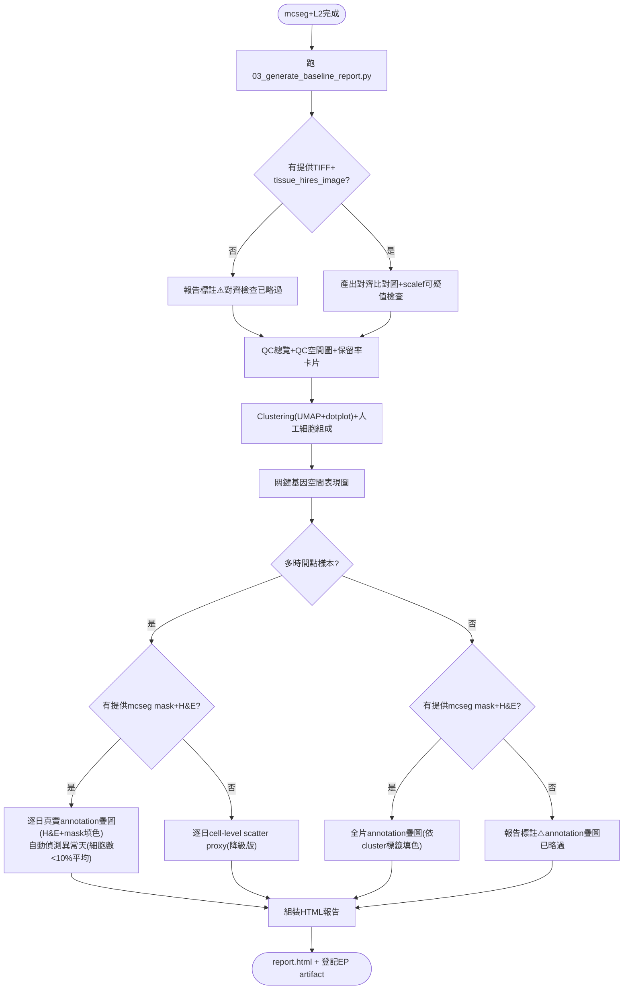

# Visium HD 標準基礎分析報告說明書

定義任何 Visium HD 樣本完成 mcseg+L2 後應自動產出的標準基礎分析套件，
設計源自 dpcp01/HF01_VH_SDS 案例分析過程中反覆踩過的坑，完整設計動機見
lcdda 筆記「Visium HD標準基礎分析與報告產出設計」(30-resources/)。

<!-- section: overview -->
## 概覽

```text
[ 樣本完成 mcseg + L2 (visium_hd_onboarding 說明書步驟1-4) ]
        ↓
[ scripts/03_generate_baseline_report.py --sample-id <id> ... ]
        ↓
[ figures/*.png + manifest.json + report.html ]
        ↓
[ 登記進 analysis_artifacts，bio_artifact_search 找得到 ]
```

## 決策流程



## Tool 對照表

| 項目 | 對應函數 | 說明 |
| --- | --- | --- |
| 對齊檢查 | `fig_alignment_check` + `check_scalef_suspicious` | 需 `--tiff-path` `--hires-path` `--scalefactors-json`，未提供則明確標註略過 |
| QC總覽/空間圖 | `fig_qc_overview` / `fig_qc_spatial` | 需 `--n-raw-cells` 才能算保留率 |
| **annotation疊圖** | `fig_annotation_overlay`（全片）/ `fig_multitimepoint_annotation_overlay`（逐日） | 需 `--mcseg-mask-path`（*_hires_for_overlay.npy 整數標籤陣列）+ `--mcseg-he-path`（同像素空間H&E），未提供則明確標註略過；核心繪圖是 `analysis/mcseg_quality.celltype_overlay_plot()`，依 `--cluster-labels-json` 填色（非邊界線） |
| Clustering | `fig_clustering` | 需 `--marker-genes-json` |
| 細胞組成 | `fig_celltype_composition` | 需 `--cluster-labels-json`，**人工判讀後才填，不可用argmax自動標籤** |
| 基因空間圖 | `fig_gene_spatial_maps` | 需 `--spatial-genes` |
| 多時間點比較 | `fig_multitimepoint_annotation_overlay`（有mask/H&E時優先）/ `fig_multitimepoint_comparison`（scatter proxy，降級版） | 需 `--day-cutpoints` `--day-labels`；**方向必須先跟使用者確認**，不可假設x遞增=時間遞增；`manifest["multitimepoint"]["mode"]` 記錄實際用了哪種 |
| pooled vs within-group統計 | `stat_pooled_vs_within_group` | 任何跨時間點/組別的空間統計檢定都應該呼叫這個，不能只報pooled結果 |
<!-- /section -->

<!-- section: prerequisites -->
## 前置條件

- 樣本已完成 `visium_hd_onboarding` 說明書步驟1-4(註冊、路徑驗證、L2轉換、mcseg對齊確認)
- 已有clustered h5ad(含 `.obs['leiden']` + `.obsm['spatial']`)
- 若為多時間點樣本：**方向已跟使用者確認**（見 `02c_derive_day_section.py` 的同樣要求）
<!-- /section -->

<!-- section: steps -->
## 標準步驟

### 步驟 1 — 準備輸入參數

- marker基因清單(`--marker-genes-json`)：依樣本組織類型挑選，DPCP/皮膚案例參考範例見appendix
- cluster標籤(`--cluster-labels-json`)：**先看 `--marker-genes-json` 產出的 dotplot + wilcoxon top markers 人工判讀，再填這個參數**，不要直接信任argmax

### 步驟 2 — 執行腳本

```bash
uv run python scripts/03_generate_baseline_report.py \
  --sample-id <id> --mcseg-h5ad <path> \
  --tiff-path <path> --hires-path <path> --scalefactors-json <path> \
  --n-raw-cells <int> \
  --marker-genes-json '{...}' --cluster-labels-json '{...}' \
  --spatial-genes "gene1,gene2" \
  [--day-cutpoints "900,1600,2300" --day-labels "Day3,Day2,Day1,Day0"]
```

- **品質關卡**：執行後檢查 `manifest.json` 的 `anomaly_flag`——非空代表某個時間點細胞數異常偏低(< 其他天平均的10%)，**先人工確認該時間點的mcseg分割是否有缺口再繼續**，不要忽略這個警告直接使用該時間點的下游結果

### 步驟 3 — 登記進 EP

```python
bio_register_external_analysis_result(
    sample_id=<id>, analysis_type="baseline_report",
    result_path=".../report.html", summary="...",
    artifact_paths=[{"path": ".../report.html", "artifact_type": "report"}]
)
```
<!-- /section -->

<!-- section: template -->
## 完整範本(以dpcp01為例)

```bash
uv run python scripts/03_generate_baseline_report.py \
  --sample-id dpcp01_vh_v114_02_hd_r004 \
  --mcseg-h5ad /Volumes/KINGSTON/Evo_PRISM/results/overflow/overflow_066b7380-....h5ad \
  --out-dir /Volumes/KINGSTON/Evo_PRISM/results/reports/dpcp01_vh_v114_02_hd_r004_baseline_report \
  --tiff-path "/Volumes/SSD/plan_a/tissue sample/raw/20241223 V114-02-HD-Region 004.tiff" \
  --hires-path "/Volumes/SSD/plan_a/tissue sample/raw/binned_outputs/square_002um/spatial/tissue_hires_image.png" \
  --scalefactors-json "/Volumes/SSD/plan_a/tissue sample/raw/binned_outputs/square_002um/spatial/scalefactors_json.json" \
  --n-raw-cells 86314 \
  --marker-genes-json '{"Mac4":["Cd74","H2-Eb1","H2-Ab1","H2-Aa"],"Mac5":["Cd14","Spp1","Il1b","S100a9"],"Bulge":["Krt15","Sox9","Lef1","Lgr5"]}' \
  --cluster-labels-json '{"5":"Mac4","15":"Mac5","10":"Bulge"}' \
  --spatial-genes "Spp1,Cd44,Krt15" \
  --day-cutpoints "900,1600,2300" --day-labels "Day3,Day2,Day1,Day0" \
  --mcseg-mask-path /Volumes/KINGSTON/Evo_PRISM/results/mcseg/dpcp01_vh_v114_02_hd_r004/fullslide/segmentation_masks_fullslide_vfr_CORRECTED.npy \
  --mcseg-he-path /Volumes/KINGSTON/Evo_PRISM/results/mcseg/dpcp01_vh_v114_02_hd_r004/fullslide/tissue_vfr_aligned_he.npy
```

實測結果：`anomaly_flag` 正確標出 Day0(380細胞，遠低於其他天的6千-2萬)。

⚠️ 局部放大是**固定「全圖窗格的1/2大小、同中心點」= 2倍放大**(`zoom_factor`參數，預設2.0)，
不是用單一天自己的細胞範圍算比例——後者對稀疏異常天(如dpcp01 Day0)會算出巨大窗格。
圖檔長寬兩邊都設14吋上限(`celltype_overlay_plot`)，避免極端長寬比產生沒必要的巨大PNG。
HTML報告全面用`<details>/<summary>`可收合，多時間點比較逐日各自收合，預設全部收起。

⚠️⚠️ **v1.1版曾經用錯mask/H&E配對(`*_hires_for_overlay.npy`+`tissue_hires_image_CORRECT.png`)**——
兩者array shape一致，但**內容完全沒對齊**(使用者肉眼一看就發現邊界線沒貼著真實細胞)。
v1.2改用`segmentation_masks_fullslide_vfr_CORRECTED.npy`(跟h5ad的`cell_id`/
`centroid_x_px`/`centroid_y_px`直接1:1對應，scale=1，用cell_id查表驗證過)，
H&E則是自己從raw TIFF依`_compute_tiff_scale()`算出的已知係數重新resample出來的
(`tissue_vfr_aligned_he.npy`)，不信任任何既有的「_CORRECT」衍生檔。

**每個新樣本第一次跑這個疊圖時，都要重複這個驗證流程**(不能假設現成的mask/H&E
配對檔案是對的)：
1. `_resolve_mask_px_scale()` 用`cell_id`實際查mask值，驗證scale=1是否直接對得上
2. 裁一塊60×80px小窗格畫邊界線疊圖，肉眼確認紅線精準貼合H&E上的細胞核/組織結構
3. 兩步都過了才能把這組mask/H&E當作正式的`--mcseg-mask-path`/`--mcseg-he-path`

見lcdda設計筆記「設計動機」第3點的完整踩坑記錄+對齊驗證方法論。
<!-- /section -->

<!-- section: appendix -->
## 完成後

- 確認 `report.html` 裡所有圖片都能正確顯示(無破圖)
- 確認 `anomaly_flag` 已人工review過，若有異常天已註記原因
- 確認已登記進 EP `analysis_artifacts`

## 未來升級方向(已查證lcdda文獻，暫不做v1)

- 分割下游訊號擴散/污染訂正：參考 ResolVI(doi:10.1101/2025.01.20.634005)
- 細胞型別標註可靠度：參考 UniCell(doi:10.1101/2025.05.06.652331)，對低豐度族群優於argmax/CellTypist等
- 2µm bin互補圖(ROI限定)：v2待實作
- cluster身份雙重驗證的結構化記錄：v2待實作

## 已知問題

`bio_register_external_analysis_result`的`supersedes_analysis_id`參數對已有
`analysis_artifacts`子紀錄的舊`analysis_id`會撞DuckDB FK constraint錯誤
(`Violates foreign key constraint`)。目前workaround：註冊新版本時不傳這個
參數，改在summary/params文字裡手動註記取代關係。根因待日後排查。

## 相關說明書

- `visium_hd_onboarding` — 樣本上線流程(本說明書的前置步驟)
- `mcseg` — mcseg分割的座標系統細節
- `spatial_visium` — 例行空間EDA
<!-- /section -->
