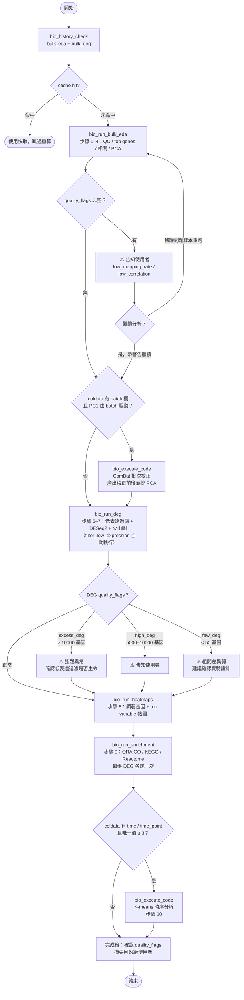

# Bulk RNA-seq 標準分析說明書

<!-- section: overview -->
對齊參考實作 [ddmanyes/bulk-rnaseq-pipeline](https://github.com/ddmanyes/bulk-rnaseq-pipeline)
（Python + OmicVerse + GSEApy，**DESeq2 統計，不是 edgeR**）。

整條 pipeline 切成「上游：fastq → counts」+「下游：counts → 圖表」兩段：

```text
[ 上游（不在 bio_DB 內，需先離線跑完）]
  fastq.gz → FastQC + trim_galore → kallisto quant → kallisto_to_matrix.py
                                                          ↓
                                                    counts.csv + coldata.tsv
                                                          ↓
[ 下游（bio_DB 接手）]                                     ↓
  低表達過濾（CPM ≥ 1 in ≥ N/4 樣本）← filter_low_expression()
              ↓
  merge counts → log2CPM → PCA → ComBat 批次校正（按需）
              → DESeq2 DEG（按 config 跑多組對照）
              → Volcano（per comparison）
              → Heatmap（significant genes + top 50 variable）＋ condition/batch annotation bar
              → ORA（GO / KEGG / Reactome via GSEApy）→ dot plot
              → [optional] K-means time-series + per-cluster 富集
```

## 分析決策流程



**四個原生 MCP tools 涵蓋下游主流程**（HELIX 版本管理 + ENGRAM 自動 artifact 登記）：

| Tool | 對應步驟 | 寫入 analysis_type |
| --- | --- | --- |
| `bio_run_bulk_eda` | 1–4：QC / top genes / 相關 / PCA | `bulk_eda` |
| `bio_run_deg` | 5–7：低表達過濾 + DEG（DESeq2 via pyDEG）+ 火山圖 | `bulk_deg` |
| `bio_run_heatmaps` | 8：顯著基因 + top variable 熱圖（含 annotation bar） | `bulk_heatmap` |
| `bio_run_enrichment` | 9：ORA（GO/KEGG/Reactome via gseapy.enrichr） | `bulk_enrichment` |

Time-series K-means（步驟 10）與 ComBat 批次校正仍走 `bio_execute_code` + `analysis.bulk_timeseries`。
<!-- /section -->

<!-- section: prerequisites -->
## 前置條件

- 樣本已在 `sample_registry`，且 `data_type = bulk_rnaseq`
- 上游已跑完，**counts + coldata** 落在以下路徑之一：
  - **Kallisto**：`bulk_rna_data/<project>/results_kallisto/deseq2_counts.csv` + `deseq2_coldata.tsv`
  - **featureCounts / STAR**：`bulk_rna_data/<project>/results_star/gene_counts.tsv` + `coldata.tsv`（欄位需含 `group`）
- `coldata.tsv`：sample × condition/batch/time 設計表，**`group` 欄位必填**

## 標準分析前必呼叫

```python
# 每次分析前先確認是否已有完成的存檔，命中就走快取，避免重算
bio_history_check(sample_id="<sid>", analysis_type="bulk_eda")
bio_history_check(sample_id="<sid>", analysis_type="bulk_deg")
```
<!-- /section -->

<!-- section: steps -->
## 標準步驟

### 步驟 1 — QC 統計與圖

- **目的**：每樣本 library size、偵測基因數、mapping rate，判斷有無壞樣本
- **函數**：`analysis.bulk_eda.qc_stats` → `analysis.bulk_eda.qc_barplot`
- **產出圖**：library size + 偵測基因數雙 barplot（subtype=`qc`）
- **品質關卡**：`mapping_rate_pct < 70%` → 自動寫入 `quality_flags`（`low_mapping_rate:<sample>(<rate>%)`）
- **artifact label（自動 caption）**：包含 lib.size 範圍與偵測基因數；agent 不需讀圖即可判斷 QC

### 步驟 1b — Count 分布（log1p，正規化前）

- **目的**：確認各樣本原始 count 分布形狀相近（library size 正規化前的分布特徵）
- **函數**：`analysis.bulk_eda.count_dist_boxplot`
- **產出圖**：每樣本 log1p(counts) boxplot，`showfliers=False`（subtype=`count_dist`）
- **解讀**：各 box 中位數與 IQR 相近即正常；某樣本 IQR 極窄或極寬可能代表 library size 差異或 batch 效應
- **artifact label（自動 caption）**：記錄 log1p 中位數範圍（如 `log1p 中位數 2.48–2.56`）

### 步驟 2 — 高表達基因檢視

- **目的**：確認 top 基因合理（非 rRNA / 接頭污染主導）
- **函數**：`analysis.bulk_eda.top_genes`
- **產出**：top 20 基因表（mean counts + 出現樣本數）
- **品質關卡（手動判斷，不寫入 quality_flags）**：單一基因 mean count 佔全部 mean count 總和 > 20% → 告知使用者，可能 ribodepletion 不全或接頭汙染

### 步驟 3 — 樣本相關矩陣

- **目的**：確認重複樣本群聚、偵測 outlier / 標籤錯置
- **函數**：`analysis.bulk_eda.sample_correlation` → `analysis.bulk_eda.correlation_heatmap`
- **產出圖**：Pearson（log1p）相關 heatmap
- **品質關卡**：樣本與其他樣本的平均 Pearson < 0.9 → 自動寫入 `quality_flags`（`low_correlation:<sample>(mean_r=<r>)`）

### 步驟 4 — PCA 降維（含 batch correction 對照）

- **目的**：整體結構視覺化、確認分組分離、評估批次效應強度
- **函數**：`analysis.bulk_eda.pca_plot`（高變異 top 2000 基因）
- **著色**：傳入 `coldata_path` 後依 `group` 欄著色（否則以 sample name 前綴推斷）
- **產出圖**：PC1–PC2 散點圖
- **進階（按需）**：若 `coldata` 含 `batch` 欄、且 PC1 主要由 batch 驅動，走 `bio_execute_code` 用 `omicverse.bulk.batch_correction` 跑 ComBat，產出校正前後並排 PCA

> 步驟 1–4（含 1b）由 `bio_run_bulk_eda(sample_id, coldata_path=...)` 一次完成，報告含五張 inline base64 圖，
> 並各自登記為 artifact（subtype：`qc` / `count_dist` / `correlation` / `pca` / `eda_report`）。
> **每張 artifact label 內嵌自動 caption**（關鍵數字），agent 讀 `bio_get_artifact` 即可理解圖的內容，無需呼叫 `bio_get_figure`。
> 若有 `quality_flags`，報告開頭顯示「⚠️ 品質警告」區塊。
>
> **回傳格式**：
>
> ```text
> Bulk EDA 完成。
> analysis_id: <uuid>
> report_path: <絕對路徑>
>
> <報告正文>
> ```
>
> 後續步驟需用 `analysis_id` 查 artifacts，請從回傳第二行取得。

### 步驟 5 — 低表達基因過濾（DEG 前自動執行）

- **目的**：移除低信號雜訊基因，避免 DEG 結果偽陽性膨脹
- **函數**：`analysis.bulk_deg.filter_low_expression`（DESeq2 前自動呼叫，無需手動）
- **邏輯**：保留 CPM ≥ 1 in ≥ max(2, N/4) 個樣本的基因
- **記錄**：過濾前後基因數寫入 `summary_metrics.n_genes_before_filter` / `n_genes_after_filter`

### 步驟 6 — 差異表達分析（DEG，DESeq2）

- **目的**：找出每組對照的顯著差異基因
- **Tool**：`bio_run_deg(sample_id, counts_path, coldata_path, comparisons, ...)`
- **底層**：`analysis.bulk_deg.run_deg_analysis` → `omicverse.bulk.pyDEG.deg_analysis(method='DEseq2')`
- **產出**：每組對照一張 `DEG_<a>_vs_<b>_<ts>.csv`（log2FC / qvalue / BaseMean）+ artifact 登記（subtype=`deg_table`）
- **最低需求**：每個 group 至少 2 個 replicate（DESeq2 硬性要求）；不足時 `bio_run_deg` 會 raise，需告知使用者補樣本
- **品質關卡**：
  - 顯著基因數（|log2FC|>1, qvalue<0.05）< 50 → `few_deg` flag（組間差異弱）
  - 顯著基因數 > 5000 → `high_deg` flag
  - 顯著基因數 > 10000 → `excess_deg` flag（強烈建議確認低表達過濾是否生效）
- **回傳格式**：

  ```text
  DEG 完成（2 comparisons）。
  analysis_id: <uuid>
  report_path: <絕對路徑>

  <報告正文>
  ```

  後續查 DEG CSV 路徑與 quality_flags 均須用此 `analysis_id`。

### 步驟 6b — Mean-Variance 圖（自動，DEG 前）

- **目的**：近似 DESeq2 dispersion 診斷，確認 count 數據符合負二項分布假設
- **產出圖**：log1p mean vs log1p variance 散點圖（subtype=`mean_variance`）
- **解讀**：低表達基因（x 軸左側）有較高 variance 屬正常；若高表達區間也有極高 variance → 批次效應或樣本異質性
- **artifact label（自動 caption）**：記錄低表達高 variance 基因數（如 `低表達高 variance 基因共 12 個`）

### 步驟 6c — 多閾值 DEG 統計表（自動，DEG 結果後）

- **目的**：提供 |FC|>0.5/1/1.5/2 × padj<0.05/0.01 的 DEG 數量，協助使用者選擇最終閾值
- **產出**：Markdown 表格嵌入報告（每組對照 5 行）
- **解讀**：|FC|>1 → |FC|>2 的 DEG 數量驟降代表大多數 DEG FC 在 1–2 之間，正常；若各閾值數量相近代表大量強 DEG

### 步驟 7 — 火山圖 + MA 圖（per comparison，與步驟 6 合併）

- **目的**：視覺化每組對照的 DEG 分布（兩種角度互補）
- **火山圖**：`Volcano_<a>_vs_<b>_<ts>.png`（紅 up / 藍 down / 灰 ns，含閾值線 + top 10 adjustText 標籤）；artifact subtype=`volcano`
- **MA 圖**：`MA_<a>_vs_<b>_<ts>.png`（x = log2(BaseMean)，y = log2FC；顯示 fold change 與表達量的關係）；artifact subtype=`ma_plot`
- **artifact label（自動 caption）**：記錄 up/down/ns 數量、最顯著基因（volcano）；MA 圖記錄 BaseMean 範圍
- **品質關卡**：火山圖點雲應對稱；MA 圖低表達端（x 左側）若有多個顯著點 → 可能有過度收縮現象

### 步驟 8 — 熱圖（顯著基因 + top 變異基因）

- **目的**：視覺化 DEG / high-variance 基因在樣本間的表達 pattern
- **Tool**：`bio_run_heatmaps(sample_id, counts_path, deg_tables=[...], top_n=50, coldata_path=...)`
- **底層**：`analysis.bulk_heatmap` → `seaborn.clustermap` z-score row-wise
- **Annotation bar**：傳入 `coldata_path` 後，熱圖上方自動顯示 group/batch 顏色條（`_make_col_colors()`）
- **產出兩張**：
  - `Heatmap_Significant_Genes_<ts>.png` — `deg_tables` union 後的顯著基因（subtype=`heatmap_sig`）
  - `Heatmap_Top<N>_Variable_Genes_<ts>.png` — 跨所有樣本 log1p variance top N（subtype=`heatmap_var`）
- **品質關卡**：同組重複應聚成一支；若 dendrogram 把重複拆散 → 回頭查 batch / 標籤

### 步驟 9 — 富集分析（ORA：GO / KEGG / Reactome）

- **目的**：把 DEG list 翻譯成生物功能 / 通路
- **Tool**：`bio_run_enrichment(sample_id, deg_table_path, libraries=[...])`
- **底層**：`analysis.enrichment.run_ora` → `gseapy.enrichr`（線上 Enrichr API）+ bar plot + dot plot
- **預設 libraries（DEFAULT_LIBRARIES）**：`GO_Biological_Process_2023` / `KEGG_2021_Human` / `Reactome_2022`
- **擴展 libraries（EXTENDED_LIBRARIES）**：傳入 `from analysis.enrichment import EXTENDED_LIBRARIES` 可額外跑 GO MF / GO CC（共 5 個 library）
- **產出（per direction × library）**：CSV + bar plot（subtype=`enrichment_barplot`）+ dot plot（subtype=`enrichment_dotplot`）
- **bar plot vs dot plot**：bar plot 用 -log10(padj) 長條直觀比較顯著性；dot plot 加入 overlap ratio / gene count 維度；兩者互補
- **⚠️ ORA background**：gseapy enrichr 使用 Enrichr 全資料庫為 background（非限縮於 tested gene universe）；若需限縮 background，改用 clusterProfiler（R）
- **artifact label（自動 caption）**：bar plot label 記錄 top term 與顯著 term 數（如 `top: apoptotic process（padj=1e-8）；顯著 10 term`）；agent 不需讀圖即可摘要結果
- **品質關卡**：
  - top pathway 與實驗主題相關（如毛囊樣本應命中 hair follicle / cell cycle / OxPhos）
  - 全部 pathway 在 Adjusted P-value > 0.25 → DEG signal 可能太弱
- **⚠️ 需網路**：Enrichr API；無網時 raise，改走 `analysis.pathway_scoring.score_pathways(method='zscore')` 對 `gene_sets/*.yaml` 離線評分

### 步驟 10 — 時序分析（按需）

- **觸發條件**：`coldata` 含 `time` 或 `time_point` 欄，且唯一值 ≥ 3
- **目的**：找隨時間共表達的基因模組
- **工具**：
  - K-means clustering（搭配 elbow plot 找最佳 k）
  - 既有函數：`analysis.bulk_timeseries.mean_by_timepoint` / `log2fc` / `timeseries_summary`
- **產出**：每個 cluster 一條趨勢線 + per-cluster GO 富集
- **品質關卡**：cluster 數合理（k=4–8）；單一 cluster 解釋 > 80% 變異 → 重新評估 k
<!-- /section -->

<!-- section: template -->
## 完整一次性分析的範本

當使用者說「跑完整 bulk 分析」時，標準流程（含 history check）：

```python
# 0) 先確認快取，命中就跳過對應步驟
bio_history_check(sample_id="kallisto_v1", analysis_type="bulk_eda")
bio_history_check(sample_id="kallisto_v1", analysis_type="bulk_deg")

COUNTS = "bulk_rna_data/Kallisto_v1/results_kallisto/deseq2_counts.csv"
COLDATA = "bulk_rna_data/Kallisto_v1/results_kallisto/deseq2_coldata.tsv"

# 1) EDA（步驟 1–4）
bio_run_bulk_eda(sample_id="kallisto_v1", coldata_path=COLDATA)

# 2) DEG + 火山（步驟 5–7，低表達過濾自動執行）
bio_run_deg(
    sample_id="kallisto_v1",
    counts_path=COUNTS,
    coldata_path=COLDATA,
    comparisons=[["pw24hr", "ctrl"], ["pw48hr", "ctrl"]],
)

# 3) 取 DEG artifact 路徑（從 analysis_artifacts 表查，避免猜時間戳）
deg_csvs = [...]   # 從上一步 artifacts 取得的實際路徑

# 4) 熱圖（步驟 8）
bio_run_heatmaps(
    sample_id="kallisto_v1",
    counts_path=COUNTS,
    deg_tables=deg_csvs,
    coldata_path=COLDATA,
    top_n=50,
)

# 5) 富集（步驟 9）— 每張 DEG 各跑一次
for deg_csv in deg_csvs:
    bio_run_enrichment(sample_id="kallisto_v1", deg_table_path=deg_csv)
```

> **DEG artifact 路徑取得方式**：不要猜時間戳，從 `analysis_artifacts` 查：
>
> ```sql
> SELECT file_path FROM analysis_artifacts
> WHERE analysis_id = '<上一步回傳的 analysis_id>'
>   AND artifact_subtype = 'deg_table'
> ```
<!-- /section -->

<!-- section: appendix -->
## 完成後

- 確認每步 `analysis_history` 都已寫入（status=completed）且 `tool_id` 已回填
- 確認 `summary_metrics.quality_flags` 是否為空，非空需向使用者說明；查法：

  ```sql
  SELECT summary_metrics->>'quality_flags'
  FROM   analysis_history
  WHERE  analysis_id = '<回傳的 analysis_id>'
  ```

  （使用 `bio_memory_query` 執行上述 SQL）

- 摘要回報（繁中）：樣本數、可疑樣本（quality_flags 內容）、過濾基因數、PCA 分離情況、各對照 DEG 數、top 3 富集通路
- 明確指出 `result_path` 供使用者查完整報告與所有圖檔

## 仍走 bio_execute_code（按需）

| 場景 | 工具 |
| --- | --- |
| ComBat 批次校正 | `omicverse.bulk.batch_correction()`；對照前後 PCA 並排 |
| GSEA prerank（不依賴 padj 閾值） | `gseapy.prerank(ranked_gene_list, gene_sets='gmt_or_name')` |
| Time-series K-means + elbow | `sklearn.cluster.KMeans` + `silhouette_score` + `analysis.bulk_timeseries.mean_by_timepoint` |
| 自訂 gene set 評分（離線） | `analysis.pathway_scoring.score_pathways(counts, 'gene_sets/*.yaml', method='zscore'/'ssgsea')` |

這些場景重複跑 ≥ 2 次 → 由控制面板 Phase 3 引導畢業成 `analysis/` 函數。
<!-- /section -->
