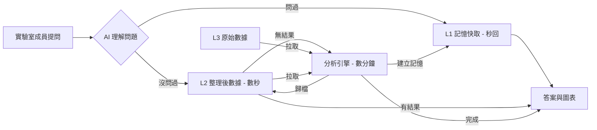

# 智慧生資分析平台

**讓實驗室成員用自然語言查詢生物資訊分析結果**
無需程式能力，無需重複運算

---

## 什麼是生物資訊分析？

現代生物醫學實驗室產出**海量多組學數據**：

- **空間轉錄體（Visium HD）**
  把組織切片上每個 8µm × 8µm 的位置都記錄「哪些基因正在活動」
  → 單片切片：~100,000 個空間位置 × 30,000 個基因 = **30 億個數字**

- **Bulk RNA-seq**
  測量整批細胞的基因表現量，比較不同樣本或時間點的差異

- **Proteomics（蛋白質體學）**
  測量細胞中實際存在的蛋白質種類與豐度

這些數據**不能直接「看」**，必須透過複雜的計算流程（Pipeline）分析後才能得出生物意義。

---

## 問題：四個實驗室痛點

1. **重複浪費時間**
   - 不同成員對同一樣本提相似問題，各自重新跑一次分析
   - 空間轉錄體的前處理工作單次需要 **~4 小時**，重跑一次就是半天

2. **結果找不到**
   - 分析完的結果散落在各人電腦，沒有統一的地方可以查

3. **沒有留下記錄**
   - 不知道這個樣本是否已經分析過、是誰做的、結果存在哪裡

4. **只有會寫程式的人能用**
   - 不熟悉程式操作的成員無法自己取得分析結果，只能等別人幫忙

---

## 目標

本系統要解決的四個問題，也是四個可以驗證的目標：

1. **不重複做一樣的事**
   同一個樣本的同一種分析，只需要跑一次，之後直接取用結果

2. **每次分析都有記錄**
   誰做了什麼、什麼時候做、結果在哪裡，全部自動留存，永不消失

3. **不浪費運算資源**
   問過的問題直接從記憶取答案（消耗 **0 token**）；有數據但沒問過的用資料庫查（極少 token）；只有全新樣本才真正呼叫 AI，大幅降低使用費用

4. **任何人都能用**
   不需要寫程式，用自然語言提問，直接得到分析結果與圖表

---

## 設計依據

本系統四個核心設計均有文獻支撐：

| 設計 | 來源 | 本系統調整 |
| ---- | ---- | ---------- |
| **三層 Bronze / Silver / Gold 架構** | Medallion Architecture（Databricks）；LakeHarbor, ICDE 2024 | Gold 層改為 HNSW 向量索引，支援自然語言查詢 |
| **語意搜尋（HNSW）** | Malkov & Yashunin, 2018；DuckDB VSS, Müller et al. 2024 | TTL 7 天 + 每週重建索引，避免索引碎片化 |
| **Agent-First 查詢策略** | Trummer, 2025；MemGPT, Packer et al. 2023 | SQL 精確查 → 語意搜尋 → 完整報告三段防線 |
| **兩階段寫入 + 狀態機** | WAL / crash recovery；Saga pattern, Garcia-Molina & Salem, 1987 | 加入 stale 狀態，ExFAT 環境下每次寫入後強制 CHECKPOINT |

---

## 解決方案：智慧生資分析平台

我們以 **AI + 三層數據倉儲** 建立一個實驗室共用的分析平台：

- **用說的就能查**
  成員透過網頁或 Telegram 輸入自然語言問題，不需要任何程式能力

- **問過的問題秒回，沒問過的自動分析**
  系統有記憶：相同或相似的問題直接從記錄中回傳，不重複跑分析

- **每次分析自動留存**
  誰做了什麼、結果在哪裡，全部自動記錄，形成實驗室的知識資產

- **原始數據永遠安全**
  分析再多次，原始數據不會被修改或覆蓋

- **支援圖片分析**
  可上傳組織切片圖或實驗圖，AI 直接在對話框中給出視覺分析結果

---

## 方法總覽：系統架構



> **對實驗室成員**：不需寫程式，用說的就能查數據、取得分析圖表。
> **對實驗室主持人**：每次分析自動記錄，誰做了什麼、結果在哪，一目了然。
> **對資料管理**：原始數據唯讀保護，分析再多次也不怕誤改原檔。

---

## 方法：三層架構

```text
L3 Bronze（銅層）── 不可變原始數據（FASTQ、SpaceRanger 輸出）→ 絕對唯讀
     │ 一次性轉換腳本
     ▼
L2 Silver（銀層）── DuckDB + Parquet（30 億數字 → 416 MB）→ 集中計算一次
     │ 分析完成後自動寫入
     ▼
L1 Gold（金層）  ── HNSW 語意快取（TTL 7 天）→ 問過的問題直接回傳
```

各層效能比較：

| 層級 | 情境 | 回應時間 | Token 消耗 |
| ---- | ---- | -------- | ---------- |
| L1 快取命中（cosine ≥ 0.88） | 相同或語意相近的問題 | < 1 秒 | **0** |
| L2 SQL 查詢（L1 未命中） | 首次提問，已有 Parquet | ~30 秒 | 極少 |
| L3 Pipeline（L2 無資料） | 全新樣本，需重新分析 | ~4 小時 | 正常 |

> **為什麼 L2 省 token？** AI 只需把問題翻譯成 SQL，資料庫負責計算所有數字；AI 拿到結果後只需格式化成回答。計算本身完全不經過 AI，token 消耗約為 L3 的 1/10。

---

## 方法：三層各用什麼方式查詢？

| 層級 | 查詢方式 | 觸發時機 | 回應時間 |
| ---- | -------- | -------- | -------- |
| L1 Gold | HNSW 語意搜尋 | 問題語意相近 | < 1 秒 |
| L2 Silver | SQL 精確查詢 | L1 未命中 | ~30 秒 |
| L3 Bronze | 直接讀取原始檔案 | L2 無資料 | 數分鐘～數小時 |

### VSS 與 HNSW：L1 的查詢核心

**VSS（Vector Similarity Search，向量相似度搜尋）** 是讓電腦理解「意思相近」而非「字面相同」的技術：先將問題轉成一串數字（向量），再找出數字最接近的歷史紀錄。

> 傳統關鍵字搜尋：「CD45」≠「免疫細胞」→ 找不到
> VSS 語意搜尋：兩者語意相近 → 命中同一筆快取，回傳 0 token

**HNSW（Hierarchical Navigable Small World）** 是讓 VSS 在大量資料中仍能**毫秒級回應**的索引演算法：

1. **速度快，資料量再大也不慢**
   搜尋時間為 O(log N)，資料筆數翻倍，搜尋時間只多一點點

2. **內建於 DuckDB，不需另外架設服務**
   不需部署 Pinecone / Weaviate 等獨立向量資料庫

> HNSW 不支援增量更新，因此設計為每週日自動重建索引，平時查詢不受影響。

*來源：Malkov & Yashunin, 2018；DuckDB VSS, Müller et al. 2024*

---

## 方法：為什麼選 DuckDB + Parquet？

### DuckDB — 嵌入式列式分析資料庫

- **列式向量化執行**：每次只讀需要的欄位，SIMD 批次運算，略過大量零值
- **零部署**：`import duckdb` 即用，不需另起 PostgreSQL / MySQL 服務
- **原生讀 Parquet**：直接 `FROM 'silver/*.parquet'` 查詢，無需預先匯入
- **內建 HNSW 向量索引**：語意快取搜尋免部署 Pinecone / Weaviate

### Parquet — 列式壓縮儲存格式

- **高壓縮率**：稀疏基因矩陣（大量零值）RLE 壓縮效果極佳
- **跨語言**：Python / R / DuckDB 原生支援，濕實驗室可直接用 R 讀取

```text
原始 .h5 (SpaceRanger)  →  Parquet (416 MB)  →  DuckDB SQL 聚合  →  LLM
  需 ~12 GB RAM 讀入        列式壓縮，磁碟即查     免讀入記憶體      Token 極少
```

CRC Visium HD 原始 ~30 億非零值 → **416 MB Parquet**（壓縮約 95%）

---

## 方法：Agent 查詢決策流程

收到問題，系統依序嘗試，**能在前面解決就不往後走**：

```text
使用者提問
 ├─ Step 1  SQL 精確比對（0 token，< 1 秒）
 │           「這個樣本的這個分析，做過嗎？」✓ 做過 → 直接回傳
 │
 ├─ Step 2  HNSW 語意搜尋（cosine ≥ 0.88）
 │           「問法不同但意思相同的問題，問過嗎？」✓ 問過 → 快取回傳
 │
 ├─ Step 3A 標準分析工具（L2 Parquet 已就緒 → 呼叫內建函數）
 │
 └─ Step 3B 動態程式碼生成
             LLM 生成 Python → 沙盒安全執行 → 結果圖直接嵌入對話框
```

> **關鍵設計**：讓資料庫做資料庫擅長的事（Step 1–2），LLM 只處理真正需要推理的部分（Step 3）

---

## 方法：文獻依據（上）

### 三層 Medallion 架構

- **來源**：Medallion Architecture（Databricks）；LakeHarbor ICDE 2024
- **截取**：原始數據不可變；Silver 集中計算一次而非每次查詢時重算
- **本系統調整**：Gold 層改用 HNSW 向量索引，適應自然語言查詢場景（非傳統 BI Cube）

### HNSW 向量語意搜尋

- **HNSW** = Hierarchical Navigable Small World：在高維向量空間中以 O(log N) 找到最相似向量
- **來源**：DuckDB VSS 擴充；Malkov & Yashunin 2018
- **本系統調整**：TTL 7 天 + 每週完整重建索引（HNSW 不支援增量更新）

### Agent-First + Token 省策

- **來源**：Agent-First Data Systems 2025；MemGPT 分層記憶模型
- **截取**：資料庫先回答結構化問題，LLM 只處理語意層
- **本系統調整**：SQL → 語意 → 完整報告三段防線，取代 MemGPT 分頁換入換出

---

## 方法：文獻依據（下）

### 兩階段寫入 + 狀態機

- **來源**：WAL / crash recovery 通例；長時間批次作業的 saga pattern
- **截取**：長任務崩潰也能留下記錄（先寫 `running`，完成再更新）
- **本系統調整**：加入 `stale` 狀態（> 24h running 自動標記）+ ExFAT 環境下 `safe_write()` CHECKPOINT

### 動態程式碼沙盒執行

- **來源**：靈感自 Code Interpreter 設計模式；RestrictedPython 沙盒框架
- **截取**：LLM 生成程式碼不應直接在生產環境執行，需白名單 import + timeout 保護
- **本系統調整**：`plt.show()` hook 自動捕獲 matplotlib 圖並以 base64 嵌入回傳聊天框

### 多模態視覺分析

- **來源**：Gemma 4 Vision（Google DeepMind 2025）；llama.cpp OpenAI-compatible API
- **截取**：本機 Vision LLM 可在不上傳敏感實驗圖至雲端的前提下做視覺分析
- **本系統調整**：支援剪貼板貼上圖片直接傳入多模態模型分析

---

## Demo：Web UI 功能展示

### 聊天介面

- 自然語言提問 → SSE 串流回覆
- 圖片上傳（附件按鈕 / Ctrl+V 貼上）→ Gemma 4 Vision 視覺分析
- 分析結果圖（matplotlib QC 圖、PCA 圖）直接顯示於聊天框，點擊可放大，支援下載
- 推理後端即時切換：本機 Gemma 4 / Claude API / Google Gemini

### 分析歷史頁面

- 所有分析記錄一覽（樣本、類型、狀態、完成時間）

### 報告頁面

- 含 base64 嵌入圖表的完整分析報告 HTML，瀏覽器直接開啟

---

## 結果：系統數字

- 測試數據總量：**~39 GB**（Visium HD）+ **84** Bulk RNA 樣本
- L2 Parquet 大小：**416 MB**（原始 30 億非零值 → SQL 可查，免去 ~12 GB RAM 讀入）
- Agent 工具數量：**10** 個 BIO_TOOLS
- 測試通過率：**105 / 106 PASSED**（6 個測試檔；1 筆為磁碟掛載路徑差異，非程式邏輯錯誤）
- 推理引擎：Gemma 4 26B Vision IQ2_M（本機，port 8080）
- Embedding 模型：bge-m3 Q8（**1024-dim**，多語含中文，本機，port 8081）
- L1 快取 TTL：**7 天**（每週日自動重建 HNSW 索引）
- 排程任務數：**4 個**（每日備份 / L1 TTL 清理 / HNSW 重建 / 新樣本自動掃描）

---

## 結果：已驗收的目標

### ✅ 已驗證（本機測試階段）

- **消除重複運算**：`bio_history_check` 正確攔截已完成分析（單元測試通過）
- **分析可追溯**：每次分析後 `analysis_history` 有記錄，`analysis_index` VIEW 正確彙總
- **Token 省策有效**：三個 0-token 工具不呼叫 LLM，SQL 直接回傳
- **數據安全**：`safe_write()` 每次寫入後 CHECKPOINT，每日備份腳本可執行還原

### ⏳ 待驗證（需部署後）

- **使用門檻低**：5 位成員實際使用後的定性調查
- **L1 命中率 ≥ 80%**：穩定使用一週後統計
- **月 Token 消耗在預算內**：Anthropic Dashboard 監控
- **多後端穩定性**：Claude / Google Gemini API 切換端對端驗證

---

## 討論

### 結果代表什麼？

- **L2 Parquet 的意義**：Visium HD 查詢從「需 ~12 GB RAM 讀入全矩陣」縮短為「SQL 聚合 20 行結果」，讓生資規模數據可在筆電即時查詢
- **兩階段寫入的意義**：~4 小時 Pipeline 中途崩潰也留下 `running` 紀錄，不重複排程、不無聲失敗
- **Token 省策的意義**：實驗室規模（月百次查詢）下，重複性問題在 Step 1/2 被攔截，幾乎零 Token 消耗

### 目前的限制

1. **本機測試階段**：L1 命中率 80% 為目標，尚無真實使用者數據驗證
2. **IQ2_M 量化精度**：Gemma 4 26B 使用 2-bit 量化壓縮以在本機執行，複雜推理能力有所下降
3. **單機單用戶**：`asyncio.Lock` 序列化寫入，高並發場景未經壓力測試
4. **ExFAT 環境**：`safe_write()` 縮小斷電損壞視窗，但無法完全取代有日誌的檔案系統

---

## 結論

**智慧生資分析平台** 以三層 Medallion 架構 + Agent-First 查詢設計，解決了實驗室生資分析的四個核心痛點：

- **重複運算** → 兩層快取（SQL 精確 + HNSW 語意）攔截重複查詢，4 小時 Pipeline 不重跑
- **數據孤島** → 統一 DuckDB + Parquet，所有樣本與分析結果集中可查
- **無記錄** → 兩階段寫入狀態機，每次分析留下永久帳本，崩潰也不遺失
- **門檻高** → Web UI 自然語言介面 + 分析圖直接顯示，成員無需命令列知識

本機測試四項可量測目標已通過單元測試驗證；L1 命中率與使用者滿意度待部署後實地量測。

---

## 下一步

```text
現在可做（本機）
    ├── 端對端測試：填入 API Key，驗證 Claude / Google 後端切換
    └── 啟用自動掃描新樣本排程（launchd_scan_samples.plist）

接著（需 Telegram Token）
    └── Telegram Bot 正式啟用（server/telegram_bot.py 骨架已完成）

之後（需 Linux 伺服器）
    ├── 路徑設定遷移（config/settings.py）
    ├── Docker 沙盒替換 code_executor.py（生產安全隔離）
    ├── FASTQ 自動 Kallisto 觸發
    └── 5 位實驗室成員實際使用驗證
        → 量測 L1 命中率與使用者滿意度
```
