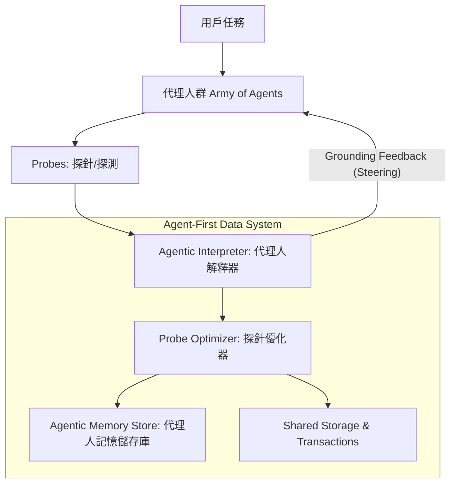

# Supporting Our AI Overlords: Redesigning Data Systems to be Agent-First

**Authors:** Shu Liu, Soujanya Ponnapalli, Shreya Shankar, Sepanta Zeighami, Alan Zhu, Shubham Agarwal, Ruiqi Chen, Samion Suwito, Shuo Yuan, Ion Stoica, Matei Zaharia, Alvin Cheung, Natacha Crooks, Joseph E. Gonzalez, Aditya G. Parameswaran
**Affiliation:** University of California, Berkeley (2025)

---

> [!abstract] 核心摘要
> 大型語言模型 (LLM) 代理人正在成為資料系統的主要負載。本文指出，Agent 在處理數據時採用了一種高通量的「探索與方案構建」過程，稱之為 **Agentic Speculation (代理人推測)**。現有的資料系統難以應付這種規模與低效性。作者提出了一種全新的 **Agent-First (代理人優先)** 資料系統架構，從查詢介面、查詢處理到儲存層（Agentic Memory Store）進行全面重新設計，以支援 Agent 的大規模、異質性、冗餘性與可引導性需求。

---

## 1. 簡介 (Introduction)

隨著 LLM 代理人能力的增強，它們將代表用戶執行數據提取、分析、轉換與更新。未來的數據系統負載將從「人類驅動」轉向「代理人驅動」。

*   **Agentic Speculation**: 代理人透過大量的探索性查詢（如探索 Schema、統計數據）來獲取背景知識（Grounding），這導致了極高的查詢通量。
*   **挑戰**: 現有的資料系統是為間歇性的人類查詢或針對性的應用設計的，難以應對代理人每秒數百次的 speculative 請求。

---

## 2. 案例研究 (Case Studies)

作者透過 BIRD dataset 與跨資料庫任務進行了研究，發現代理人負載具備以下特點：

### 2.1 代理人推測的四項關鍵特性
| 特性 | 說明 |
| :--- | :--- |
| **高通量 (High Throughput)** | 透過並行或順序的大量請求來提升準確度（最高提升 14%-70%）。 |
| **冗餘性 (Redundancy)** | 查詢中存在大量重複。只有 10-20% 的子查詢是獨一無二的，具備高度的計算共享潛力。 |
| **異質性 (Heterogeneity)** | 需求從粗粒度的元數據探索（早期）到精確的方案驗證（後期）不等。 |
| **可引導性 (Steerable)** | 如果系統能主動提供提示 (Hints)，查詢效率可提升 20% 以上。 |

> [!important] 關鍵發現
> 代理人負載並非單一任務，而是由「元數據探索 (Metadata Exploration)」與「方案構建 (Solution Formulation)」兩個交織的階段組成。

---

## 3. Agent-First 資料系統架構 (Architecture)

作者提出了一種專為代理人設計的架構：

---

## 4. 查詢介面：從 SQL 到 Probe (Query Interfaces)

### 4.1 超越 SQL 的「探針 (Probes)」
*   **Briefs (簡報)**: 除了 SQL，Agent 應提供自然語言描述的意圖、階段、準確度需求與優先級。
*   **語意運算子**: 支援語意相似度搜尋（Semantic Similarity），而非僅限於 `LIKE`。

### 4.2 從「應答」到「引導 (Steering)」
*   **Auxiliary Information**: 資料庫主動提供相關表格或「為何結果為空」的解釋。
*   **基於成本的反饋**: 告知 Agent 某查詢成本過高，建議其縮小範圍（如：只查加州而非全美）。

---

## 5. 探針處理與優化 (Processing & Optimization)

目標不再是優化吞吐量，而是評估足夠多的數據，讓 Agent 能夠做出下一步決策（Satisficing）。

### 5.1 優化策略
*   **Intra-Probe Optimization**: 在單次 Probe 中決定哪些查詢需要精確執行，哪些可以近似（Approximate）。
*   **Inter-Probe Optimization**: 跨輪次的優化。如果新 Probe 沒有提供新資訊，則直接丟棄；或預先物化（Materialize）Agent 之後可能需要的 Join。

---

## 6. 索引、儲存與交易 (Storage & Transactions)

### 6.1 Agentic Memory Store (代理人記憶儲存庫)
這是一個持久化的「語意快取」，存儲過往探測的結果、元數據、缺失值資訊等。
*   **更新挑戰**: 當底層 Schema 或數據更新時，如何處理過時的記憶（Stale Information）。

### 6.2 分支更新 (Branched Updates)
Agent 在更新數據時會進行大量的「假設性 (What-if)」分支，回滾 (Rollback) 次數是人類的 50 倍。
*   **多世界隔離**: 每個分支需要邏輯隔離但實體共享。
*   **超快速回滾**: 類似「加強版的 MVCC」，支援數千個近乎相同的快照。

---

## 7. 結論 (Conclusion)

資料系統必須從「人類優先」轉向「代理人優先」。這需要處理 **Agentic Speculation** 帶來的高通量、冗餘與動態性。未來的研究應聚焦於如何讓資料庫與 Agent 進行雙向的「語意通訊」。

---

## 參考文獻 (References)
* [1] Neon Serverless Postgres (2025)
* [10] BIRD Text-to-SQL Benchmark (NeurIPS 2023)
* [20] LLM-Powered Proactive Data Systems (IEEE 2025)
* ... (詳見原始轉檔文件)
